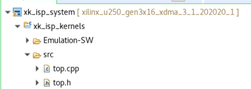
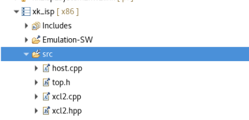
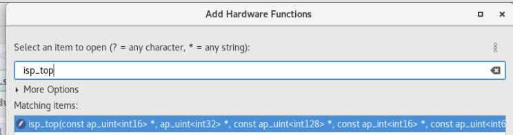
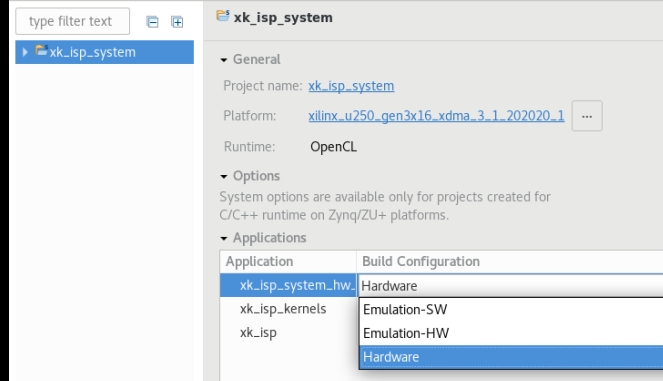

# Introduction
xkISP is an open source image signal processor (ISP) based on Xilinx development tools.
xkISP is jointly developed by VIP Lab of Fudan university and DAMO CTL lab of Alibaba.
Up to now, xkISP supports to process 12-bit raw image data of any resolution. The entire pipeline includes 17 function modules  shown in the following:
The official on-line forum of xkISP project is: http://openasic.org/


##  File Structure

```
openISP
├─fpga
│      host.cpp
│      top.cpp
│      top.h
│      xcl2.cpp
│      xcl2.h
│
├─src
│    isp_top.h
│    file_define.h
│    "*module*".cpp
│    "*module*".h
│    ...
│
├─tb
│     tb_"*module*".cpp
│    ...
│
├─tcl
│      Makefile
│      "*module*".tcl
│      "*module*"_directives.tcl
│    ...
│
├─tv
│     Makefile
│     hls_param.txt
│     input.raw
│     isp
│     readme_for_tv
├─  LICENSE
├─  setup_env.sh
└─  README.md
```


  `fpga` contains code files for top level integration verification.
  `src` contains source code files which are the single module of the xk-isp project and head files(`file_define.h`) for single module test.
  `tb` contains  code files for verificating the function consistency with  Cmodel(`tv/isp`)  in the module level.
  `tcl` contains  the scripts for  execuating the code files in the `tb`("*module*".tcl) and adding the pragma command for the  code files in the `src` ("*module*"_directives.tcl). Makefile in the  `tcl`  is used for module level verification.
  `tv` contains  the files for generating the test vectors. You can read the `readme_for_tv` for more details.
`setup_env.sh`  is used to designate the development tools. (Vitis HLS or Vivado)
# Usage
Clone this repo:
> git clone xxx.git

> cd xk-isp

##  Environment setup
Modify `setup_env.sh` to add the installed *vivado* or *vitis hls* path under the current system. Then complete the environment setup.
> source setup_env.sh

##  Test vector generate
Before starting the project, we need use xk-isp Cmodel `isp`to generate test vectors. These is an test image `input.raw`and default configuration  `hls_param.txt`  in `tv`.
> cd tv

> ./isp -i input.raw -c hls_param.txt

If you want to use your own image, please modify makefile

> ./isp -i "your test image" -c "your configuration"

**Note**：the configuration is fixed in each module level verification. You should modify the verification code files( `tb_"*module*".cpp` in `tb`) to match the configuration of Cmodel. We will modify the  verification code files to read configuration file in the future update.

## module level verification
For module level  verification, you can use the script `Makefile` in the  `tcl`. Of course, you can modify the `Makefile`as needed
> cd tcl

> make

## Top level integration verification
For top level integration verification, you can use the vitis GUI. The example is shown as follows:
1.Create a new project using the vitis.
Import `top.h` and `top.cpp` under kernels and  `host.cpp`, `top.h`, `xcl2.cpp`, `xcl2.hpp` under host platform(x86).





2.Set top file
Under the kernel directory, double-click `.prj` to enter its configuration interface, click  and set the “*isp_top*” function as the top level.



3.Set test images path and configuration parameters
Enter the `host.cpp`
 - image path
Modify the  "*TOP_SRC1*" and "*TOP_DST1*" to your image paths.
 - image resolution
"*IMAGE_HEIGHT*" and "*IMAGE_WIDTH*" determine the input image height and witdh.
"*upper_left_x*", "*upper_left_y*" , *"lower_right_x**" ,"*lower_right_y*"   determine the pixel positions of the upper left and lower right corners of the cropped image.
"*CROP_HEIGHT*" and "*CROP_WIDTH*" determine the output image height and width. They need to be matched with  "*upper_left_x*", "*upper_left_y*" , *"lower_right_x**" ,"*lower_right_y*"
 - module configuration
 You can find them in the  `host.cpp`

4.Compile and run
Click the settings  in the Assistant window to select the target we compile ("*emulation-SW", "emulation-HW", "HW*")




Click build  in the Assistant window to compile. Click run  to execute the project.


