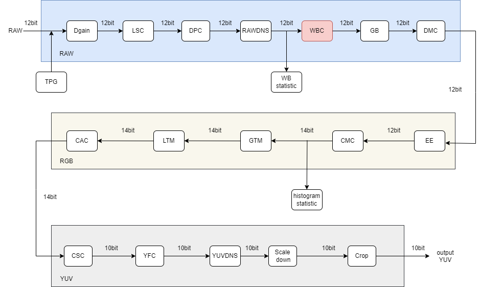
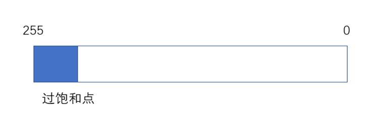

# AWB 模块

[TOC]

## 历史版本修订

| Revision | Date       | Author    | Description |
| 0.1      | 2022.12.06 | Gao Yuxin | origin      |
|          |            |           |             |

## 1.简介

### 1.1 需求及目的

该文档描述了CTL ISP架构中的自动白平衡模块的算法。团队成员可以依据该文档理解相应代码，也可以依据设计细节自行实现。

### 1.2 定义与缩略词说明

| 定义 | 说明       |
| :--- | ---------- |
| AWB  | 自动白平衡 |

## 2. 概述

在我们的xkISP中，AWB模块在RAW域进行信息统计，估计图像光源值并得出各通道增益值传给WBC模块。

在代码中主要包含了三种算法，分别是Grey World，White Patch以及Shades of Grey算法。

### 2.1 AWB位置

WBC模块中包含AWB。

### 2.2 AWB参数

<table>
   <tr>
      <td>参数</td>
      <td>说明</td>
   </tr>
   <tr>
      <td>m_nEb</td>
      <td>信号使能</td>
   </tr>
   <tr>
      <td>r_ Gain</td>
      <td>R通道增益值</td>
   </tr>
   <tr>
      <td>g_ Gain</td>
      <td>G通道增益值</td>
   </tr>
   <tr>
      <td>b_ Gain</td>
      <td>B通道增益值</td>
   </tr>
   <tr>
      <td>mink</td>
      <td>Minkowski范数</td>
   </tr>
   <tr>
      <td>bit_widths</td>
      <td>数据位宽</td>
   </tr>
   <tr>
      <td>remove_en</td>
      <td>去除过饱和点的使能信号</td>
   </tr>
   <tr>
      <td>remove_T</td>
      <td>去除过饱和点的阈值</td>
   </tr>
   <tr>
      <td>w_T</td>
      <td>白点阈值</td>
   </tr>
</table>

## 3. AWB 算法及流程

### 3.1 AWB 顶层模块(isp_awb)

#### 3.1.1 函数接口

| 参数     | 说明        |
| -------- | ----------- |
| topParam | ISP顶层参数 |
| awbParam | AWB模块参数 |
| srcdata  | 输入数据    |

#### 3.1.2 算法和函数

该代码是自动白平衡(AWB)算法的实现。它以一个图像作为输入，表示为一个16位像素值的数组，以及两个数据结构_isp_top_param_t和_isp_awb_param_t，它们分别包含图像信息和AWB算法的参数。该算法首先检查awbParam中是否设置了remove_en标志，如果设置了remove_en标志，则删除值大于upper的像素。然后，该算法计算图像中红色、绿色和蓝色像素的数量，并通过查找每个颜色通道中最高w_T百分比的平均值来找到白平衡。白平衡值存储在white_r, white_g和white_b变量中。如果执行成功，算法返回ISP_SUCCESS。

AWB模块的代码主要包含三种算法，分别是Grey World，White Patch以及Shades of Grey算法，其对应公式如下所示：

| 算法           | 符号             | 公式                                          | 假设                              |
| -------------- | ---------------- | --------------------------------------------- | --------------------------------- |
| Grey-World     | $e^{0,1,0}$      | ($\int$f(x)dx)=ke                             | 场景中的平均反射率是消色差的      |
| max-RGB        | $e^{0,\infty,0}$ | ($\int|f(x)|^\infty$dx)$^\frac{1}{\infty}$=ke | 场景中的最大反射是消色差的        |
| Shades of Grey | $e^{0,p,0}$      | ($\int|f(x)|^p$dx)$^\frac{1}{p}$=ke           | 场景的pth-Minkowsky范数是消色差的 |

其中Grey World以及Shades of Grey算法统计全局像素信息，通过Minkowski 范数进行区分，当mink =1时为Grey World算法，当mink >1时为Shades of Grey算法。

White Patch算法以图像中最亮点作为统计信息，由于仅仅使用最亮点信息即各通道的max值会导致部分图像色彩失衡，因此对其进行改进，其中参数w_T用于选择图像中最亮的前w_T%的像素点，如下图所示：

针对White Patch算法，使用图像中最亮的前w_T%的像素点作为统计可能会包含图像中的过饱和点，影响图像校正，因此对此进行进一步完善。通过remove_en选择是否开启移除过饱和点，remove_T为移除过饱和点的阈值，以像素值0-255为例，如下图所示：

算法流程图：

AWB算法效果展示：

### 3.2 参数初始化（awb_init)

#### 3.2.1 函数接口

| 参数     | 说明         |
| -------- | ------------ |
| topParam | ISP 顶层参数 |
| awbParam | AWB模块参数  |

#### 3.2.2 算法和函数

初始化所有参数值

## 4. 参考文献

[1]Joost, van, de, et al. Edge-based color constancy.[J]. IEEE Transactions on Image Processing A Publication of the IEEE Signal Processing Society, 2007.