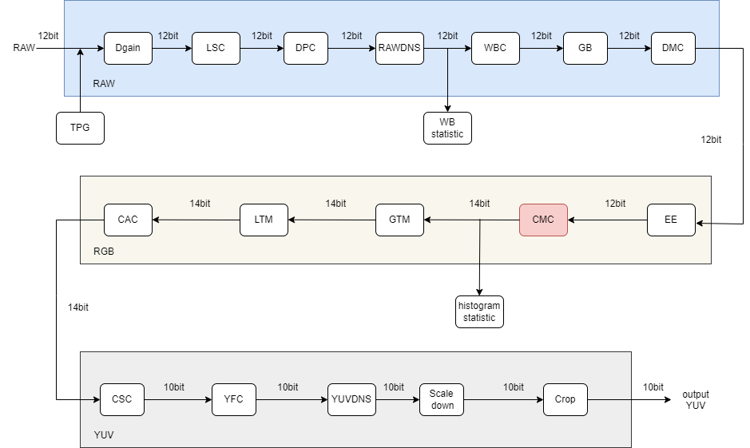
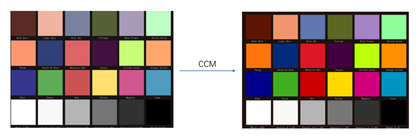
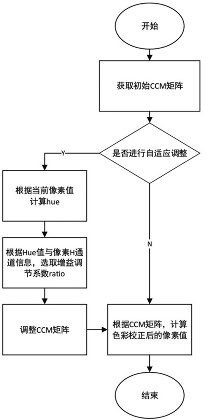

# CMC 模块

[TOC]

## 历史版本修订

| Revision | Date | Author | Description |
| -------- | ---- | ------ | ----------- |
| 0.1      | 2022.12.06 | Xiao Wanwei | origin      |

## 1.简介

### 1.1 算法需求及目的

该文档描述了CTL ISP架构中的颜色校正矩阵模块的算法。团队成员可以依据该文档理解相应代码，也可以依据设计细节自行实现。

### 1.2 定义与缩略词说明

| 定义 | 说明         |
| :--- | ------------ |
| CMC  | 颜色校正矩阵 |

## 2. 概述

这一模块通过 CCM（Color Correction Matrix）也就是色彩矫正矩阵对图像的色彩进行 校正，使得校正后的图像的效果更接近人眼的视觉感受。之所以需要进行色彩矫正，是由于 sensor 对光谱的响应与人眼对光谱的响应通常是有偏差的，这会导致人眼所看的场景色彩 与相机拍摄出的照片的色彩有偏差。也就是说对于同一个场景，相机拍摄出来的照片上场景 的色彩与人眼所看到的场景色彩有所不同，那么就需要通过对拍摄出来的照片进行颜色矫正， 使得最终的图片观感和人眼的观感尽可能一样。所以在 ISP 中通常会通过一个色彩矫正矩阵 CCM 校正光谱响应的交叉效应和响应强度，使 ISP 处理后的图片与人眼视觉在色彩上保持 一致。

### 2.1 CMC位置

## 3. CMC 算法及流程

### 3.1 CMC 算法及功能

在我们的xkISP中，颜色矫正的基本原理是用一个3×3的颜色矫正矩阵CCM对输入的图像像素值在RGB域进行变换，再加上一个偏执系数，映射得到一个新的像素值（R`,G`,B`）这里参考了[1],因此颜色矫正的关键就在于CCM矩阵的获得。
$$
\left[
 \begin{matrix}
   R^`\\
   G^`\\
   B^`
  \end{matrix}
  \right] =M*\left[
 \begin{matrix}
   R\\
   G\\
   B
  \end{matrix}
  \right]
$$

一般采用标定的3*4的CCM矩阵进行校正，其通过拍摄color checker24色板，将相机拍摄图片值与色板标准值之间对比，得出一组能将拍摄值矫正到最接近标准值的CCM矩阵

### 3.2 参数初始化（cmc_init）

#### 3.2.1 函数接口

| 参数     | 说明         |
| -------- | ------------ |
| topParam | ISP 顶层参数 |
| cmcParam | CMC 模块参数 |

#### 3.2.2 算法和函数

初始化所有参数值

### 3.3 DPC 顶层模块（isp_cmc）

#### 3.3.1 函数接口

| 参数     | 说明         |
| -------- | ------------ |
| topParam | ISP 顶层参数 |
| CMCParam | CMC模块参数  |
| srcData  | 输入数据     |
| dstData  | 输出数据     |

#### 3.3.2 算法和函数

该函数对输入图像执行颜色校正，并将结果存储在输出图像中。

我们的算法流程提供了一种色彩矩阵自适应的调整方法，整个计算过程如下：

对于自适应调整方法，首先根据当前像素的R,G,B三通道值计算出其对应的色度值也即Hue值（0<Hue<360）； 再根据计算出的当前像素对应的色度值所分布的区间选取不同的色彩增益调节系数HueRatio，根据当前像素的H通道记录的边缘信号强度选取色彩增益调节系数EdgeRatio；最后结合HueRatio和EdgeRatio对CCM矩阵增益进行调整。

接下来详细介绍算法自适应调整处理的细节部分。首先设置好默认的CCM矩阵，然后用当前像素RGB三个通道的值，计算出其色度值（Hue值），对于不同的Hue值所处区间，要选取相对应的预设的增益调节系数HueRatio；当Hue值位于色相区间边界HueRange时，根据设定的平滑间隔bandshift，计算色相渐变区间HueVanishBoundary，最后计算出HueRatio。
$$
HueVanishBoundary = HueRange - 2^{bandshift}\\
HueRatio = (Hue - HueVanishBoundary) * 2^{6-bandshift}
$$
最后就是用原像素[R G B]与更新后的矩阵相乘得到颜色矫正后的像素值 [R 'G' B ']。
$$
\left[
 \begin{matrix}
   R^`\\
   G^`\\
   B^`
  \end{matrix}
  \right] =M*\left[
 \begin{matrix}
   R\\
   G\\
   B
  \end{matrix}
  \right]
$$

### 3.4 CCM算法功能模块（RGB2H）

#### 3.4.1 函数接口

| 参数 | 说明        |
| ---- | ----------- |
| R    | R通道像素值 |
| G    | G通道像素值 |
| B    | B通道像素值 |

#### 3.4.2 算法和函数

该函数用于将RGB值转换为HSL颜色模型。该函数接受表示颜色的R、G和B值的三个整数，并返回表示色调的整数。色调的计算方法是找到最小和最大RGB值，并使用它们来确定基于R、G或B中哪一个等于最大值的色调。返回的色调值在0到360的范围内，其中0代表红色，色调随着它在色轮上的移动以60的增量增加。

### 3.5 CMC算法功能模块（_procCMCLine）

#### 3.5.1 函数接口

| 参数       | 说明           |
| ---------- | -------------- |
| frameWidth | 图像的宽度     |
| src        | 输入图像数据   |
| dst        | 输出图像数据   |
| blc        | 黑色水平校正值 |
| gain       | 图像增益值     |

#### 3.5.2 算法和函数

这是一种进行图像色彩校正的方法。该方法接收图像作为输入，并基于“CCM滤波器”算法进行校正。该方法处理图像的每一行，调整每个像素的红色、绿色和蓝色值，考虑色调和边缘信息。修正后的值存储在输出图像中。校正过程包括计算基于色调和边缘信息的比率，然后将该比率应用于每个像素的红色、绿色和蓝色值。修正还使用4x3矩阵来调整每个像素的值。该方法采用色调范围、边缘阈值和校正强度等控制参数来控制校正过程。

## 4. 参考文献

[1] Leon Lozhkin, and A.A. Soldatov. "Color Correction in Modern Color Reproduction Devices." Journal of Communications Technology and Electronics 63.4: 361-366,2018. 