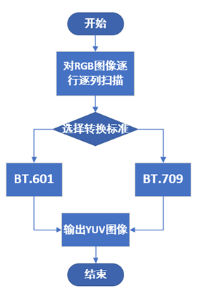

# CSC 模块

1. 简介

   1.1 需求及目的

   1.2 定义及缩略词说明

2. 概述

   2.1 CSC位置

   2.2 CSC参数及配置

3. CSC算法及流程

   3.1 参数初始化（csc_init）

   3.2 CSC参数传递函数（_rgb2yuvFrameStart）

   3.3 CSC顶层模块（isp_csc）

   3.4 CSC算法功能模块（_rgb2yuv）

   3.5 CSC算法功能模块（_rgb2yuvLineProc）

4. 参考文献

## 历史版本修订

| 版本 | 日期       | 修订人员 | 说明 |
| ---- | ---------- | -------- | ---- |
| 0.1  | 2022.11.08 | 魏宇恒      | 初稿 |
|      |            |          |      |
|      |            |          |      |

## 1. 简介

### 1.1 需求及目的

该文档描述了CTL ISP架构中的色彩空间转换模块的算法。团队成员可以依据该文档理解相应代码，也可以依据设计细节自行实现。

### 1.2 定义与缩略词说明

| 定义 | 说明         |
| ---- | ------------ |
| CSC  | 色彩空间转换 |
|      |              |
|      |              |
|      |              |
|      |              |

## 2. 概述

在我们的xkISP中，CSC 模块进行RGB色彩空间向YUV色彩空间的转换。RGB颜色空间到YUV颜色空间的转换标准[1]\[2]\[3]如下：

(1) BT.601标准——标清数字电视（SDTV)
$$
\begin{cases}
Y=0.299×R+0.587×G+0.114×B \\
U=Cb=0.564×(B-Y) \\
V=Cr=0.713×(R-Y)
\end{cases}\tag{2-1}
$$
(2) BT.709标准——高清数字电视（HDTV)
$$
\begin{cases}
Y=0.2126×R+0.7152×G+0.0722×B \\
U=Cb=0.539×(B-Y) \\
V=Cr=0.635×(R-Y)
\end{cases}\tag{2-2}
$$
(3) BT.2020标准——超高清数字电视（UHDTV)
$$
\begin{cases}
Y=0.2627×R+0.6780×G+0.0593×B \\
U=Cb=0.5315×(B-Y) \\
V=Cr=0.678×(R-Y)
\end{cases}\tag{2-3}
$$

### 2.1 CSC位置

图2-1 CSC模块在ISP流水线中的位置

### 2.2 CSC参数配置

| 参数     | 默认值 | Shadow | 说明                 |
| -------- | ------ | ------ | -------------------- |
| m_nEb    | 1      |        | CSC模块使能信号      |
| coef[12] | \      |        | 色彩空间转换公式参数 |
|          |        |        |                      |
|          |        |        |                      |
|          |        |        |                      |
|          |        |        |                      |
|          |        |        |                      |
|          |        |        |                      |
|          |        |        |                      |

## 3. CSC算法及流程

BGR图像转换为YUV图像，需要进行逐点转换，所以要对每个像素点进行扫描，在本模块中可供选择的标准为BT.601和BT.709。

- 顶层参数

| 参数        | 说明                                            |
| ----------- | ----------------------------------------------- |
| imgPattern  | bayer格式（通道0:r,通道1:Gr ,通道2:Gb,通道3:b） |
| frameWidth  | 图像的宽度                                      |
| frameHeight | 图像的高度                                      |
|             |                                                 |
|             |                                                 |
|             |                                                 |

### 3.1 CSC参数初始化（csc_init）

#### 3.1.1 函数接口

| 参数     | 说明        |
| -------- | ----------- |
| topParam | ISP顶层参数 |
| cscParam | CSC模块参数 |
|          |             |
|          |             |
|          |             |
|          |             |

#### 3.1.2 算法和函数

初始化所有参数值

### 3.2 CSC参数传递函数（_rgb2yuvFrameStart）

#### 3.2.1 函数接口

| 参数         | 说明         |
| ------------ | ------------ |
| topParam     | ISP顶层参数  |
| inParam      | 函数输入参数 |
| rgb2yuvParam | CSC模块参数  |
|              |              |
|              |              |
|              |              |

#### 3.2.2 算法和函数

用于参数传递功能

### 3.3 CSC顶层模块（isp_csc）

#### 3.3.1 函数接口

| 参数         | 说明        |
| ------------ | ----------- |
| topParam     | ISP顶层参数 |
| rgb2yuvParam | CSC模块参数 |
| srcData      | 输入数据    |
| dstData      | 输出数据    |
|              |             |
|              |             |

### 3.3.2 算法和函数

整个色彩空间转换算法流程可分为3个步骤：

- 步骤1：对RGB图像逐点扫描；
- 步骤2：选择转换标准进行转换；
- 步骤3：保存YUV图像。

图3-1  BGR2YUV流程图

### 3.4 CSC算法功能模块（_rgb2yuv）

#### 3.4.1 函数接口

| 参数 | 说明                 |
| ---- | -------------------- |
| src  | 输入数据             |
| dst  | 输出数据             |
| coef | 色彩空间转换公式参数 |
| data | 存储像素RGB和YUV数据 |
|      |                      |
|      |                      |
|      |                      |

#### 3.4.2 算法和函数

对单像素进行色彩空间转换处理

### 3.5 CSC算法功能模块（_rgb2yuvLineProc）

#### 3.5.1 函数接口

| 参数         | 说明             |
| ------------ | ---------------- |
| src          | 输入数据         |
| dst          | 输出数据         |
| srcPitch     | 输入图像宽度边界 |
| rgb2yuvParam | CSC模块参数      |
|              |                  |
|              |                  |
|              |                  |

#### 3.5.2 算法和函数

对图像按行执行色彩空间转换处理

图3-2 CSC效果

## 4. 参考文献

[1] Recommendation ITU-R BT.601-7 (03/2011), Studio encoding parameters of digital television for standard 4:3 and wide-screen 16:9 aspect ratios, BT Series Broadcasting service (television), Electronic Publication Geneva, 2015.

[2] Recommendation ITU-R BT.709-6 (06/2015), Parameter values for the HDTV standards for production and international programme exchange, BT Series Broadcasting service (television), Electronic Publication Geneva, 2015.
