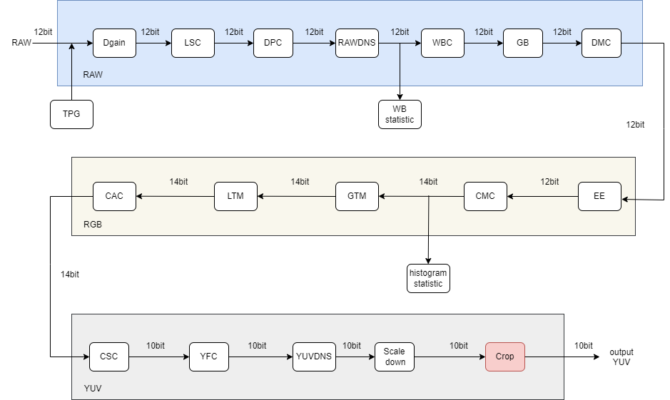
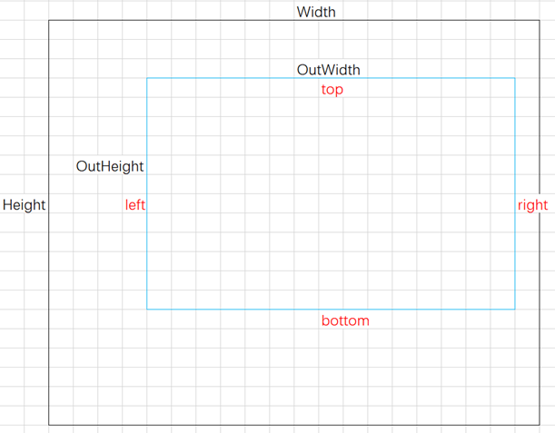
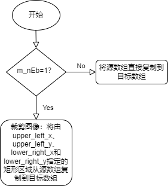

# Crop 模块

[TOC]

## 历史版本修订

| Revision | Date | Author | Description |
| -------- | ---- | ------ | ----------- |
| 0.1  | 2022.12.06 | 许珐      | 初稿 |

## 1.简介

### 1.1 算法需求及目的

该文档描述了CTL ISP架构中的图片裁剪模块的算法。团队成员可以依据该文档理解相应代码，也可以依据设计细节自行实现。

### 1.2 定义与缩略词说明

| 定义 | 说明     |
| :--- | -------- |
| Crop | 图片裁剪 |

## 2. 概述

图片裁剪（Crop）模块位于xkISP流水线最后一级，其作用是在处理完成的图像中裁剪出感兴趣区域，是ISP流水线中较为简单的一个模块。

### 2.1 Crop位置

## 3. Crop 模块算法及流程

### 3.1 Crop 模块算法及功能

图像裁剪的方式较为单一，将图像感兴趣区域的像素值保存到输出图像中，即可完成图像的裁剪。如图所示：With、Height表示原图像的宽度和高度，OutWidth、OutHeight表示裁剪后的图像宽度，top、bottom、left、right表示完成图像裁剪需要的信息。

算法流程图：

Crop算法效果展示：

### 3.2 参数初始化（crop_init）

#### 3.2.1 函数接口

| 参数      | 说明          |
| --------- | ------------- |
| topParam  | ISP 顶层参数  |
| cropParam | CROP 模块参数 |

#### 3.2.2 算法和函数

初始化所有参数值

### 3.3 Crop 顶层模块（isp_crop）

#### 3.3.1 函数接口

| 参数      | 说明          |
| --------- | ------------- |
| topParam  | ISP 顶层参数  |
| cropParam | Crop 模块参数 |
| srcData   | 输入数据      |
| dstData   | 输出数据      |

#### 3.3.2 算法和函数

该函数将源YUV图像数据和裁剪参数作为输入，并生成裁剪后的YUV图像数据。作物区域由作物矩形的左上和右下坐标定义。输入图像数据可以有两种不同的格式:完整的YUV格式或仅y格式。过滤器检查输入数据的格式，并相应地执行裁剪。如果m_nEb标志设置为0，则输出图像与输入图像相同。否则，将输入的Y/U/V数据复制到指定的裁剪区域，得到输出的Y/U/V数据。
