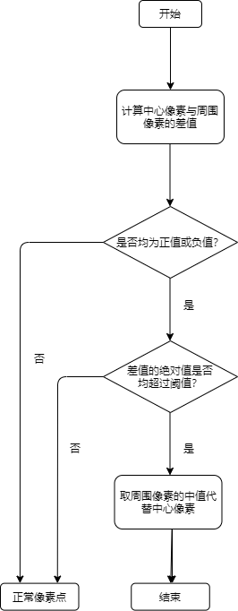

# DPC 模块

1. 简介

   1.1 需求及目的

   1.2 定义及缩略词说明

2. 概述

   2.1 DPC 位置

   2.2 DPC 参数及配置

3. DPC 算法及流程

   3.1 参数初始化（dpc_init）

   3.2 DPC 顶层模块（isp_dpc）

   3.3 DPC 算法功能模块（medianFilter）

   3.4 DPC 算法功能模块（defectPixelDetection）

   3.5 DPC 算法功能模块（GetRawWindow）

4. 参考文献

## 历史版本修订

| 版本 | 日期       | 修订人员 | 说明 |
| ---- | ---------- | -------- | ---- |
| 0.1  | 2022.10.14 | 柯弘博   | 初稿 |
|      |            |          |      |
|      |            |          |      |

## 1. 简介

### 1.1 需求及目的

该文档描述了 CTL ISP 架构中的坏点矫正模块的算法。团队成员可以依据该文档理解相应代码，也可以依据设计细节自行实现。

### 1.2 定义与缩略词说明

| 定义 | 说明     |
| ---- | -------- |
| DPC  | 坏点矫正 |
|      |          |
|      |          |
|      |          |
|      |          |

## 2. 概述

CMOS 镜头上对于外界光照失效而呈现为极亮或极暗的点，可分为坏点(Dead pixel)、粘滞点(Stuck Pixels)与亮点(Hot pixel)，前者是高度曝光下的暗像素点，中者是高度曝光下相同位置出现的彩色像素点，后者为极暗条件下产生的亮点。坏点矫正模块则是起到检测坏点并进行坏点校正的作用。

图2-1 图像坏点

### 2.1 DPC 位置

图2-2 DPC模块在ISP流水线中的位置

### 2.2 DPC 参数配置

| 参数        | 默认值 | Shadow | 说明                       |
| ----------- | ------ | ------ | -------------------------- |
| m_nEb       | 1      |        | DPC 模块使能信号           |
| threshold_w | 300    |        | 像素值之差的阈值上限绝对值 |
| threshold_b | 300    |        | 像素值之差的阈值下限绝对值 |
|             |        |        |                            |
|             |        |        |                            |
|             |        |        |                            |
|             |        |        |                            |
|             |        |        |                            |
|             |        |        |                            |

## 3. DPC 算法及流程

### PINTO 算法

主要思想是坏点往往是在一个邻域中的极亮或极暗点，如图 3-1 所示，以一个 5x5 的邻域为检测区域，判断为坏点后就用八个临近的像素值的中位值来替换当前的像素值。

图3-1 5x5的邻域检测区域

- 顶层参数

| 参数        | 说明                                                 |
| ----------- | ---------------------------------------------------- |
| imgPattern  | bayer 格式（通道 0:r,通道 1:Gr ,通道 2:Gb,通道 3:b） |
| frameWidth  | 图像的宽度                                           |
| frameHeight | 图像的高度                                           |
|             |                                                      |
|             |                                                      |
|             |                                                      |

### 3.1 参数初始化（dpc_init）

#### 3.1.1 函数接口

| 参数     | 说明         |
| -------- | ------------ |
| topParam | ISP 顶层参数 |
| dpcParam | DPC 模块参数 |
|          |              |
|          |              |
|          |              |
|          |              |

#### 3.1.2 算法和函数

初始化所有参数值

### 3.2 DPC 顶层模块（isp_dpc）

#### 3.2.1 函数接口

| 参数     | 说明         |
| -------- | ------------ |
| topParam | ISP 顶层参数 |
| dpcParam | DPC 模块参数 |
| srcData  | 输入数据     |
| dstData  | 输出数据     |
|          |              |
|          |              |

### 3.2.2 算法和函数

整个镜头坏点矫正算法流程可分为 5 个步骤：

- 步骤 1：计算中心像素与周围八个像素值的差；
- 步骤 2：判断八个差值是否都为正值或者都为负值；
- 步骤 3：如果有的为正有的为负，那么就为正常值，否则进行下一步；
- 步骤 4：设置一个阈值，如果八个差值的绝对值都查过阈值，那么就判断为坏点；
- 步骤 5：判断为坏点后就用八个临近的像素值的中位值来替换当前的像素值。

图3-2 DPC算法流程图

### 3.3 DPC 算法功能模块（medianFilter）

#### 3.3.1 函数接口

| 参数       | 说明                    |
| ---------- | ----------------------- |
| array_ori  | 输入 8 个临近像素值     |
| array_sort | 输出 8 个像素值的中位值 |
|            |                         |
|            |                         |
|            |                         |
|            |                         |
|            |                         |

#### 3.3.2 算法和函数

利用冒泡排序算法，寻找待检测中心像素点八个临近的像素值的中位值。

### 3.4 DPC 算法功能模块（defectPixelDetection）

#### 3.4.1 函数接口

| 参数         | 说明                       |
| ------------ | -------------------------- |
| array_ori[8] | 输入 8 个临近像素值        |
| pixel        | 待检测中心像素点的像素值   |
| th_w         | 像素值之差的阈值上限绝对值 |
| th_b         | 像素值之差的阈值下限绝对值 |
|              |                            |
|              |                            |
|              |                            |

#### 3.4.2 算法和函数

设置一个阈值，计算中心像素与周围八个像素值的差，判断八个差值是否都为正值或者都为负值；如果八个差值的绝对值都查过阈值，那么就判断为坏点。

### 3.5 DPC 算法功能模块（GetRawWindow）

#### 3.5.1 函数接口

| 参数             | 说明                 |
| ---------------- | -------------------- |
| srcData          | 输入数据             |
| (\*rawWindow)[5] | 5x5 的邻域为检测区域 |
| row              | 窗口的行数           |
| col              | 窗口的列数           |
| stride           | 间隔步长             |
|                  |                      |
|                  |                      |

#### 3.5.2 算法和函数

扫描图像获取窗口数据。

图3-3 DPC效果

## 4. 参考文献

[1] Jenny Leung, Jozsef Dudas, Glenn H. Chapman, Israel Koren and Zahava Koren. Quantitative Analysis of In-Field Defects in Image Sensor Arrays[C]// Defect and Fault-Tolerance in VLSI Systems, 2007. DFT '07. 22nd IEEE International Symposium on. IEEE, 2007.
