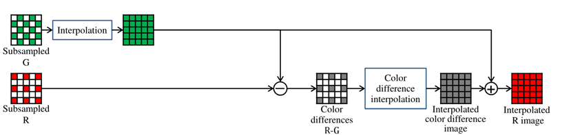
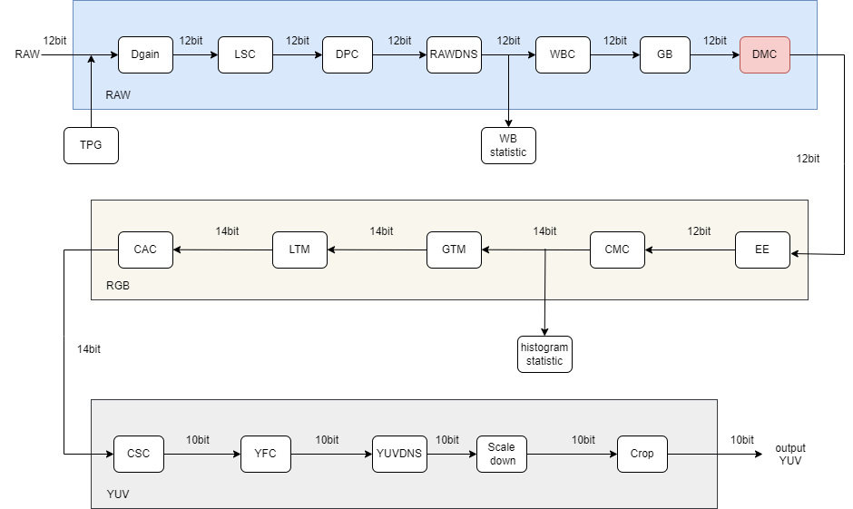
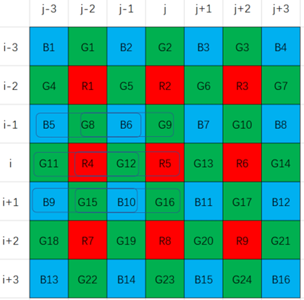

# Demosaic 模块

[TOC]

## 历史版本修订

| Revision | Date       | Author     | Description |
| -------- | ---------- | ---------- | ----------- |
|          | 2022.12.06 | Liu Jiarui | Origin      |

## 1.简介

### 1.1 模块需求及目的

该文档描述了CTL ISP架构中的去马赛克模块的算法。团队成员可以依据该文档理解相应代码，也可以依据设计细节自行实现。

### 1.2 定义与缩略词说明

| 定义     | 说明     |
| :------- | -------- |
| Demosaic | 去马赛克 |

## 2. 概述

整体算法结构为基于色差的去马赛克，算法整体框架如下所示：整体结构为先计算G通道插值，再计算色差值（R-G或B-G），对色差值进行插值，恢复RB通道像素值。

### 2.1 Demosaic位置

## 3. Demosaic 模块算法及流程

### 3.1 Demosaic 算法

插值方向判断：

计算色度分量（R或B）位置的水平和垂直方向梯度，用以判断边缘方向。
$$
\begin{aligned}
& \left\{\begin{aligned}
\Delta H_{m, n}^R= & \left|R_{m, n-2}+R_{m, n+2}-2 \times R_{m, n}\right| \\
& +\left|G_{m, n-1}-G_{m, n+1}\right| \\
\Delta V_{m, n}^R= & \left|R_{m-2, n}+R_{m+2, n}-2 \times R_{m, n}\right| \\
& +\left|G_{m-1, n}-G_{m+1, n}\right|
\end{aligned}\right. \\
& \left\{\begin{aligned}
\Delta H_{m, n}^B= & \left|B_{m, n-2}+B_{m, n+2}-2 \times B_{m, n}\right| \\
& +\left|G_{m, n-1}-G_{m, n+1}\right| \\
\Delta V_{m, n}^B= & \left|B_{m-2, n}+B_{m+2, n}-2 \times B_{m, n}\right| \\
& +\left|G_{m-1, n}-G_{m+1, n}\right|
\end{aligned}\right. \\
&
\end{aligned}
$$
根据梯度大小确定边缘方向，flag = 1，垂直方向边缘；flag = 0，水平方向边缘。
$$
\begin{cases}\text { flag }_{m, n}^X=1, & \text { if } \Delta H_{m, n}^X>\Delta V_{m, n}^X \\ \text { flag }_{m, n}^X=0, & \text { if } \Delta H_{m, n}^X \leq \Delta V_{m, n}^X\end{cases}
$$
投票策略：

sum >= 4, 主导插值方向为垂直方向。

sum <= 1, 主导插值方向为水平方向。

其他，不边缘区域（平滑区域）。
$$
f_{l a g_{s u m}}=\sum_{m, n} f l a g_{m, n}^X
$$
G插值：

利用相邻像素之间的光谱相关性，估计4个方向的处于R5位置的G。
$$
\left\{\begin{array}{l}
\widetilde{G}_5^N=G_9+0.5 \times\left(R_5-R_2\right) \\
\widetilde{G}_5^S=G_{16}+0.5 \times\left(R_5-R_8\right) \\
\widetilde{G}_5^W=G_{12}+0.5 \times\left(R_5-R_4\right) \\
\widetilde{G}_5^E=G_{13}+0.5 \times\left(R_5-R_6\right)
\end{array}\right.
$$
计算四个方向梯度。
$$
\left\{\begin{array}{c}
\nabla^N=\left|G_5-G_{12}\right|+\left|G_2-G_9\right|+\left|G_6-G_{13}\right| \\
\quad+\left|B_2-B_6\right|+\left|B_3-B_7\right|+\left|R_2-R_5\right|+\varepsilon \\
\nabla^S=\left|G_{12}-G_{19}\right|+\left|G_{13}-G_{20}\right|+\left|G_{16}-G_{23}\right| \\
\quad+\left|B_{10}-B_{14}\right|+\left|B_{11}-B_{15}\right|+\left|R_5-R_8\right|+\varepsilon \\
\nabla^W=\left|G_8-G_9\right|+\left|G_{11}-G_{12}\right|+\left|G_{15}-G_{16}\right| \\
\quad+\left|B_5-B_6\right|+\left|B_9-B_{10}\right|+\left|R_4-R_5\right|+\varepsilon \\
\nabla^E=\left|G_9-G_{10}\right|+\left|G_{13}-G_{14}\right|+\left|G_{16}-G_{17}\right| \\
\quad+\left|B_7-B_8\right|+\left|B_{11}-B_{12}\right|+\left|R_5-R_6\right|+\varepsilon
\end{array}\right.
$$
根据梯度计算权重值。
$$
w^N=\frac{1}{\nabla^N}, \quad w^S=\frac{1}{\nabla^S}, \quad w^W=\frac{1}{\nabla^W}, \quad w^E=\frac{1}{\nabla^E} 
$$
根据插值方向决定插值策略。水平方向插值，垂直方向插值，平滑区域插值。
$$
\begin{gathered}
\widetilde{G}_5=\frac{\widetilde{G}_5^W \times w^W+\widetilde{G}_5^E \times w^E}{w^W+w^E} \\
\widetilde{G}_5=\frac{\widetilde{G}_5^N \times w^N+\widetilde{G}_5^S \times w^S}{w^N+w^S} \\
\widetilde{G}_5=\frac{\widetilde{G}_5^N \times w^N+\widetilde{G}_5^S \times w^S+\widetilde{G}_5^W \times w^W+\widetilde{G}_5^E \times w^E}{w^N+w^S+w^W+w^E}
\end{gathered}
$$
G通道增强：
$$
\begin{gathered}
\left\{\begin{array}{l}
d^N=\left|G_9-\widetilde{G}_5\right|+\left|R_2-R_5\right|+\varepsilon \\
d^S=\left|G_{16}-\widetilde{G}_5\right|+\left|R_8-R_5\right|+\varepsilon \\
d^W=\left|G_{12}-\widetilde{G}_5\right|+\left|R_4-R_5\right|+\varepsilon \\
d^E=\left|G_{13}-\widetilde{G}_5\right|+\left|R_6-R_5\right|+\varepsilon
\end{array}\right. \\
w_d^N=\frac{1}{d^N}, \quad w_d^S=\frac{1}{d^S}, \quad w_d^W=\frac{1}{d^W}, \quad w_d^E=\frac{1}{d^E}
\end{gathered}
$$
根据插值方向决定G pixel增强策略。水平方向插值，垂直方向插值，平滑区域插值。
$$
\begin{aligned}
\widetilde{G}_5^e & =R_5+\frac{\left(G_{12}-R_5\right) \times w_d^W+\left(G_{13}-R_5\right) \times w_d^E}{2 \times\left(w_d^W+w_d^E\right)} \\
& +0.5 \times\left(\widetilde{G}_5-R_5\right) . \\
\widetilde{G}_5^e & =R_5+\frac{\left(G_9-R_5\right) \times w_d^N+\left(G_{16}-R_5\right) \times w_d^S}{2 \times\left(w_d^N+w_d^S\right)} \\
& +0.5 \times\left(\widetilde{G}_5-R_5\right) . \\
\widetilde{G}_5^e & =R_5+\frac{\Psi}{2 \times\left(w_d^W+w_d^E+w_d^N+w_d^S\right)}+0.5 \times\left(\widetilde{G}_5-R_5\right)
\end{aligned}
$$
$$
\begin{aligned}
\Psi & =\left(G_{12}-R_5\right) \times w_d^W+\left(G_{13}-R_5\right) \times w_d^E \\
& +\left(G_9-R_5\right) \times w_d^N+\left(G_{16}-R_5\right) \times w_d^S
\end{aligned}
$$
RB通道插值：

RB通道对色差值使用双线性插值。
$$
\begin{aligned}
&\left\{\begin{array}{c}
D^{R G}=R-G \\
D^{B G}=B-G
\end{array}\right.\\
&\left\{\begin{array}{c}
R=G+D^{R G} \\
B=G+D^{B G}
\end{array}\right.
\end{aligned}
$$

Demosaic 模块流程：

核心为_vdi_g_inter函数，包含初始g插值和g增强模块。

顶层参数：

| 名称          | 说明                                 |
| ------------- | ------------------------------------ |
| eb            | 使能信号，是否开启去马赛克           |
| frameWidth    | 图像宽度                             |
| frameHeight   | 图像高度                             |
| m_nCFAPattern | bayer 模式                           |
| g_enhance_eb  | g通道增强使能信号，是否开启g通道增强 |
| cal_h_eb      | h通道使能信号，是否计算图像高频信息  |

Demosaic效果展示：

### 3.2 参数初始化（**demosaic_init**)

#### 3.2.1 函数接口

| 参数          | 说明              |
| ------------- | ----------------- |
| topParam      | ISP 顶层参数      |
| demosaicParam | demosaic 模块参数 |

#### 3.2.2 算法和函数

初始化所有参数值

### 3.3 DEMOSAIC顶层模块（isp_demosaic）

#### 3.3.1 函数接口

| 参数          | 说明             |
| ------------- | ---------------- |
| topParam      | ISP 顶层参数     |
| demosaicParam | demosaic模块参数 |
| srcData       | 输入数据         |
| dstData       | 输出数据         |

### 3.3.2 算法和函数

该函数实现了图像的颜色插值处理，用于从图像传感器获取的图像数据中提取颜色信息。

### 3.4 DEMOSAIC算法功能模块（**GetRawWindow_3**)

#### 3.4.1 函数接口

| 参数             | 说明                 |
| ---------------- | -------------------- |
| srcData          | 原始图像数据         |
| rawWindow[3] [3] | 3*3窗口的图像数据    |
| row              | 正在处理图像的当前行 |
| col              | 正在处理图像的当前列 |
| stride           | 图像数据的步幅       |

#### 3.4.2 算法和函数

该函数从源数据中提取一个3x3像素值窗口，并将其存储在“rawWindow”数组中。

### 3.5 DEMOSAIC算法功能模块（**GetRawWindow_5**)

#### 3.5.1 函数接口

| 参数             | 说明              |
| ---------------- | ----------------- |
| srcData          | 原始图像数据      |
| rawWindow[5] [5] | 5*5窗口的图像数据 |
| row              | 窗口中心的行数    |
| col              | 窗口中心的列数    |
| stride           | 图像数据的步幅    |

#### 3.5.2 算法和函数

1. 使用两个循环遍历窗口的每一个位置
2. 将每个位置的像素值复制到rawWindow数组中。

### 3.6 DEMOSAIC算法功能模块（**GetRawWindow_7**)

#### 3.6.1 函数接口

| 参数            | 说明              |
| --------------- | ----------------- |
| srcData         | 原始图像数据      |
| (*rawWindow)[7] | 7*7窗口的图像数据 |
| row             | 窗口中心的行数    |
| col             | 窗口中心的列数    |
| stride          | 图像数据的步幅    |

#### 3.6.2 算法和函数

1. 使用两个循环遍历窗口的每一个位置
2. 将每个位置的像素值复制到rawWindow数组中。

### 3.7 DEMOSAIC算法功能模块（**_cal_grade**)

#### 3.7.1 函数接口

| 参数            | 说明                             |
| --------------- | -------------------------------- |
| direction_flag  | 表示边缘的方向（0-水平，1-垂直） |
| ct_y            | 指定窗口中中心像素的纵坐标       |
| ct_x            | 指定窗口中中心像素的横坐标       |
| (*rawWindow)[7] | 7*7窗口的图像数据                |

#### 3.7.2 算法和函数

该函数返回一个整数grade_t，它是计算出的边缘等级。边缘等级计算为中心像素在指定方向上相对两侧的两个像素的平均值与中心像素值的两倍之间的绝对差之和，以及在指定方向上与中心像素相邻的两个像素之间的绝对差之和。

### 3.8 DEMOSAIC算法功能模块（**_cal_volting_result**)

#### 3.8.1 函数接口

| 参数            | 说明               |
| --------------- | ------------------ |
| (*rawWindow)[7] | 7*7窗口的图像数据  |
| ct              | 计算目标像素的位置 |

#### 3.8.2 算法和函数

该函数是一个用于计算投票结果的函数。函数通过调用另一个函数 _cal_grade，计算出原始窗口中 R5、B6、B7、B10、B11 等多个位置的横向和纵向评分。然后计算它们的差值，并统计所有差值大于零的数的个数。该数字将作为投票的结果返回，其表示该窗口中被认为具有最高可能性的边缘方向数量。

### 3.9 DEMOSAIC算法功能模块（**_vdi_g_inter**)

#### 3.9.1 函数接口

| 参数            | 说明                 |
| --------------- | -------------------- |
| (*rawWindow)[7] | 7*7窗口的图像数据    |
| ct              | 计算目标像素的位置   |
| voting          | 用于选择最终的像素值 |
| g_enhance_eb    | 绿色增强参数         |

#### 3.9.2 算法和函数

该函数用于去除由拜耳模式图像传感器捕获的图像。拜耳模式是应用于图像传感器的马赛克滤波器阵列，以较低分辨率对图像的颜色信息进行采样。去马赛克的目标是估计缺失的颜色信息并生成全彩图像。

函数_vdi_g_inter接受一个7x7的rawWindow数组作为输入，该数组包含当前像素周围的一个小窗口的原始像素值、当前像素位置ct、投票参数和绿色增强参数。然后计算当前像素(位置ct)缺失的绿色(G)像素值，方法是从它的四个相邻像素(北，南，东，西)插值G值。

它根据周围像素的原始值的差值和每个方向的权重，通过将等级除以它们的和来计算四个方向的等级。然后，通过对四个方向上的每个绿色值进行加权平均来估计绿色像素值。最后的绿色像素值也可以基于绿色增强参数进行增强。

### 3.10 DEMOSAIC算法功能模块（**_vdi_rb_inter**)

#### 3.10.1 函数接口

| 参数            | 说明                       |
| --------------- | -------------------------- |
| (*rawWindow)[5] | 存储相机原始数据的二维数组 |
| (*gWindow)[5]   | 存储灰度数据的二维数组     |
| ct              | 目标像素的中心位置         |
| flag            | 计算方式的选择             |

#### 3.10.2 算法和函数

函数通过计算`M1`和`M2`的值，并使用这些值计算`rb_pixel`的值。`flag`的值决定了计算方式。如果`flag`的值为0，则使用第一种计算方式；如果`flag`的值为1，则使用第二种计算方式；如果`flag`的值为2，则使用第三种计算方式。最终，函数返回计算得到的`rb_pixel`值，该值代表一个颜色分量（红或蓝）的数值。

