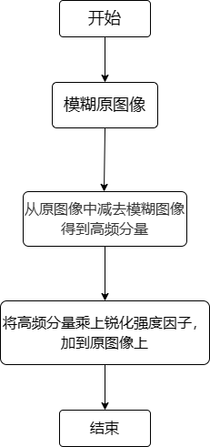

# EE 模块

1. 简介

   1.1 需求及目的

   1.2 定义及缩略词说明

2. 概述

   2.1 EE 位置

   2.2 EE 参数及配置

3. EE 算法及流程

   3.1 参数初始化（ee_init）

   3.2 EE 顶层模块（isp_edge_enhancement）

   3.3 EE 窗口获取函数（get_block）

   3.4 EE 图像拷贝函数（copydata）

   3.5 EE 算法运行（ee_process）

4. 参考文献

## 历史版本修订

| 版本 | 日期       | 修订人员 | 说明 |
| ---- | ---------- | -------- | ---- |
| 0.1  | 2022.10.17 | 柯弘博   | 初稿 |
|      |            |          |      |
|      |            |          |      |

## 1. 简介

### 1.1 需求及目的

该文档描述了 CTL ISP 架构中的边缘增强模块的算法。团队成员可以依据该文档理解相应代码，也可以依据设计细节自行实现。

### 1.2 定义与缩略词说明

| 定义 | 说明     |
| ---- | -------- |
| EE   | 边缘增强 |
|      |          |
|      |          |
|      |          |
|      |          |

## 2. 概述

在 ISP 流水线中经过去噪等模块处理的图像经常出现模糊的视觉效应，使用锐化模块可以达到增强图像中细节和边缘的目的。本锐化模块处于 Demosaic 之后，是在图像 RGB 域进行的锐化。

图2-1 图像锐化

### 2.1 EE 位置

图2-2 EE模块在ISP流水线中的位置

### 2.2 EE 参数配置

| 参数     | 默认值 | Shadow | 说明            |
| -------- | ------ | ------ | --------------- |
| eb       | 1      |        | EE 模块使能信号 |
| win_size | 5      |        | 窗口尺寸        |
| ee_coeff | 3      |        | 滤波器参数      |
|          |        |        |                 |
|          |        |        |                 |
|          |        |        |                 |
|          |        |        |                 |
|          |        |        |                 |
|          |        |        |                 |

## 3. EE 算法及流程

### USM 算法

由于图像中的细节和边缘在频域中主要体现为尖锐程度较高的高频段上，因此锐化基本思想就是增强图像分离产生高频分量在像素值中的比重。如表达式 3-1 式所示：

$$
y'=y+k\times HighFeq \tag{3-1}
$$

上式中 y'和 y 分别代表同位置进行锐化前后的像素值,k 代表锐化强度因子，k 值越大则锐化程度越强，HighFeq 为待锐化的高频分量。

- 顶层参数

| 参数        | 说明       |
| ----------- | ---------- |
| frameWidth  | 图像的宽度 |
| frameHeight | 图像的高度 |
|             |            |
|             |            |
|             |            |
|             |            |

### 3.1 参数初始化（ee_init）

#### 3.1.1 函数接口

| 参数 | 说明         |
| ---- | ------------ |
| t1   | ISP 顶层参数 |
| t2   | EE 模块参数  |
|      |              |
|      |              |
|      |              |
|      |              |

#### 3.1.2 算法和函数

初始化所有参数

### 3.2 EE 顶层模块（isp_edge_enhancement）

#### 3.2.1 函数接口

| 参数    | 说明         |
| ------- | ------------ |
| isp_top | ISP 顶层参数 |
| ee_reg  | EE 模块参数  |
| src     | 输入数据     |
| dst     | 输出数据     |
|         |              |
|         |              |

### 3.2.2 算法和函数

整个边缘增强算法流程可分为 3 个步骤：（流程图添加）

- 步骤 1：模糊原图像；
- 步骤 2：从原图像中减去模糊图像得到高频分量；
- 步骤 3：将高频分量乘上锐化强度因子，加到原图像上。

图3-2 EE算法流程图

### 3.3 EE 窗口获取函数（get_block）

#### 3.3.1 函数接口

| 参数         | 说明               |
| ------------ | ------------------ |
| src_in       | 函数输入参数       |
| block[5] [5] | 图像滤波 5\*5 窗口 |
| isp_top      | ISP 顶层参数       |
| ee_reg       | EE 模块参数        |
| cur_y        | 窗口行数           |
| cur_x        | 窗口列数           |

#### 3.3.2 算法和函数

在图像中读取 5\*5 大小的窗口，为下一步算法做准备

### 3.4 EE 图像拷贝函数（copydata）

#### 3.4.1 函数接口

| 参数    | 说明         |
| ------- | ------------ |
| isp_top | ISP 顶层参数 |
| src     | 输入图像     |
| dst     | 输出图像     |
|         |              |
|         |              |
|         |              |

#### 3.4.2 算法和函数

对全图数据进行拷贝

### 3.5 EE 算法运行（ee_process）

#### 3.5.1 函数接口

| 参数         | 说明               |
| ------------ | ------------------ |
| block[5] [5] | 图像滤波 5\*5 窗口 |
| isp_top      | ISP 顶层参数       |
| ee_reg       | EE 模块参数        |
| cur_y        | 窗口行数           |
| cur_x        | 窗口列数           |
|              |                    |

#### 3.5.2 算法和函数

模糊图像的方法采用以待滤波位置为中心自定义阈值的 5\*5 范围高斯滤波，系数如图 3-3 所示：

图3-3 5*5范围内的高斯滤波

高频分量 HighFreq 利用图像原始像素值减去高斯滤波后的模糊图像像素得到。

图3-4 边缘增强效果

## 4. 参考文献

[1] 冈萨雷斯.数字图像处理: 第三版[TN].北京：电子工业出版社，2011
