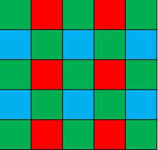
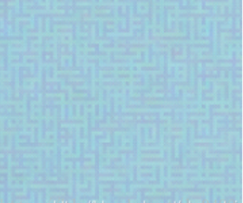
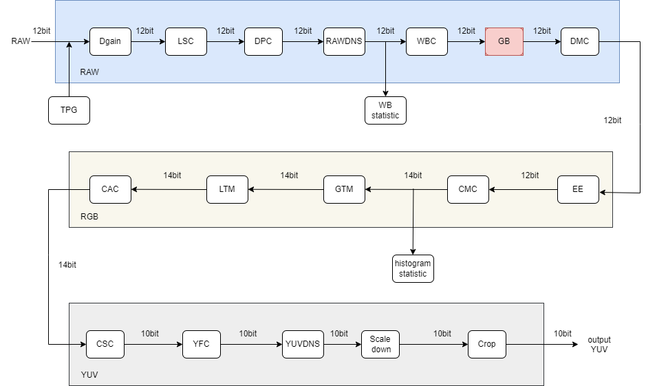
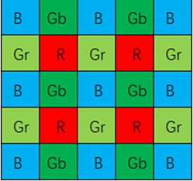
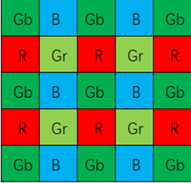
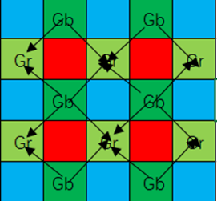
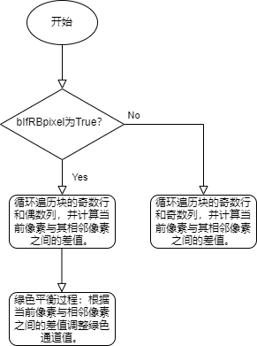

# GB 模块

[TOC]

## 历史版本修订

| Revision | Date | Author | Description |
| -------- | ---- | ------ | ----------- |
|          | 2022.12.06   | Ke Hongbo| Origin      |

## 1. 简介

### 1.1 模块需求及目的

该文档描述了CTL ISP架构中的自动绿平衡模块的算法。团队成员可以依据该文档理解相应代码，也可以依据设计细节自行实现。

## 1.2 定义与缩略词说明

| 定义 | 说明   |
| ---- | ------ |
| GB   | 绿平衡 |

## 2. 概述

绿平衡模块在ISP流水线中通常处于去马赛克模块之前，目的是为了消除Gr和Gb模块不同产生的通道亮度过大差异，进而导致“迷宫格子”效应的产生。绿平衡前后图像的视觉效果如下图所示:

 

正常的Bayer格子,Gr/Gb间无工艺偏差        图像相邻区域色彩均匀,无迷宫格子现象

由于制造工艺产生的Gr/Gb间亮度偏差                     图像出现迷宫格子现象

### 2.1 GB位置

### 2.2 GB 参数说明

| 参数              | 默认值 | Shadow | 说明                           |
| ----------------- | ------ | ------ | ------------------------------ |
| gb_top.eb         | 1      |        | GB模块的使能信号               |
| gb_local.low_num  | 4      |        | 一个block中Gb和Gr对的最小数目  |
| gb_local.high_num | 20     |        | 一个block中Gb和Gr对的最大数目  |
| gb_local.thre     | 683    |        | 相邻Gb和Gr之间色度差的最大阈值 |

## 3. GB 模块算法及流程

### 3.1 GB 模块算法及功能

解决迷宫格子现象的思路是均衡Gr和Gb通道之间的亮度差异。对于Raw格式图像中的R/Gr像素，需要减去其与邻近区域中Gb均值的差异；对于B/Gb像素同理，如下图实例所示:

​               中心点色度类型为Gr                                 中心点色度类型为R

​                中心点色度类型为B                                    中心点色度类型为Gb

如上面第一行图片所示，当中心点色度类型为Gr/R色度时，其位置像素值需要减去5*5区域内所有位置邻近Gr/Gb对的差异均值，如下式所示（式中Gr’、Gr分别代表同一位置进行绿平衡处理前后的像素值）:

$R'=R-\frac{Mean(Gr-Gb)}{2}$   $Gr'=Gr-\frac{Mean(Gr-Gb)}{2}$  

以中心点色度类型R为例（Gr同理），以其为中心5*5区域内的Gr/Gb差异对均值计算如下图所示。观察图像可知，实质就是图中各Gr位置与其对角位置的Gb色度计算差异后再取均值。

当中心点色度类型为Gb/B色度时，其位置像素值需要减去5*5区域内所有位置邻近Gr/Gb对的差异均值，如下式所示:

$B'=B-\frac{Mean(Gb-Gr)}{2}$  $Gb'=Gb-\frac{Mean(Gb-Gr)}{2}$

以中心点色度类型B为例（Gb同理），以其为中心5*5区域内的Gr/Gb差异对均值计算如下图所示。观察图像可知，实质就是各Gb位置与其对角位置的Gr计算差异后取均值。

顶层参数初始化：

| 参数名              | 默认值 | 说明               |
| ------------------- | ------ | ------------------ |
| isp_top.frameHeight | 1088   | 图像高度           |
| isp_top.frameWidth  | 1928   | 图像宽度           |
| isp_top.imgPattern  | 3      | bayer的模式        |
| gb_top.win_size     | 7      | 每个像素窗口的尺寸 |

算法流程图：

### 3.2 参数初始化（**gb_init**)

#### 3.2.1 函数接口

| 参数    | 说明         |
| ------- | ------------ |
| isp_top | ISP 顶层参数 |
| gb_top  | gb模块参数   |

#### 3.2.2 算法和函数

初始化所有参数值

### 3.3 GB顶层模块（isp_greenbalance）

#### 3.3.1 函数接口

| 参数    | 说明         |
| ------- | ------------ |
| isp_top | ISP 顶层参数 |
| gb_top  | gb模块参数   |
| src_in  | 输入数据     |
| dst_out | 输出数据     |

#### 3.3.2 算法和函数

该函数首先检查绿色平衡特性是否已启用。如果启用，它将初始化局部变量并将输出数组设置为输入数组。然后，它对图像进行分块处理，其中每个分块为7x7像素。该函数使用名为“get_block”的函数提取当前块，然后对每个块执行“gb_process”以获得输出像素值。最后，该函数返回一个布尔值，表示流程是否成功。如果绿色平衡特性未启用，该函数将使用"copydata"函数将输入数组复制到输出数组。

### 3.4 GB功能模块（get_block）

#### 3.4.1 函数接口

| 参数         | 说明                            |
| ------------ | ------------------------------- |
| src_in       | 输入数据                        |
| block[7] [7] | 存储从输入数据中提取的7x7的窗口 |
| isp_top      | ISP 顶层参数                    |
| gb_top       | gb模块参数                      |
| cur_y        | 当前点的纵坐标                  |
| cur_x        | 当前点的横坐标                  |

#### 3.4.2 算法和函数

该函数用于获取窗口像素。从输入的源图像数组src_in中获取一个以当前坐标(cur_x, cur_y)为中心的7*7的窗口块。这个窗口块存储在block数组中。函数还使用了两个结构体参数：isp_top和gb_top。最后，函数返回一个布尔值表示操作是否成功。

### 3.5 GB功能模块（gb_process）

#### 3.5.1 函数接口

| 参数         | 说明                                    |
| ------------ | --------------------------------------- |
| block[7] [7] | 输入数据                                |
| top          | 输入数据                                |
| gb_top       | ISP 顶层参数                            |
| local        | gb模块参数                              |
| cur_y        | 当前点的纵坐标                          |
| cur_x        | 当前点的横坐标                          |
| bIfRBpixel   | 指示它是红/蓝(RB)像素还是绿色像素的标志 |
| Gfifo[6]     | 用作fifo(先进先出)的数组                |
| countfifo[6] | 用作fifo(先进先出)的数组                |

#### 3.5.2 算法和函数

该函数用于对窗口内像素完成绿平衡计算。处理图像中的7x7像素块，并计算绿色平衡统计信息。根据块是否为Red and Blue (RB)像素，对其进行不同的处理。对于RB像素，计算当前像素与其两个对角线邻居之间的差值，如果绝对差值小于阈值，则将其添加到总和中。对于非rb像素，计算当前像素与其四个对角线邻居之间的差值，如果绝对差值小于阈值，则将其添加到总和中。计算总和以及在总和中使用的像素差总数，并用于更新绿色平衡统计信息。

### 3.6 GB功能模块（copydata）

#### 3.6.1 函数接口

| 参数    | 说明         |
| ------- | ------------ |
| isp_top | ISP 顶层参数 |
| src_in  | 输入数据     |
| dst_out | 输出数据     |

#### 3.6.2 算法和函数

该函数的功能是当类`GreenBalance`的某个变量被禁用时，通过复制将原始数据写入输出数组`dst_out`。该函数使用`memcpy`函数复制内存。函数返回一个布尔型变量，表示执行状态。
