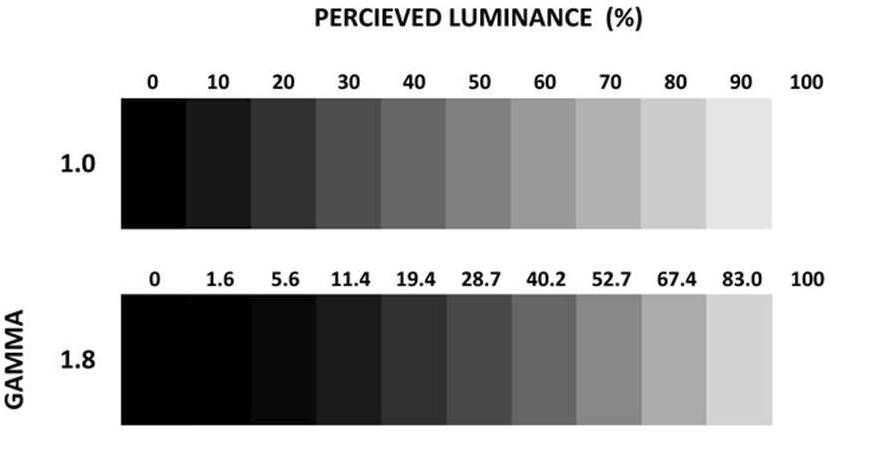
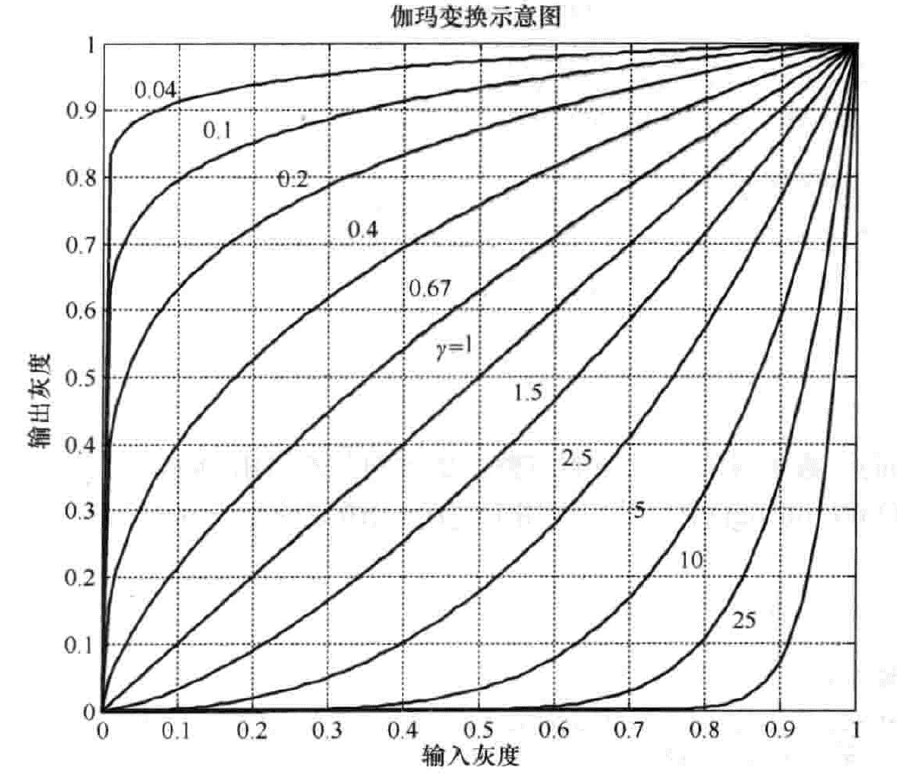
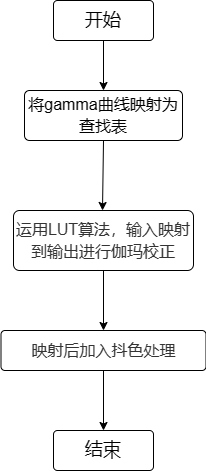
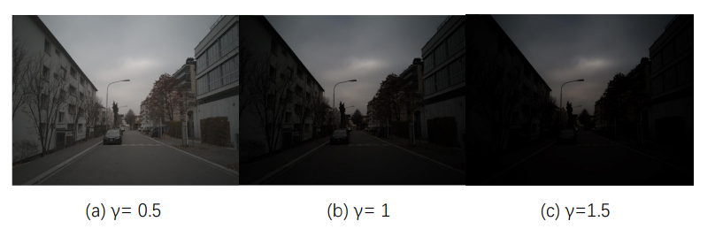

# GTM模块

1. 简介

   1.1 需求及目的

   1.2 定义及缩略词说明

2. 概述

   2.1 GTM位置

   2.2 GTM参数及配置

3. GTM算法及流程

   3.1 参数初始化（gtm_init）

   3.2 GTM参数传递函数（_gtmFrameStart）

   3.3 GTM顶层模块（isp_gtm）

   3.4 GTM算法运行（globalToneMapping）

   3.5 GTM算法运行（_gtmLineProc）

4. 参考文献


## 历史版本修订

| 版本 | 日期       | 修订人员 | 说明 |
| ---- | ---------- | -------- | ---- |
| 0.1  | 2022.10.14 | 肖万伟    | 初稿 |
|      |            |          |      |
|      |            |          |      |

## 1. 简介

### 1.1 需求及目的

该文档描述了CTL ISP架构中的伽玛校正模块的算法。团队成员可以依据该文档理解相应代码，也可以依据设计细节自行实现。

### 1.2 定义与缩略词说明

| 定义 | 说明     |
| ---- | -------- |
| GTM  | 伽玛校正 |
|      |          |
|      |          |
|      |          |
|      |          |

## 2. 概述

由于人眼对自然亮度感知是非线性的，并且用来记录/展示画面的媒介上，动态范围和灰阶预算是有限的。为了在灰阶预算有限的前提下，协调自然亮度和主观灰阶感受这二者的映射关系，伽玛就产生了。



<center>图2-1 不同伽玛值下的灰度图</center>

### 2.1 GTM位置


<center>图2-2 GTM模块在ISP流水线中的位置</center>

### 2.2 GTM参数配置

| 参数               | 默认值 | Shadow | 说明                  |
| ------------------ | ------ | ------ | --------------------- |
| eb                 | 1      |        | GTM模块使能信号       |
| m_bDitheringEnable | 1      |        | 抖色模块使能信号      |
| gtmTab[129];       | /      |        | gamma曲线映射的查找表 |
|                    |        |        |                       |
|                    |        |        |                       |
|                    |        |        |                       |
|                    |        |        |                       |
|                    |        |        |                       |
|                    |        |        |                       |

## 3. GTM算法及流程

在我们的xkISP中GTM模块使用伽玛曲线进行校正，主要在RGB彩色空间进行校正，校正公式如下：
$$
y=(x+esp)^γ \tag{3-1}
$$
上式中, x与y分别为输入、输出图像的灰度值，esp为补偿系数，γ即为伽玛系数。伽玛变换可以根据不同取值选择性地增强低灰度区域的对比度或是高灰度区域的对比度。γ是图像灰度校正中非常重要的一个参数，其取值决定了输入图像和输出图像之间的灰度映射方式，即决定了是增强低灰度区域(图像中的较暗处)还是增强高灰度区域(图像中的较亮处)。



<center>图3-1 0~1范围上的伽玛变换示意图</center>

- 顶层参数

| 参数        | 说明                                            |
| ----------- | ----------------------------------------------- |
| imgPattern  | bayer格式（通道0:r,通道1:Gr ,通道2:Gb,通道3:b） |
| frameWidth  | 图像的宽度                                      |
| frameHeight | 图像的高度                                      |
|             |                                                 |
|             |                                                 |
|             |                                                 |

### 3.1 参数初始化（gtm_init）

#### 3.1.1 函数接口

| 参数     | 说明        |
| -------- | ----------- |
| topParam | ISP顶层参数 |
| gtmParam | GTM模块参数 |
|          |             |
|          |             |
|          |             |
|          |             |

#### 3.1.2 算法和函数

初始化所有参数值

### 3.2 GTM参数传递函数（_gtmFrameStart）

#### 3.2.1 函数接口

| 参数     | 说明         |
| -------- | ------------ |
| topParam | ISP顶层参数  |
| inParam  | 函数输入参数 |
| gtmParam | GTM模块参数  |
| Seed[6]  | 抖色参数     |
|          |              |
|          |              |

#### 3.2.2 算法和函数

用于参数传递功能

### 3.3 GTM顶层模块（isp_gtm）

#### 3.3.1 函数接口

| 参数     | 说明        |
| -------- | ----------- |
| topParam | ISP顶层参数 |
| gtmParam | GTM模块参数 |
| src_data | 输入数据    |
| dst_data | 输出数据    |
|          |             |
|          |             |

### 3.3.2 算法和函数

整个伽玛校正算法流程可分为3个步骤：

- 步骤1：首先将gamma曲线映射为查找表，对于不同的曲线自行生成不同的查找表，查找表位数越大，拟合曲线精度越高；
- 步骤2：得到查找表后，运用LUT算法，输入映射到输出进行伽玛校正；
- 步骤3：为了解决映射后色彩断层的问题，映射后加入抖色处理。



<center>图3-2 LUT算法流程图</center>


<center>图3-3 LUT算法示意图</center>


<center>图3-4 抖色处理示意图</center>

### 3.4 GTM算法运行（globalToneMapping）

#### 3.4.1 函数接口

| 参数               | 说明             |
| ------------------ | ---------------- |
| in_data            | 输入数据         |
| m_bDitheringEnable | 抖色模块使能信号 |
| gamma_curve        | 伽玛变换曲线     |
| Seed               | 抖色参数         |
|                    |                  |
|                    |                  |
|                    |                  |

#### 3.4.2 算法和函数

伽玛矫正得到输出值的过程如下所示：

```c++
index = in_data >> 7
y_pos0 = (gamma_curve[index] << 4) | 0xf
y_pos1 = (gamma_curve[index + 1] << 4) | 0xf 
```

上式中，in_data为输入像素点，将输入像素点进行位移操作，则index索引值位于gamma曲线映射查找表范围内，再对获得的gamma_curve值后四位补一后获得y_pose0,y_pose1。

$$
f(n) =
\begin{cases} 
y*x+16>>5,  & \text{if }index\text{ < 127} \\
y*x*129+2048>>12, & \text{if }index\text{ > 127}
\end{cases}
$$
上述计算过程不仅完成了伽马矫正的非线性化校正过程，同时也通过右移的计算过程，对于数据的比特位宽进行了压缩，后用于从RGB色彩空间到YUV色彩空间的映射，因此在ISP流程中，RGBCurve的位置位于RGBH2YUVH模块前边，在进行比特位宽的压缩之后，再进行色彩空间转换。

在gamma矫正后，为弥补精度损失，以及让色彩过度更平滑，加入抖色处理，对输出像素处理方式如下所示:

dithering:

```c++
out_value = (y_pos0 << 2) + out_value + (*Seed);
Seed = out_value &0x1f;
out_value >>= 2;
```

no_dithering:

```
out_value = y_pos0 +((out_value + 2) >> 2);
```

### 3.5 GTM算法运行（_gtmLineProc）

#### 3.5.1 函数接口

| 参数       | 说明        |
| ---------- | ----------- |
| src        | 输入数据    |
| dst        | 输出数据    |
| frameWidth | 图像的宽度  |
| gtmParam   | GTM模块参数 |
| Seed[3]    | 抖色参数    |
|            |             |
|            |             |

#### 3.5.2 算法和函数

按行执行globalToneMapping函数。



<center>图3-5 GTM效果图</center>

## 4.参考文献
