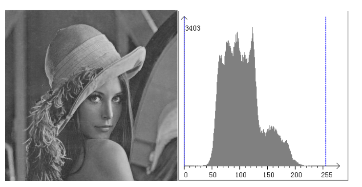
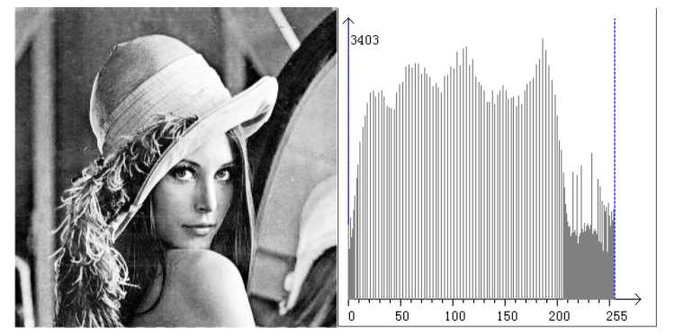
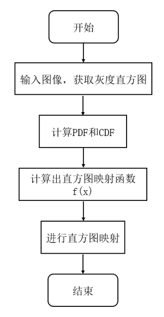
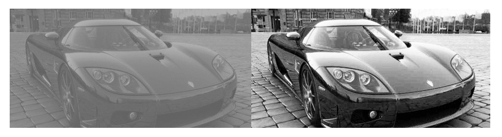

# HistEQ模块

1. 简介

   1.1 需求及目的

   1.2 定义及缩略词说明

2. 概述

   2.1 HistEQ位置

   2.2 HistEQ参数及配置

3. HistEQ算法及流程

   3.1 HistEQ参数初始化（histeq_init）

   3.2 HistEQ顶层模块（histteq）

   3.3 HistEQ算法执行模块（hist_static）

   3.4 HistEQ算法执行模块（hist_sum）

   3.5 HistEQ算法执行模块（map_matrix）

   3.6 HistEQ算法执行模块（mapping）

   3.7 HistEQ算法执行模块（ColorSplit）

   3.8 HistEQ算法执行模块（ColorMerge）

   3.9 HistEQ算法执行模块（copydata）

4. 参考文献

## 历史版本修订

| 版本 | 日期       | 修订人员 | 说明 |
| ---- | ---------- | -------- | ---- |
| 0.1  | 2022.11.08 | 许珐      | 初稿 |
|      |            |          |      |
|      |            |          |      |

## 1. 简介

### 1.1 需求及目的

该文档描述了CTL ISP架构中的直方图均衡化模块的算法。团队成员可以依据该文档理解相应代码，也可以依据设计细节自行实现。

### 1.2 定义与缩略词说明

| 定义   | 说明         |
| ------ | ------------ |
| HistEQ | 直方图均衡化 |
|        |              |
|        |              |
|        |              |
|        |              |

## 2. 概述

直方图均衡化是一种简单有效的图像增强技术，通过改变图像的直方图来改变图像中各像素的灰度，主要用于增强动态范围偏小的图像的对比度。原始图像由于其灰度分布可能集中在较窄的区间，造成图像不够清晰；直方图均衡化的目的是拉伸调整原始图像的直方图,使得其分布更均匀。

### 2.1 HistEQ位置

图2-1 HistEQ模块在ISP流水线中的位置

### 2.2 HistEQ参数配置

| 参数 | 默认值 | Shadow | 说明           |
| ---- | ------ | ------ | -------------- |
| eb   | 1      |        | HistEQ使能信号 |
|      |        |        |                |
|      |        |        |                |
|      |        |        |                |
|      |        |        |                |
|      |        |        |                |
|      |        |        |                |
|      |        |        |                |
|      |        |        |                |

## 3. HistEQ算法及流程

直方图均衡化的基本思路是拟合直方图映射曲线:y=f(x)。其中x为输入图像的直方图灰度级，以8位图像为例共有255种灰度等级，f()为拟合的直方图映射函数，是决定直方图均衡效果好坏的关键;y为输入灰度x经映射函数f()变换后的灰度值。

图3-1 直方图均衡化前的图像视觉效果和其直方图分布

图3-2 直方图均衡化后的图像视觉效果和其直方图分布

观察同一图像直方图均衡化前后的效果可知，均衡化后的图像直方图分布范围更广，更加均匀。图像对比度明显增加(上图中图像亮度的变化)。

- 顶层参数

| 参数        | 说明                                            |
| ----------- | ----------------------------------------------- |
| imgPattern  | bayer格式（通道0:r,通道1:Gr ,通道2:Gb,通道3:b） |
| frameWidth  | 图像的宽度                                      |
| frameHeight | 图像的高度                                      |
|             |                                                 |
|             |                                                 |
|             |                                                 |

### 3.1 HistEQ参数初始化（histeq_init）

#### 3.1.1 函数接口

| 参数       | 说明           |
| ---------- | -------------- |
| histeq_reg | HistEQ模块参数 |
|            |                |
|            |                |
|            |                |
|            |                |
|            |                |

#### 3.1.2 算法和函数

初始化所有参数值

### 3.2 HistEQ顶层模块（histteq）

#### 3.2.1 函数接口

| 参数       | 说明           |
| ---------- | -------------- |
| top_reg    | ISP顶层参数    |
| histeq_reg | HistEQ模块参数 |
| src_in     | 输入数据       |
| dst_out    | 输出数据       |
|            |                |
|            |                |

### 3.2.2 算法和函数

整个色彩空间转换算法流程可分为4个步骤：

- 步骤1：对输入图像进行RGB三色的直方图统计；
- 步骤2：计算PDF和CDF；
- 步骤3：根据上式计算直方图映射函数f(x)；
- 步骤4：进行直方图的灰度图映射。

图3-3 直方图均衡化流程图

直方图均衡化的基本思路是拟合直方图映射曲线:y=f(x)。其中x为输入图像的直方图灰度级，以8位图像为例共有255种灰度等级，f()为拟合的直方图映射函数，是决定直方图均衡效果好坏的关键;y为输入灰度x经映射函数f()变换后的灰度值。

确定直方图映射函数的过程中包含两个基本的概念：（1）概率密度函数PDF（2）累积密度函数CDF。

（1） PDF:假设8位图像(灰度级共256种，范围[0，255])包含N个像素点,对其中每级灰度值计算概率密度后获得灰度级分布的PDF函数，可用下列公式进行表示:
$$
PDF(X_i)=\frac{n(i)}{N}\tag{3-1}
$$
上式3-1中i=0,1,2...255，n(i)代表灰度级为i的像素点个数

（2） CDF:在PDF的基础上积分，获得CDF。两者间的关系为:
$$
CDF(I)=\sum_{i=0}^{I}PDF(i)\tag{3-2}
$$
映射函数f()的选择有两条最基本的原则: (1)f()的选取一定是一个单调递增的函数。 (2) f()映射的起始点一定和原始图像灰度等级的起始点相对应，例如原始8位图像的灰度等级范围为[0,255],则映射后的灰度区间仍然为[0,255]，其中映射前后的灰度等级区间起末位置相互对应。

我们Cmodel采用的映射函数为：
$$
f(x)=\frac{(2^B-1)*CDF(x)}{2*(N-1)}\tag{3-3}
$$
上式3-3中B为图像深度,CDF的含义如上所述,N为待均衡图像中的像素点总数

### 3.3 HistEQ算法执行模块（hist_static）

#### 3.3.1 函数接口

| 参数              | 说明                 |
| ----------------- | -------------------- |
| src_in            | 输入数据             |
| hist_matrix[4096] | 存储不同灰度值像素点 |
| top_reg           | ISP顶层参数          |
| type              | 色彩通道             |
|                   |                      |
|                   |                      |

### 3.3.2 算法和函数

进行直方图统计

### 3.4 HistEQ算法执行模块（hist_sum）

#### 3.4.1 函数接口

| 参数                  | 说明                 |
| --------------------- | -------------------- |
| hist_matrix[4096]     | 存储不同灰度值像素点 |
| hist_sum_matrix[4096] | 不同灰度值像素点之和 |
| type                  | 色彩通道             |
|                       |                      |
|                       |                      |
|                       |                      |

### 3.4.2 算法和函数

直方图累计概率分布计算

### 3.5 HistEQ算法执行模块（map_matrix）

#### 3.5.1 函数接口

| 参数                  | 说明                 |
| --------------------- | -------------------- |
| hist_sum_matrix[4096] | 不同灰度值像素点之和 |
| mapping_matrix[4096]  | 灰度级分布           |
| top_reg               | ISP顶层参数          |
|                       |                      |
|                       |                      |
|                       |                      |

### 3.5.2 算法和函数

构建直方图均衡映射表

### 3.6 HistEQ算法执行模块（mapping）

#### 3.6.1 函数接口

| 参数                 | 说明        |
| -------------------- | ----------- |
| src_in               | 输入数据    |
| dst_out              | 输出数据    |
| mapping_matrix[4096] | 灰度级分布  |
| top_reg              | ISP顶层参数 |
|                      |             |
|                      |             |

### 3.6.2 算法和函数

根据map_matrix完成直方图均衡

### 3.7 HistEQ算法执行模块（ColorSplit）

#### 3.7.1 函数接口

| 参数      | 说明        |
| --------- | ----------- |
| src_in    | 输入数据    |
| r_channel | R通道       |
| g_channel | B通道       |
| b_channel | G通道       |
| top_reg   | ISP顶层参数 |
|           |             |

### 3.7.2 算法和函数

颜色通道分离

### 3.8 HistEQ算法执行模块（ColorMerge）

#### 3.8.1 函数接口

| 参数      | 说明        |
| --------- | ----------- |
| r_channel | R通道       |
| g_channel | B通道       |
| b_channel | G通道       |
| top_reg   | ISP顶层参数 |
| dst_out   | 输出数据    |
|           |             |

### 3.8.2 算法和函数

颜色通道合并

### 3.9 HistEQ算法执行模块（copydata）

#### 3.9.1 函数接口

| 参数    | 说明        |
| ------- | ----------- |
| src_in  | 输入数据    |
| dst_out | 输出数据    |
| top_reg | ISP顶层参数 |
|         |             |
|         |             |
|         |             |

### 3.9.2 算法和函数

输出数据

图3-4 HistEQ效果图

## 4.参考文献

