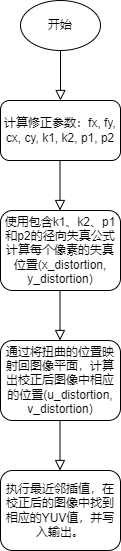

# LDC 模块

[TOC]

## 历史版本修订

| Revision | Date | Author | Description |
| -------- | ---- | ------ | ----------- |
|          | 2022.12.06   | Wei Yuheng | Origin      |

## 1.简介

### 1.1 模块需求及目的

该文档描述了CTL ISP架构中的镜头畸变矫正模块的算法。团队成员可以依据该文档理解相应代码，也可以依据设计细节自行实现。

### 1.2 定义及缩略词说明

| 定义 | 说明                |
| :----- | -------------------------- |
| LDC | 镜头畸变矫正 |

## 2. 概述

LDC(Lens Distortion Correction)模块负责执行镜头畸变校正，目前是一个纯软件实现的模块，暂无对应硬件功能。

### 2.1 LDC 位置

## 3. LDC 模块算法及流程

### 3.1 LDC 模块算法及功能

畸变校正的模型如下，我们将实际成像点与正确成像点的偏离建模成径向畸变和切向畸变，如图：

畸变校正算法如下，理想成像点用$\left(x_c, y_c\right)$表示，实际成像点用$\left(x_d, y_d\right)$表示。则二者之间满足如下关系：
$$
\begin{aligned}
& x_d=x_c\left(1+k_1 r^2+k_2 r^4+k_3 r^6\right)+2 p_1 x_c y_c+p_2\left(r^2+2 x_c^2\right) \\
& y_d=y_c\left(1+k_1 r^2+k_2 r^4+k_3 r^6\right)+p_1\left(r^2+2 y_c^2\right)+2 p_2 x_c y_c
\end{aligned}
$$
其中第一项为径向偏差矫正，第二、三项为切向偏差校正。

算法为每个实际成像点$\left(x_d, y_d\right)$计算其对应的$\left(x_c, y_c\right)$，使用最近邻插值获得$\left(x_c, y_c\right)$的整数坐标，最后将$\left(x_d, y_d\right)$的像素搬移至$\left(x_c, y_c\right)$处。

参数k1、k2、k3为径向畸变系数，p1、p2为切向畸变系数，畸变系数与实际成像系统有关，为了获得良好的校正结果，需对棋盘格拍摄一系列不同角度照片，使用标定算法获得精准的畸变系数。

算法流程图：

### 3.2 参数初始化（ldc_init）

#### 3.2.1 函数接口

| 参数    | 说明         |
| ------- | ------------ |
| top_reg | ISP 顶层参数 |
| ldc_reg | LDC 模块参数 |

#### 3.2.2 算法和函数

初始化所有参数值

### 3.3 LDC 顶层模块（isp_ldc）

#### 3.3.1 函数接口

<table>
   <tr>
      <td>参数名</td>
      <td>类型</td>
      <td>描述</td>
   </tr>
   <tr>
      <td>y_src_in</td>
      <td>uint16_t *</td>
      <td>存储图像源Y分量的指针</td>
   </tr>
   <tr>
      <td>u_src_in</td>
      <td>uint16_t *</td>
      <td>存储图像源U分量的指针</td>
   </tr>
   <tr>
      <td>v_src_in</td>
      <td>uint16_t *</td>
      <td>存储图像源V分量的指针</td>
   </tr>
   <tr>
      <td>y_dst_out</td>
      <td>uint16_t *</td>
      <td>存储图像目的Y分量的指针</td>
   </tr>
   <tr>
      <td>u_dst_out</td>
      <td>uint16_t *</td>
      <td>存储图像目的U分量的指针</td>
   </tr>
   <tr>
      <td>v_dst_out</td>
      <td>uint16_t *</td>
      <td>存储图像目的V分量的指针</td>
   </tr>
   <tr>
      <td>top_reg</td>
      <td>_isp_top_param_t 结构体</td>
      <td>包含图像的高度和宽度的_isp_top_param_t结构体实例</td>
   </tr>
</table>

#### 3.3.2 算法和函数

该函数用于消除图像中的镜头失真，首先检查镜头畸变校正(eb)是否启用。如果是，它从输入中计算修正参数(fx, fy, cx, cy, k1, k2, p1, p2)。然后，它运行两个嵌套循环来处理输入图像的每个像素。对于每个像素，函数首先使用包含k1、k2、p1和p2的径向失真公式计算失真位置(x_distortion, y_distortion)。然后，通过将扭曲的位置映射回图像平面，计算出校正后图像中相应的位置(u_distortion, v_distortion)。最后，该函数执行最近邻插值，在校正后的图像中找到相应的YUV值，并将它们写入输出。

### 3.4 LDC 算法功能模块（copydata）

#### 3.4.1 函数接口

<table>
   <tr>
      <td>参数名</td>
      <td>类型</td>
      <td>描述</td>
   </tr>
   <tr>
      <td>y_src_in</td>
      <td>uint16_t *</td>
      <td>存储图像源Y分量的指针</td>
   </tr>
   <tr>
      <td>u_src_in</td>
      <td>uint16_t *</td>
      <td>存储图像源U分量的指针</td>
   </tr>
   <tr>
      <td>v_src_in</td>
      <td>uint16_t *</td>
      <td>存储图像源V分量的指针</td>
   </tr>
   <tr>
      <td>y_dst_out</td>
      <td>uint16_t *</td>
      <td>存储图像目的Y分量的指针</td>
   </tr>
   <tr>
      <td>u_dst_out</td>
      <td>uint16_t *</td>
      <td>存储图像目的U分量的指针</td>
   </tr>
   <tr>
      <td>v_dst_out</td>
      <td>uint16_t *</td>
      <td>存储图像目的V分量的指针</td>
   </tr>
   <tr>
      <td>top_reg</td>
      <td>_isp_top_param_t 结构体</td>
      <td>包含图像的高度和宽度的_isp_top_param_t结构体实例</td>
   </tr>
</table>

#### 3.4.2 算法和函数

copydata函数使用memcpy函数将数据从源数组(y_src_in, u_src_in, v_src_in)复制到目标数组(y_dst_out, u_dst_out, v_dst_out)。

### 3.5 LDC 算法功能模块（initUndistorRectifyMap）

#### 3.5.1 函数接口

<table>
   <tr>
      <td>参数名称</td>
      <td>类型</td>
      <td>描述</td>
   </tr>
   <tr>
      <td>top_reg</td>
      <td>_isp_top_param_t</td>
      <td>ISP 顶层参数</td>
   </tr>
   <tr>
      <td>ldc_reg</td>
      <td>_isp_ldc_param_t</td>
      <td>LDC 模块参数</td>
   </tr>
   <tr>
      <td>map_x</td>
      <td>uint32_t *</td>
      <td>指向每个像素矫正 x 坐标的数组的指针</td>
   </tr>
   <tr>
      <td>map_y</td>
      <td>uint32_t *</td>
      <td>指向每个像素矫正 y 坐标的数组的指针</td>
   </tr>
</table>

#### 3.5.2 算法和函数

该函数使用给定的畸变参数计算畸变图像坐标，并将结果矫正图像坐标存储在 map_x 和 map_y 中。畸变校正算法基于径向畸变模型，该模型使用 k1、k2、p1 和 p2 参数描述从未畸变到畸变坐标的映射。
