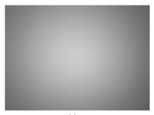
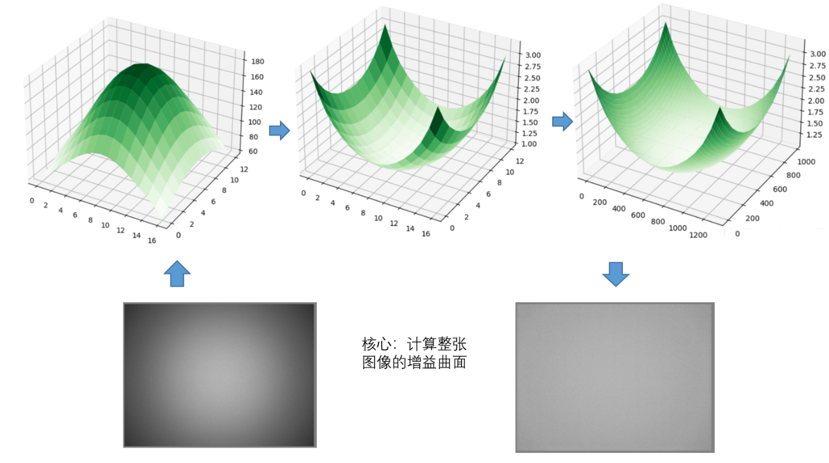
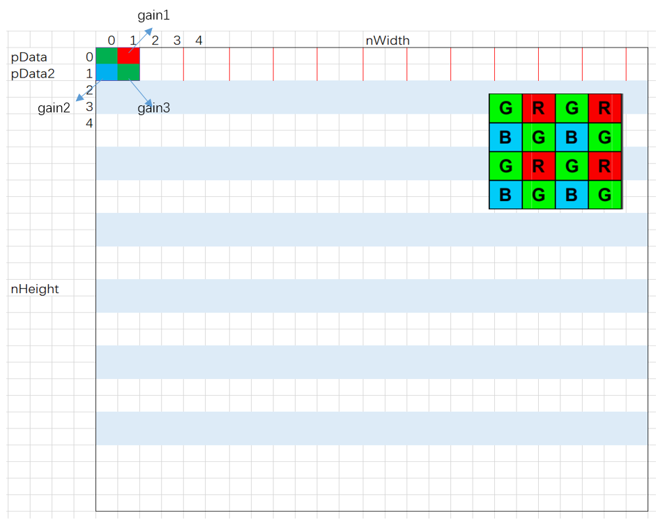
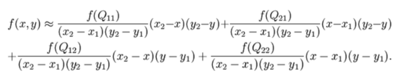
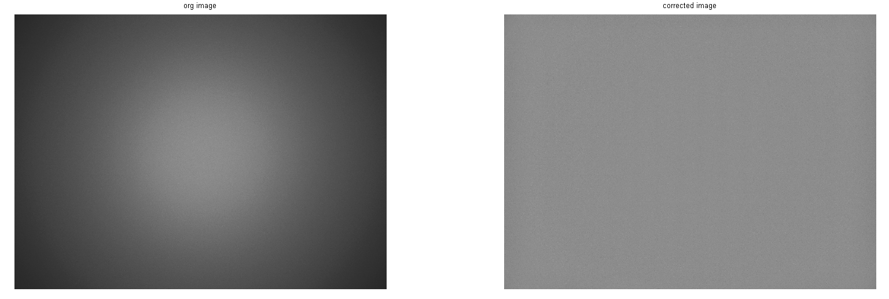

# LSC模块

1. 简介

   1.1 需求及目的

   1.2 定义及缩略词说明

2. 概述

   2.1 LSC位置

   2.2 LSC参数及配置

3. LSC算法及流程

   3.1 参数初始化（lsc_init）

   3.2 LSC参数传递函数（_ispLSCFrameStart）

   3.3 LSC顶层模块（isp_lsc）

   3.4 LSC算法运行（BilinearInterpolation）

4. 参考文献

## 历史版本修订

| 版本 | 日期       | 修订人员 | 说明 |
| ---- | ---------- | -------- | ---- |
| 0.1  | 2022.10.17 | 刘佳瑞    | 初稿 |
|      |            |          |      |
|      |            |          |      |

## 1. 简介

### 1.1 需求及目的

该文档描述了CTL ISP架构中的镜头阴影校正模块的算法。团队成员可以依据该文档理解相应代码，也可以依据设计细节自行实现。

### 1.2 定义与缩略词说明

| 定义 | 说明         |
| ---- | ------------ |
| LSC  | 镜头阴影校正 |
|      |              |
|      |              |
|      |              |
|      |              |

## 2. 概述

图像中由于镜头和传感器所产生的阴影，一般包括亮度阴影和色彩阴影。本文LSC模块主要针对亮度阴影（luma shading），会采用原始像素点像素值*增益值（gain），对图像进行校正。

图2-1 亮度阴影

### 2.1 LSC位置

图2-2 LSC模块在ISP流水线中的位置

### 2.2 LSC参数配置

| 参数            | 默认值 | Shadow | 说明                   |
| --------------- | ------ | ------ | ---------------------- |
| m_nEb           | 1      |        | LSC模块使能信号        |
| rGain[13] [17]  | \      |        | 通道r预取的顶点增益值  |
| GrGain[13] [17] | \      |        | 通道Gr预取的顶点增益值 |
| GbGain[13] [17] | \      |        | 通道Gb预取的顶点增益值 |
| bGain[13] [17]  | \      |        | 通道b预取的顶点增益值  |
|                 |        |        |                        |
|                 |        |        |                        |
|                 |        |        |                        |
|                 |        |        |                        |

## 3. LSC算法及流程

### mesh算法

本文选择网格阴影校正（mesh shading correct）的方法，把整幅图像分成m*n个网格，然后针对网格顶点预取校正的增益，然后把这些顶点的增益储存到内存中，同理其他的点的增益也是通过双线性插值的方式求出。

图3-1 LSC模块

- 顶层参数

| 参数        | 说明                                            |
| ----------- | ----------------------------------------------- |
| imgPattern  | bayer格式（通道0:r,通道1:Gr ,通道2:Gb,通道3:b） |
| frameWidth  | 图像的宽度                                      |
| frameHeight | 图像的高度                                      |
| blc         | 黑色像素值                                      |
|             |                                                 |
|             |                                                 |

### 3.1 参数初始化（lsc_init）

#### 3.1.1 函数接口

| 参数     | 说明        |
| -------- | ----------- |
| topParam | ISP顶层参数 |
| lscParam | LSC模块参数 |
|          |             |
|          |             |
|          |             |
|          |             |

#### 3.1.2 算法和函数

初始化所有参数值

### 3.2 LSC参数传递函数（_ispLSCFrameStart）

#### 3.2.1 函数接口

| 参数     | 说明         |
| -------- | ------------ |
| topParam | ISP顶层参数  |
| inParam  | 函数输入参数 |
| lscParam | LSC模块参数  |
|          |              |
|          |              |
|          |              |

#### 3.2.2 算法和函数

用于参数传递功能

### 3.3 LSC顶层模块（isp_lsc）

#### 3.3.1 函数接口

| 参数     | 说明        |
| -------- | ----------- |
| topParam | ISP顶层参数 |
| lscParam | LSC模块参数 |
| src_data | 输入数据    |
| dst_data | 输出数据    |
|          |             |
|          |             |

### 3.3.2 算法和函数

整个镜头阴影校正算法流程可分为5个步骤：

- 步骤1：输入图像以及预取17*13个像素点的增益值，将图像均匀划分为16 *12个方块，如图3-2所示；
- 步骤2：以2*2个像素点为最小处理单元，对图像所有像素点进行遍历，判断当前像素点所处位置；
- 步骤3：利用所属方块4个顶点的增益值，通过双线性插值函数计算当前像素点的增益值；
- 步骤4：利用计算好的增益值与像素点的值相乘，对图像进行校正；
- 步骤5：输出完成镜头阴影矫正的图像。

图3-2 LSC像素扫描示意图

### 3.4 LSC算法运行（BilinearInterpolation）

#### 3.4.1 函数接口

| 参数          | 说明                   |
| ------------- | ---------------------- |
| topParam      | ISP顶层参数            |
| LeftTopGain   | 方块左上角预取的增益值 |
| LeftDownGain  | 方块左下角预取的增益值 |
| RightTopGain  | 方块右上角预取的增益值 |
| RightDownGain | 方块右下角预取的增益值 |
| row           | 窗口的行数             |
| col           | 窗口的列数             |

#### 3.4.2 算法和函数

利用所属块4个顶点的增益值，插值得出当前像素增益值，如图3-3所示。

图3-3 双线性插值示意图

图3-4 LSC效果

## 4. 参考文献

