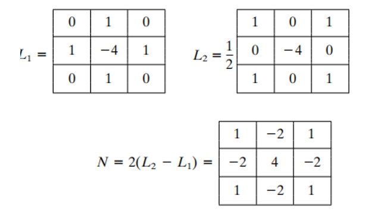
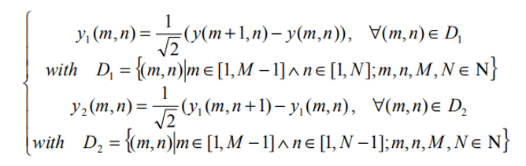
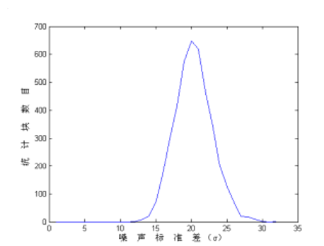

# Noise_Estimation模块

1. 简介

   1.1 需求及目的

   1.2 定义及缩略词说明

2. 概述

   2.1 Noise_Estimation参数及配置

3. Noise_Estimation算法及流程

   3.1 Noise_Estimation顶层模块（Noise_Top）

   3.2 Noise_Estimation顶层模块（FS96_Main）

   3.3 Noise_Estimation算法执行模块（FS96_Single）

   3.4 Noise_Estimation顶层模块（FMNS09_Main）

   3.5 Noise_Estimation算法执行模块（FMNS09_Single）

4. 参考文献

## 历史版本修订

| 版本 | 日期       | 修订人员 | 说明 |
| ---- | ---------- | -------- | ---- |
| 0.1  | 2022.11.08 | 张智涵      | 初稿 |
|      |            |          |      |
|      |            |          |      |

## 1. 简介

### 1.1 需求及目的

该文档描述了CTL ISP架构中的Raw/RGB/YUV域的降噪估计模块的算法。团队成员可以依据该文档理解相应代码，也可以依据设计细节自行实现。

### 1.2 定义与缩略词说明

| 定义             | 说明     |
| ---------------- | -------- |
| Noise_Estimation | 降噪估计 |
|                  |          |
|                  |          |
|                  |          |
|                  |          |

## 2. 概述

降噪估计算法就是用来估计噪声，根据估计出的噪声进行降噪。

### 2.2 Noise_Estimation参数配置

| 参数 | 默认值 | Shadow | 说明 |
| ---- | ------ | ------ | ---- |
|      |        |        |      |
|      |        |        |      |
|      |        |        |      |
|      |        |        |      |
|      |        |        |      |
|      |        |        |      |
|      |        |        |      |
|      |        |        |      |
|      |        |        |      |

## 3. Noise_Estimation算法及流程

降噪估计算法就是用来估计噪声，根据估计出的噪声进行Raw/RGB/YUV域的降噪估计， 核心算法是FS96与FMNS09算法。

- 顶层参数

| 参数        | 说明       |
| ----------- | ---------- |
| Img_Height; | 图像的高度 |
| Img_Width   | 图像的宽度 |
| Img_Mode    | 图像类型   |
|             |            |
|             |            |
|             |            |

### 3.1 Noise_Estimation顶层模块（Noise_Top）

#### 3.1.1 函数接口

| 参数        | 说明         |
| ----------- | ------------ |
| src_in      | 输入数据     |
| Img_Height  | 图像的高度   |
| Img_Width   | 图像的宽度   |
| Img_Mode    | 图像类型     |
| Enable_Mode | 算法模块选择 |
| sigma_out   | 输出噪声数据 |

#### 3.1.2 算法和函数

整个降噪估计算法流程可分为3个步骤：

- 步骤1：选择对应算法；
- 步骤2：对图像进行噪声估计；
- 步骤3：输出对应估计的噪声。

图3-1 Noise_Estimation流程图

### 3.2 Noise_Estimation顶层模块（FS96_Main）

#### 3.2.1 函数接口

| 参数      | 说明        |
| --------- | ----------- |
| src_in    | 输入数据    |
| top_param | ISP顶层参数 |
|           |             |
|           |             |
|           |             |
|           |             |

#### 3.2.2 算法和函数

FS96算法思路如下所示，首先使用边缘抑制滤波器压制图像边缘后，统计全图计算方差作为图像噪声的方差值。

图3-2 边缘抑制滤波器

$$
\sigma^2_n=\frac{1}{36(W-2)(H-2)}\sum_{imageI}(I(x,y)*N)^2\tag{3-1}
$$

$$
\sigma^2_n=\sqrt\frac{\pi}{2}\frac{1}{6(W-2)(H-2)}\sum_{imageI}|I(x,y)*N|\tag{3-2}
$$

上式3-1和3-2分别计算噪强方差值与标准差值。

### 3.3 Noise_Estimation算法执行模块（FS96_Single）

#### 3.3.1 函数接口

| 参数   | 说明       |
| ------ | ---------- |
| src_in | 输入数据   |
| Height | 图像的高度 |
| Width  | 图像的宽度 |
|        |            |
|        |            |
|        |            |

#### 3.2 算法和函数

FS96算法进行噪声估计

### 3.4 Noise_Estimation顶层模块（**FMNS09**_Main）

#### 3.4.1 函数接口

| 参数      | 说明        |
| --------- | ----------- |
| src_in    | 输入数据    |
| top_param | ISP顶层参数 |
|           |             |
|           |             |
|           |             |
|           |             |

#### 3.4.2 算法和函数

FMNS09算法思路如下所示，主要包含边缘二维抑制滤波、图像分块方差计算和直方图统计排序等步骤。

上式通过计算参数进行边缘二维抑制滤波，同时对图像进行分块计算方差

图3-3 分块方差的直方图统计过程

### 3.5 Noise_Estimation算法执行模块（FMNS09_Single）

#### 3.5.1 函数接口

| 参数   | 说明       |
| ------ | ---------- |
| src_in | 输入数据   |
| Height | 图像的高度 |
| Width  | 图像的宽度 |
|        |            |
|        |            |
|        |            |

#### 3.5.2 算法和函数

FMNS09算法进行噪声估计

## 4.参考文献

[1] Immerk?R J . Fast Noise Variance Estimation[J]. Computer Vision & Image Understanding, 1996, 64(2):300-302.

[2] Liu A . A Fast Method of Estimating Gaussian Noise[C]// 2009 First International Conference on Information Science and Engineering. IEEE, 2010

