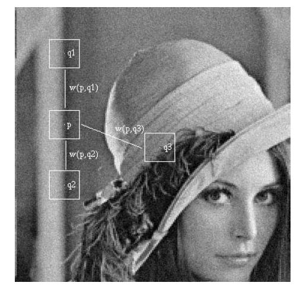
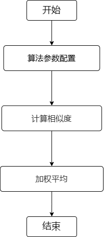
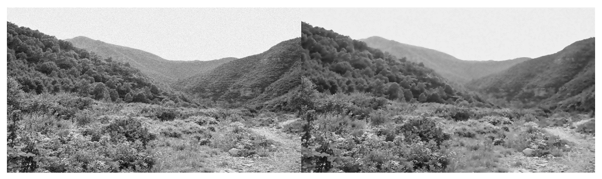

# RAWDNS模块

1. 简介

   1.1 需求及目的

   1.2 定义及缩略词说明

2. 概述

   2.1 RAWDNS位置

   2.2 RAWDNS参数及配置

3. RAWDNS算法及流程

   3.1 参数初始化（rawdns_init）

   3.2 RAWDNS顶层模块（isp_rawdns）

   3.3 RAWDNS窗口获取函数（Get_NLM_Block）

   3.4 RAWDNS欧氏距离函数（Cal_Euc_Dis）

   3.5 RAWDNS权重计算函数（_cal_NLM_weight）

   3.6 RAWDNS行处理函数（ProcessLine）

   3.7 RAWDNS全图处理函数（processimage）

   3.8 RAWDNS图像拷贝函数（CopyData）

4. 参考文献

## 历史版本修订

| 版本 | 日期       | 修订人员 | 说明 |
| ---- | ---------- | -------- | ---- |
| 0.1  | 2022.10.17 | zhangzh  | 初稿 |
|      |            |          |      |
|      |            |          |      |

## 1. 简介

### 1.1 需求及目的

该文档描述了CTL ISP架构中的Raw域降噪模块的算法。团队成员可以依据该文档理解相应代码，也可以依据设计细节自行实现。

### 1.2 定义与缩略词说明

| 定义   | 说明           |
| ------ | -------------- |
| RAWDNS | Raw域降噪      |
| NLM    | 非局部均值算法 |
|        |                |
|        |                |
|        |                |

## 2. 概述

人类的世界就是一个信号传输的世界，所以噪声无处不在，图像作为一种信号传输的方式当然也无法幸免。为了尽量减少噪声对图像质量的影响，还原物体的本来状态就提出了一系列降噪的方法，RAWDNS模块选取NLM算法，利用整个图像的信息来进行降噪滤波处理。

图2-1 噪声

### 2.1 RAWDNS位置

图2-2 RAWDNS模块在ISP流水线中的位置

### 2.2 RAWDNS参数配置

| 参数       | 默认值 | Shadow | 说明               |
| ---------- | ------ | ------ | ------------------ |
| m_nEb      | 1      |        | RAWDNS模块使能信号 |
| win_size   | 1      |        | 邻域窗口           |
| Filterpara | 0x66   |        | 滤波控制参数       |
| sigma      |        |        | 噪声水平           |
|            |        |        |                    |
|            |        |        |                    |
|            |        |        |                    |
|            |        |        |                    |
|            |        |        |                    |

## 3. RAWDNS算法及流程

### NLM算法

NLM算法思路如下所示，式中p代表待去噪像素位置，q代表用于加权计算的参考像素位置，v(x)表示像素x所在图像块构成的像素值向量，权重w(p,q)表示像素p和q之间的相似性，注意两个像素间的相似性一般都是由对应图像块的像素值向量v(x)决定的。根据NLM的思想，因为 q1和q2像素与待去噪点p像素有更相似的邻域，而q3像素邻域与p像素差异较大，因此，对p像素的去噪，q1和q2像素的贡献更大。
$$
NL(v(p))=\sum_{q\in S}w(p,q)v(q) \tag{3-1}
$$

图3-1 NLM算法示意图

权重w(p,q)的计算，可以用高斯加权的欧式距离‖v(p)-v(q)‖^2^~(2,α)~ 来衡量，其中α为高斯核函数的标准差，一般取值为2~5。最终权重w(p,q)计算公式如式下式所示，式中Z(p)为权重归一化常数，参数h控制指数函数的衰减速度，取值与图像中的噪声水平σ线性相关，取h=λ*σ，σ为噪声图像的标准差。注意，NLM最后计算待去噪像素p自身所在图像块权重w，即p=q时，取当前最大权重。
$$
w(p,q)=\frac{1}{Z(q)}\exp(-\frac{||v(p)-v(q)||^{2}_{2,\alpha}}{h^2})\tag{3-2}
$$

- 顶层参数

| 参数        | 说明                                            |
| ----------- | ----------------------------------------------- |
| imgPattern  | bayer格式（通道0:r,通道1:Gr ,通道2:Gb,通道3:b） |
| frameWidth  | 图像的宽度                                      |
| frameHeight | 图像的高度                                      |
| blc         | 黑色像素值                                      |
|             |                                                 |
|             |                                                 |

### 3.1 参数初始化（rawdns_init）

#### 3.1.1 函数接口

| 参数         | 说明           |
| ------------ | -------------- |
| top_param    | ISP顶层参数    |
| rawdns_param | RAWDNS模块参数 |
|              |                |
|              |                |
|              |                |
|              |                |

#### 3.1.2 算法和函数

初始化所有参数值

### 3.2 RAWDNS顶层模块（isp_rawdns）

#### 3.2.1 函数接口

| 参数         | 说明           |
| ------------ | -------------- |
| top_param    | ISP顶层参数    |
| rawdns_param | RAWDNS模块参数 |
| src_data     | 输入数据       |
| dst_data     | 输出数据       |
|              |                |
|              |                |

### 3.2.2 算法和函数

对待去噪数据点的NLM过程如图3-2所示，图中每个格子代表一个像素位置Raw数据，区别于YUV域降噪，Raw域降噪选取的计算中心具有间隔性。

整个NLM算法流程可分为3个步骤：

- 步骤1：算法参数配置。根据噪声水平，设定计算图像块大小W\*W，搜索区域S\*S和滤波控制参数h与噪声水平σ的线性比例λ；
- 步骤2：计算相似度。求以搜索区域（灰色格子区域）内数据为中心的图像块（橙色框）中的数据值与待去噪数据点（蓝色格子）为中心的图像块（蓝色框）中的数据的绝对差之和D；随后根据绝对差之和D与2\*W\*W*σ的相对关系分配权重值，权重分配遵循如下规则：D相对越小，分配的权重值越大；
- 步骤3：加权平均。完成搜索区域内数据块的相似度权重计算后，对灰色区域内的数据进行加权平均，参与计算的数据包括待去噪数据点，对待去噪数据点分配最大权重。最终得到了待去噪数据点的去噪结果。

图3-2 NLM计算流程示意图算法示意图

图3-3 RAWDNS算法流程图

### 3.3 RAWDNS窗口获取函数（Get_NLM_Block）

#### 3.3.1 函数接口

| 参数               | 说明         |
| ------------------ | ------------ |
| src_data           | 函数输入参数 |
| nlm_block\[11][11] | NLM窗口      |
| top_reg            | ISP顶层参数  |
| block              | 窗口半径     |
| cur_x              | 窗口列数     |
| cur_y              | 窗口行数     |

#### 3.3.2 算法和函数

从图像中为NLM算法获取对应的窗口

【针对每一个点定义一个滑动窗口，降噪的时候利用该窗口中的所有点的信息计算

### 3.4 RAWDNS欧氏距离函数（Cal_Euc_Dis）

#### 3.4.1 函数接口

| 参数               | 说明                 |
| ------------------ | -------------------- |
| nlm_block\[11][11] | NLM窗口              |
| cur_x              | 搜索区域像素x坐标    |
| cur_y              | 搜索区域像素y坐标    |
| center_x           | 待去噪像素x坐标      |
| center_y           | 待去噪像素y坐标      |
| win_size           | 搜索区域像素窗口半径 |
| block_size         | 搜索区域大小         |

#### 3.4.2 算法和函数

计算像素块欧式距离之和

### 3.5 RAWDNS权重计算函数（_cal_NLM_weight）

#### 3.5.1 函数接口

| 参数         | 说明               |
| ------------ | ------------------ |
| rawdns_param | RAWDNS模块参数     |
| diff         | 像素块欧式距离之和 |
|              |                    |
|              |                    |
|              |                    |
|              |                    |

#### 3.5.2 算法和函数

计算NLM权重系数

### 3.6 RAWDNS行处理函数（ProcessLine）

#### 3.6.1 函数接口

| 参数       | 说明           |
| ---------- | -------------- |
| poutline   | 去噪后的像素值 |
| top_reg    | ISP顶层参数    |
| rawdns_reg | RAWDNS模块参数 |
| i          | 图像行数       |
| src_data   | 输入数据       |
|            |                |

#### 3.6.2 算法和函数

图像按行执行RAWDNS处理

### 3.7 RAWDNS全图处理函数（processimage）

#### 3.7.1 函数接口

| 参数         | 说明           |
| ------------ | -------------- |
| top_param    | ISP顶层参数    |
| rawdns_param | RAWDNS模块参数 |
| src_data     | 输入数据       |
| dst_data     | 输出数据       |
|              |                |
|              |                |

#### 3.7.2 算法和函数

全图处理的TOP功能

### 3.8 RAWDNS图像拷贝函数（CopyData）

#### 3.8.1 函数接口

| 参数     | 说明        |
| -------- | ----------- |
| top_reg  | ISP顶层参数 |
| src_data | 输入图像    |
| dst_data | 输出图像    |
|          |             |
|          |             |
|          |             |

#### 3.8.2 算法和函数

对全图数据进行拷贝

图3-4 RAWDNS效果图

##  4.参考文献

[1]Antoni Buades, Bartomeu Coll, and Jean-Michel Morel, ''Non-Local Means Denoising,'' Image Processing On Line, vol. 1, pp. 208-212, 2011.
