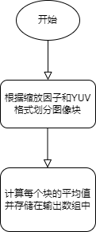

# ScaleDown 模块

[TOC]

## 历史版本修订

| Revision | Date | Author | Description |
| -------- | ---- | ------ | ----------- |
| 0.1  | 2022.12.06 | 许珐      | 初稿 |

## 1.简介

### 1.1 模块需求及目的

该文档描述了CTL ISP架构中的图像缩小模块（即图像降采样模块）的算法。团队成员可以依据该文档理解相应代码，也可以依据设计细节自行实现。

### 1.2 定义与缩略词说明

| 定义      | 说明                   |
| --------- | ---------------------- |
| Scaledown | 图像缩小（图像降采样） |

## 2. 概述

图像降采样又称为图像缩小（Scale Down），其主要目的有两个，一是使得图像符合显示区域的大小，二是生成对应图像的缩略图。图像上采样又称为图像放大，其主要目的是放大原图像，从而可以显示在更高分辨率的显示设备上。在我们的xkISP中，ScaleDown模块采用的平均值法。

### 2.1 Scaledown 位置

## 3. ScaleDown 模块算法及流程

### 3.1 ScaleDown 算法及功能

对于一幅尺寸为 $X^* Y$的图像，对其进行N倍降采样，得到尺寸为$(X/N)^* (Y/N)$ 的图像，其中N应当是X和Y的公约数。如果把图像抽象成矩阵的形式，图像降采样就是把原始图像$N^* N$窗口内的像素点变成一个像素点，这个像素点的值就是窗口内所有像素点的均值，其公式如下所示：
$$
P_{\text {out }}=\sum_{i=0}^{N^2} \frac{p_i}{N^2}
$$
其中$P_i$为输入像素点的像素值，$P_{\text {out }}$为输出像素点的像素值，$N^2$为选定窗口内像素点的个数。

算法流程图：

Scaledown算法效果展示：

### 3.2 参数初始化（scaledown_init）

#### 3.2.1 函数接口

| 参数           | 说明               |
| -------------- | ------------------ |
| topParam       | ISP 顶层参数       |
| scaledownParam | Scaledown 模块参数 |

#### 3.2.2 算法和函数

初始化所有参数值

### 3.3 Scaledown 顶层模块（isp_scaledown）

#### 3.3.1 函数接口

<table>
   <tr>
      <td>变量</td>
      <td>说明</td>
   </tr>
   <tr>
      <td>topParam</td>
      <td>指向帧头参数结构体的指针，该结构体存储了帧的宽度和高度等信息</td>
   </tr>
   <tr>
      <td>scaledownParam</td>
      <td>指向缩放参数结构体的指针，该结构体存储了缩放的参数和因子</td>
   </tr>
   <tr>
      <td>y_srcData</td>
      <td>源YUV图像的每个像素的Y分量值</td>
   </tr>
   <tr>
      <td>u_srcData</td>
      <td>源YUV图像的每个像素的U分量值</td>
   </tr>
   <tr>
      <td>v_srcData</td>
      <td>源YUV图像的每个像素的V分量值</td>
   </tr>
   <tr>
      <td>y_dstData</td>
      <td>目标YUV图像的每个像素的Y分量值</td>
   </tr>
   <tr>
      <td>u_dstData</td>
      <td>目标YUV图像的每个像素的U分量值</td>
   </tr>
   <tr>
      <td>v_dstData</td>
      <td>目标YUV图像的每个像素的V分量值</td>
   </tr>
</table>

#### 3.3.2 算法和函数

该函数将YUV图像按2或4的因子缩小，这取决于缩放参数中的“times”值。缩放是通过分别在2x2或4x4块中平均像素来完成的。
