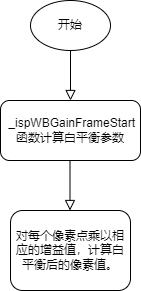

# WBC 模块

[TOC]

## 历史版本修订

| Revision | Date       | Author    | Description |
| 0.1      | 2022.12.06 | Gao Yuxin | origin      |
|          |            |           |             |

## 1.简介

### 1.1 模块需求及目的

该文档描述了CTL ISP架构中的白平衡校正模块的算法。团队成员可以依据该文档理解相应代码，也可以依据设计细节自行实现。

### 1.2 定义及缩略词说明

| 定义 | 说明       |
| :--- | ---------- |
| WBC  | 白平衡校正 |

## 2. 概述

在我们的xkISP中，WBC模块在RAW域接收AWB模块的增益值，对图像色彩进行校正。

### 2.1 WBC位置

### 2.2 WBC 参数配置

| 参数  | 说明         | 数值 |
| ----- | ------------ | ---- |
| m_nEb | 使能信号     | 1    |
| m_nR  | R通道增益值  | 9090 |
| m_nGr | Gr通道增益值 | 4686 |
| m_nGb | Gb通道增益值 | 4686 |
| m_nB  | B通道增益值  | 6667 |

## 3. WBC 模块算法及流程

### 3.1 WBC 算法及功能

计算公式如下所示，对每个像素点乘以相应的增益值：

R_out = m_nR * R_in

Gr_out = m_nGr * Gr_in

Gb_out = m_nGb * Gb_in

B_out = m_nB * B_in

校正结果如下所示：

算法流程图：

### 3.2参数初始化（**wbc_init**）

#### 3.2.1 函数接口

| 参数     | 说明         |
| -------- | ------------ |
| topParam | ISP 顶层参数 |
| wbc4gain | WBC 模块参数 |

#### 3.2.2 算法和函数

初始化所有参数值

### 3.3 WBC 顶层模块（_isp_wbc_gain）

#### 3.3.1 函数接口

| 参数      | 说明         |
| --------- | ------------ |
| topParam  | ISP 顶层参数 |
| wbc_param | WBC 模块参数 |
| srcData   | 输入数据     |
| dstData   | 输出数据     |

#### 3.3.2 算法和函数

该函数的作用是实现白平衡。函数检查输入参数是否有空指针，如果有则返回错误。然后调用 _ispWBGainFrameStart 函数计算白平衡参数。如果 m_nEb 为零，则将 srcData 数组复制到 dstData 数组中，否则函数执行白平衡算法，从 srcData 数组读取像素值，计算白平衡后的像素值，并将其存储在 dstData 数组中。
