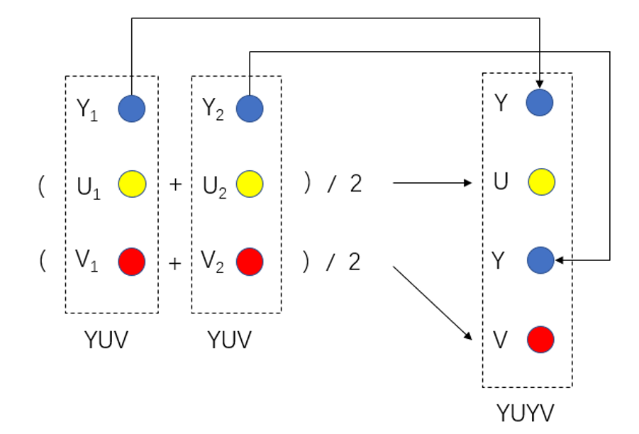
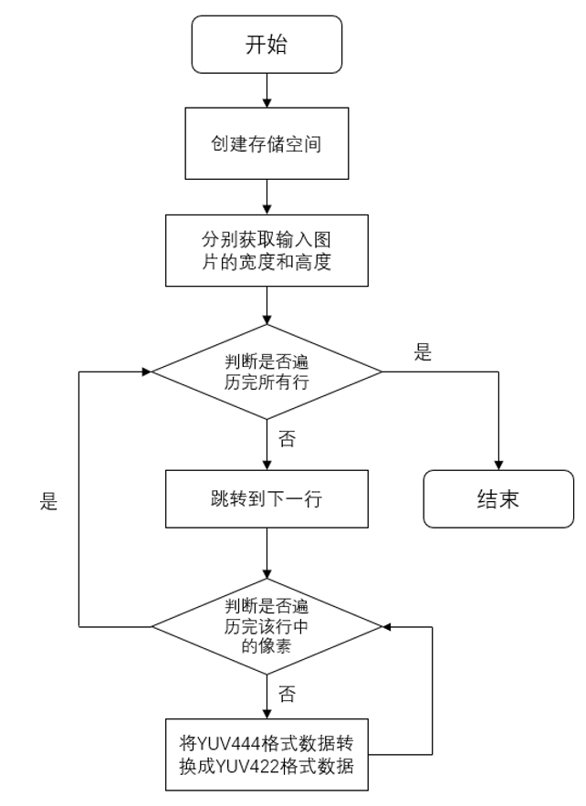

# YFC模块

1. 简介

   1.1 需求及目的

   1.2 定义及缩略词说明

2. 概述

   2.1 YFC位置

   2.2 YFC参数及配置

3. YFC算法及流程

   3.1 YFC参数初始化（yfc_init）

   3.2 YFC参数传递函数（_yfcFrameStart）

   3.3 YFC顶层模块（isp_yfc）

4. 参考文献

## 历史版本修订

| 版本 | 日期       | 修订人员 | 说明 |
| ---- | ---------- | -------- | ---- |
| 0.1  | 2022.11.08 | 魏宇恒      | 初稿 |
|      |            |          |      |
|      |            |          |      |

## 1. 简介

### 1.1 需求及目的

该文档描述了CTL ISP架构中的YUV 格式转换模块的算法。团队成员可以依据该文档理解相应代码，也可以依据设计细节自行实现。

### 1.2 定义与缩略词说明

| 定义 | 说明         |
| ---- | ------------ |
| YFC  | YUV 格式转换 |
|      |              |
|      |              |
|      |              |
|      |              |

## 2. 概述

YFC模块负责进行YUV 格式的转换，该模块支持将YUV444格式转换为YUV422 和YUV420格式，可通过配置寄存器选择。

图2-1 YUV格式

### 2.1 YFC位置

图2-2 YFC模块在ISP流水线中的位置

### 2.2 YFC参数配置

| 参数              | 默认值             | Shadow | 说明            |
| ----------------- | ------------------ | ------ | --------------- |
| m_nEb             | 1                  |        | YFC模块使能信号 |
| output_yuvpattern | 0:yuv422，1:yuv420 |        | YUV输出格式     |
|                   |                    |        |                 |
|                   |                    |        |                 |
|                   |                    |        |                 |
|                   |                    |        |                 |
|                   |                    |        |                 |
|                   |                    |        |                 |
|                   |                    |        |                 |

## 3. YFC算法及流程

以YUV444转422为例，将YUV444存储格式转成YUV422存储格式，是一个下采样的过程，常见方法是将相邻两个像素点的UV值取平均来实现，如图3-1所示：

图3-1 下采样方式

图中左边Y1、U1、V1和Y2、U2、V2为YUV444采样相邻两个像素点的YUV值，右边YUYV为YUV422采样相邻两个像素点的YUV值。可以从图中看到YUYV中的Y值是从YUV444中两个相邻像素点的Y值直接拷贝过来的，而YUYV中的U、V值则是从YUV444中两个相邻像素点的U、V值取平均得来的，完成从YUV444到YUV422的转换。

- 顶层参数

| 参数        | 说明                                            |
| ----------- | ----------------------------------------------- |
| imgPattern  | bayer格式（通道0:r,通道1:Gr ,通道2:Gb,通道3:b） |
| frameWidth  | 图像的宽度                                      |
| frameHeight | 图像的高度                                      |
|             |                                                 |
|             |                                                 |
|             |                                                 |

### 3.1 YFC参数初始化（yfc_init）

#### 3.1.1 函数接口

| 参数     | 说明        |
| -------- | ----------- |
| topParam | ISP顶层参数 |
| yfcParam | YFC模块参数 |
|          |             |
|          |             |
|          |             |
|          |             |

#### 3.1.2 算法和函数

初始化所有参数值

### 3.2 YFC参数传递函数（_yfcFrameStart）

#### 3.2.1 函数接口

| 参数     | 说明         |
| -------- | ------------ |
| topParam | ISP顶层参数  |
| inParam  | 函数输入参数 |
|          |              |
|          |              |
|          |              |
|          |              |

#### 3.2.2 算法和函数

用于参数传递功能

### 3.3 YFC顶层模块（isp_yfc）

#### 3.3.1 函数接口

| 参数      | 说明          |
| --------- | ------------- |
| topParam  | ISP顶层参数   |
| yfcParam  | YFC模块参数   |
| srcData   | 输入数据      |
| y_dstData | 输出数据Y分量 |
| u_dstData | 输出数据U分量 |
| v_dstData | 输出数据V分量 |

### 3.3.2 算法和函数

整个色彩空间转换算法流程可分为4个步骤：

- 步骤1：首先创建一个临时的存储空间存储先读取进来的YUV值；
- 步骤2：下一个YUV值读取来时进行拷贝和取平均操作；
- 步骤3：完成操作后将YUYV数据输出；
- 步骤4：其他像素点依次进行上述操作，遍历完整幅图片后即可完成YUV444格式到YUV422格式的转换。

图3-2 YFC算法流程图

## 4. 参考文献

