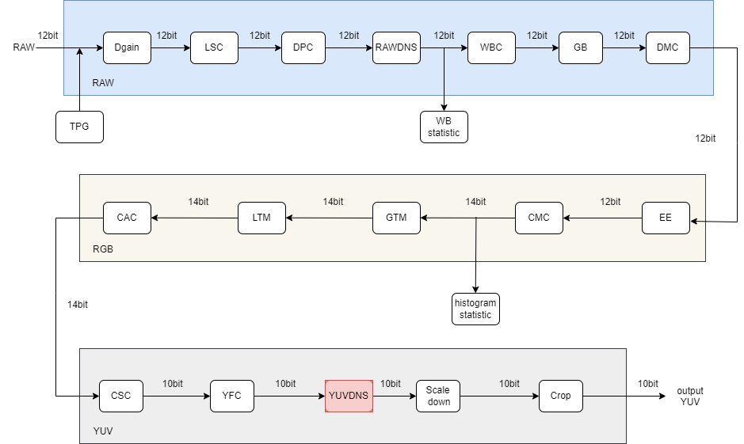
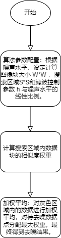
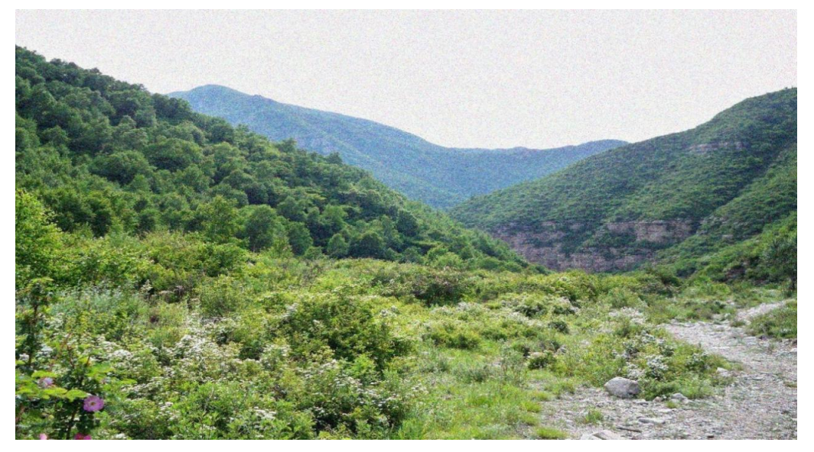
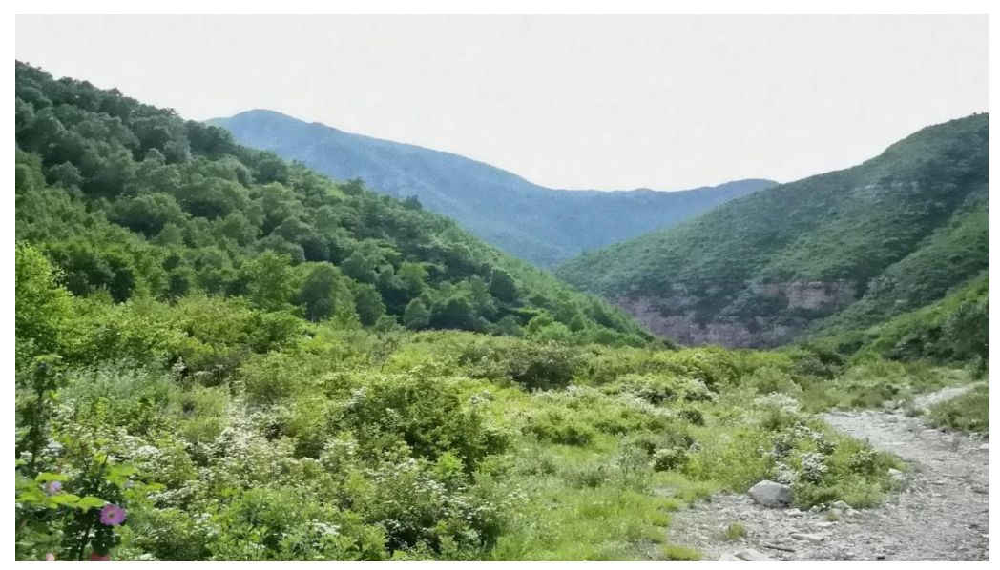

# YUVDNS 模块

[TOC]

## 历史版本订正

| Revision | Date | Author | Description |
| -------- | ---- | ------ | ----------- |
| 0.1  | 2022.12.06 | 许珐      | 初稿 |

## 1.简介

### 1.1 模块需求及目的

该文档描述了CTL ISP架构中的YUV图像去噪模块的算法。团队成员可以依据该文档理解相应代码，也可以依据设计细节自行实现。

### 1.2 定义及缩略词说明

| 定义   | 说明        |
| :----- | ----------- |
| YUVDNS | YUV图像去噪 |

## 2. 概述

数字图像信号在采集、传输和显示过程中受到成像设备以及外部环境的影响，会包含许多噪声，噪声会影响图像的视觉效果，也会给后续的图像分析，如压缩、编码、识别等，造成不利影响，因此需要对噪声图像进行去噪处理。ISP 中 RAW 图去噪环节更靠近传感器端，因此该环节能够更有效地抑制图像信号采集过程中遇到的噪声， 如光子散粒噪声，固定模式噪声，暗电流噪声等。但即使经过 RAW 图去噪，由信号采集环节引入噪声也不会完全消除，而且当 ISP 将采集的图像信号转换到 YUV 域时，图像信号又经过 ISP 中多个处理模块，每个模块不同程度地引入了新的噪声。YUV 图像去噪环节可以在 图像最终成像前再次有效地增大图像信号的信噪比，提高图像质量，直接影响到后续图像视觉效果。该环节处理的信息包括图像亮度和色度。

在我们的ISP中，YUVDNS模块将Y 通道和 UV通道分开进行降噪， 降噪的核心算法是非局部均值算法（NLM, non-local mean）。

### 2.1 YUVDNS模块位置

## 3. YUVDNS 模块算法及流程

### 3.1 YUVDNS 算法及功能

NLM算法思路如下所示，式中 *p* 代表待去噪像素位置，*q* 代表用于加权计算的参考像素位置， v(x) 表示像素x所在图像块构成的像素值向量，权重 w(p,q) 表示像素 p 和 q 之间的相似性，注意两个像素间的相似性一般都是由对应图像块的像素值向量 v(x) 决定的。根据NLM的思想，因为 *q1* 和 *q2* 像素与待去噪点*p*像素有更相似的邻域，而 *q3* 像素邻域与 *p* 像素差异较大，因此，对*p*像素的去噪，*q1* 和 *q2* 像素的贡献更大。
$$
NLM(v(p))=\sum_{q\in S}w(p,q)v(q)
$$

权重 w(p,q) 的计算，可以用高斯加权的欧式距离$\|v(p)-v(q)\|_{2, \alpha}^2$来衡量，其中$\alpha$为高斯核函数的标准差，一般取值为2~5。最终权重 w(p,q) 计算公式如式下式所示，式中 z(p) 为权重归一化常数，参数 h 控制指数函数的衰减速度，取值与图像中的噪声水平σ线性相关，取$\mathrm{h}=\lambda * \sigma$，$\sigma$为噪声图像的标准差。注意，NLM最后计算待去噪像素 *p* 自身所在图像块权重*w*，即*p*=*q* 时，取当前最大权重。
$$
w(p,q)=\frac{1}{Z(p)}exp(-\frac{\|v(p)-v(q)\|_{2,\alpha}^{2}}{h^2})
$$

算法流程图：

YUVDNS算法效果展示（上图为YUVDNS前，下图为YUVDNS后）：

### 3.2 参数初始化（yuvdns_init）

#### 3.2.1 函数接口

| 参数        | 说明           |
| ----------- | -------------- |
| topParam    | ISP 顶层参数   |
| yuvdnsParam | YUVDNS模块参数 |

#### 3.2.2 算法和函数

初始化所有参数值

### 3.3 YUVDNS顶层模块（isp_yuvdns） 

#### 3.3.1函数接口

<table>
   <tr>
      <td>参数名称</td>
      <td>类型</td>
   </tr>
   <tr>
      <td>_isp_top_param_t* topParam</td>
      <td>顶层参数</td>
   </tr>
   <tr>
      <td>_isp_yuvdns_param_t* YUVDNSParam</td>
      <td>YUV DNS的参数</td>
   </tr>
   <tr>
      <td>uint16_t* y_srcData</td>
      <td>输入的Y通道数据</td>
   </tr>
   <tr>
      <td>uint16_t* u_srcData</td>
      <td>输入的U通道数据</td>
   </tr>
   <tr>
      <td>uint16_t* v_srcData</td>
      <td>输入的V通道数据</td>
   </tr>
   <tr>
      <td>uint16_t* y_dstData</td>
      <td>输出的Y通道数据</td>
   </tr>
   <tr>
      <td>uint16_t* u_dstData</td>
      <td>输出的U通道数据</td>
   </tr>
   <tr>
      <td>uint16_t* v_dstData</td>
      <td>输出的V通道数据</td>
   </tr>
</table>

#### 3.3.2算法和函数

对待去噪数据点的NLM过程如图所示，图中每个格子代表一个像素位置的Y/U/V数据。

①算法参数配置。根据噪声水平，设定计算图像块大小 W**W ，搜索区域 S*S 和滤波控制参数 h 与噪声水平$\sigma$的线性比例$\lambda$；

②计算相似度。求以搜索区域（灰色格子区域）内数据为中心的图像块（橙色框）中的数据值与待去噪数据点（蓝色格子）为中心的图像块（蓝色框）中的数据的绝对差之和D；随后根据绝对差之和D与 $2 * \mathrm{~W}^* \mathrm{~W} * \sigma$的相对关系分配权重值，权重分配遵循如下规则：D相对越小，分配的权重值越大；

③加权平均。完成搜索区域内数据块的相似度权重计算后，对灰色区域内的数据进行加权平均，参与计算的数据包括待去噪数据点，对待去噪数据点分配最大权重。最终得到了待去噪数据点的去噪结果。

### 3.4 YUVDNS算法功能模块（get_NLM_block） 

#### 3.4.1函数接口

<table>
   <tr>
      <td>参数名称</td>
      <td>类型</td>
      <td>描述</td>
   </tr>
   <tr>
      <td>pInLines</td>
      <td>uint16_t**</td>
      <td>输入图像数据</td>
   </tr>
   <tr>
      <td>nlm_block</td>
      <td>uint16_t[9][9]</td>
      <td>存储当前正在处理的图像块</td>
   </tr>
   <tr>
      <td>frameWidth</td>
      <td>uint32_t</td>
      <td>图像的宽度</td>
   </tr>
   <tr>
      <td>cur_x</td>
      <td>uint32_t</td>
      <td>当前处理的图像列的索引</td>
   </tr>
   <tr>
      <td>block_size</td>
      <td>uint32_t</td>
      <td>图像块的大小</td>
   </tr>
</table>

#### 3.4.2算法和函数

该函数通过从输入图像中选取与当前处理列相关的数据填充"nlm_block"数组，从而获取计算窗口像素。

### 3.5 YUVDNS算法功能模块（_RotateLine） 

#### 3.5.1函数接口

<table>
   <tr>
      <td>参数名称</td>
      <td>类型</td>
      <td>描述</td>
   </tr>
   <tr>
      <td>pInLine</td>
      <td>uint16_t*</td>
      <td>输入的一行数据</td>
   </tr>
   <tr>
      <td>pOutLine</td>
      <td>uint16_t*</td>
      <td>输出的一行数据</td>
   </tr>
   <tr>
      <td>frameWidth</td>
      <td>uint32_t</td>
      <td>图像的宽度</td>
   </tr>
   <tr>
      <td>h</td>
      <td>uint32_t</td>
      <td>行数，用于计算输入数据的偏移量</td>
   </tr>
</table>

#### 3.5.2算法和函数

从输入的一行数据（pInLine）中读取数据，并将其转换为输出的一行数据（pOutLine）。该函数通过一个循环来访问每个像素，并将其从输入的数据中读取并存储在输出的数据中。

### 3.6 YUVDNS算法功能模块（_cal_euc_dis）

#### 3.6.1函数接口 

<table>
   <tr>
      <td>参数名称</td>
      <td>类型</td>
      <td>描述</td>
   </tr>
   <tr>
      <td>nlm_block</td>
      <td>uint16_t[9][9]</td>
      <td>输入的9x9像素块</td>
   </tr>
   <tr>
      <td>cur_i</td>
      <td>uint32_t</td>
      <td>当前处理的像素的行号</td>
   </tr>
   <tr>
      <td>cur_j</td>
      <td>uint32_t</td>
      <td>当前处理的像素的列号</td>
   </tr>
   <tr>
      <td>win_size</td>
      <td>uint32_t</td>
      <td>窗口大小</td>
   </tr>
   <tr>
      <td>block_size</td>
      <td>uint32_t</td>
      <td>像素块大小</td>
   </tr>
</table>

#### 3.6.2 算法和函数

该函数的功能是计算两个块之间的欧式距离。该函数内部通过循环遍历窗口中的每一个元素，计算当前元素与窗口内其他元素之间的欧式距离，最后返回平均距离的结果。

### 3.7 YUVDNS算法功能模块（_cal_NLM_weight）

#### 3.7.1函数接口

<table>    <tr>       <td>参数</td>       <td>描述</td>    </tr>    <tr>       <td>eur_distance</td>       <td>两个块之间的欧几里得距离</td>    </tr>    <tr>       <td>sigma2</td>       <td>确定权重的参数</td>    </tr>    <tr>       <td>H2</td>       <td>确定权重的参数</td>    </tr>    <tr>       <td>invH2</td>       <td>H2的逆值</td>    </tr> </table>

#### 3.7.2算法和函数

函数通过计算欧几里得距离，来计算NLM权重系数。计算过程包括将欧几里得距离与2 * sigma2作差，再根据H2和sigma2的值，使用表预先定义的权重值，最终确定返回的权重。

### 3.8  YUVDNS算法功能模块（_procdnsline）

#### 3.8.1函数接口

<table>    <tr>       <td>参数</td>       <td>描述</td>    </tr>    <tr>       <td>pInLines</td>       <td>输入图像的行数据</td>    </tr>    <tr>       <td>dst</td>       <td>处理后的输出数据</td>    </tr>    <tr>       <td>sigma2</td>       <td>确定权重的参数</td>    </tr>    <tr>       <td>block_size</td>       <td>块大小</td>    </tr>    <tr>       <td>win_size</td>       <td>窗口大小</td>    </tr>    <tr>       <td>H2</td>       <td>确定权重的参数</td>    </tr>    <tr>       <td>invH2</td>       <td>H2 的逆</td>    </tr>    <tr>       <td>nWidth</td>       <td>图像的宽度</td>    </tr>    <tr>       <td>block_len</td>       <td>块的长度</td>    </tr>    <tr>       <td>y</td>       <td>当前处理的行的编号</td>    </tr> </table>

#### 3.8.2算法和函数

该函数的主要作用是，对图像进行降噪处理，处理后的图像数据将存储在 dst 中。它利用了非局部均值（NLM）算法实现降噪。

## 4. 参考文献

[1]Antoni Buades, Bartomeu Coll, and Jean-Michel Morel, ''Non-Local Means Denoising,'' Image Processing On Line, vol. 1, pp. 208-212, 2011.