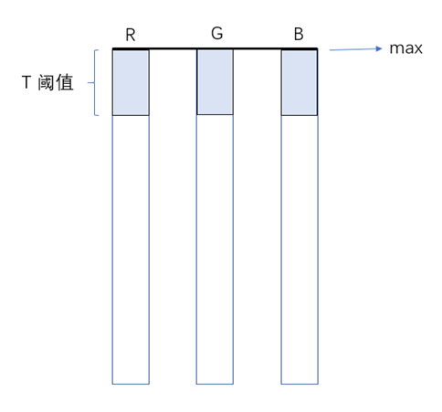
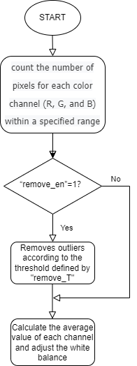

# AWB algorithm module

[TOC]

## Revision History

| Revision | Date       | Author    | Description |
| 0.1      | 2022.12.06 | Gao Yuxin | origin      |
|          |            |           |             |

## 1.Introduction

### 1.1 Request & Purpose

This document presents automatic white balance algorithm and specification in XK-ISP pipeline architecture. It defines the features with high-level diagram and modules design. The team members can follow this document to do detailed design and implementation.

### 1.2 Definitions & Abbreviations

| Name | Description             |
| :--- | ----------------------  |
| AWB  | automatic white balance |

### 1.3 Reference

[1]Joost, van, de, et al. Edge-based color constancy.[J]. IEEE Transactions on Image Processing A Publication of the IEEE Signal Processing Society, 2007.

## 2. Overview

In our xkISP, AWB module conducts information statistics in RAW domain, estimates the image light source value and obtains the gain value of each channel to the WBC module.

The code mainly contains three algorithms, namely Grey World, White Patch and Shades of Grey algorithm.

### 2.1 AWB location

The WBC module contains the AWB.

### 2.2 AWB Parameters

| Name       | Description                                           |
| ---------- | ----------------------------------------------------- |
| m_nEb      | enable signal                                         |
| r_gain     | gain value of R channel                               |
| g_gain     | gain value of G channel                               |
| b_gain     | gain value of B channel                               |
| mink       | Minkowski norm                                        |
| bit_widths | Data bits wide                                        |
| remove_en  | enable signal of removing the over-saturation point   |
| remove_T   | threshold value of removing the over-saturation point |
| w_T        | White point threshold                                 |

## 3. AWB algorithm and process

### 3.1AWB top-level module (isp_awb)

#### 3.1.1 Function interfaces

| Name     | Description              |
| -------- | ------------------------ |
| topParam | ISP top-level parameters |
| srcData  | input data               |
| awbData  | AWB module parameters    |

#### 3.1.2 Algorithm and function

This code is an implementation of automatic white balance (AWB) algorithm. It takes an image as input, represented as an array of 16-bit pixel values, and two data structures _isp_top_param_t and _isp_awb_param_t, which contain the image information and the parameters of the AWB algorithm respectively. The algorithm first checks to see if the remove_en flag is set in awbParam. If the remove_en flag is set, pixels with a value greater than upper are removed. The algorithm then counts the number of red, green, and blue pixels in the image and finds the white balance by looking for the average of the highest w_T percentage in each color channel. The white balance values are stored in the white_r, white_g, and white_b variables. If the execution succeeds, the algorithm returns ISP_SUCCESS.

The three algorithms are Grey World, White Patch and Shades of Grey algorithm, and their corresponding formulas are as follows

| name           | symbol           | equation                                      | hypothesis                                       |
| -------------- | ---------------- | --------------------------------------------- | ------------------------------------------------ |
| Grey-World     | $e^{0,1,0}$      | ($\int$f(x)dx)=ke                             | the average reflectance in a scene is achromatic |
| max-RGB        | $e^{0,\infty,0}$ | ($\int|f(x)|^\infty$dx)$^\frac{1}{\infty}$=ke | the maximum reflection in a scene is achromatic  |
| Shades of Grey | $e^{0,p,0}$      | ($\int|f(x)|^p$dx)$^\frac{1}{p}$=ke           | the pth-Minkowsky norm of a scene is achromatic  |

Grey World and Shades of Grey algorithm count global pixel information, which is distinguished by Minkowski norm. When MINk =1, it is Grey World algorithm, and when mink & GT; "1" is the Shades of Grey algorithm.

The White Patch algorithm takes the brightest point in the image as the statistical information. Since only using the brightest point information, namely the Max value of each channel, will lead to color imbalance in some images, it is improved. The parameter w_T is used to select the brightest pixel point before w_T% in the image, as shown in the figure below.

For the White Patch algorithm, using the brightest pixel before w_T% in the image as statistics may contain the over-saturation point in the image, which will affect the image correction, so it should be further improved. Use remove_en to determine whether to enable the over-saturation point removal. Remove_T is the threshold for removing the over-saturation point. Take pixel values 0-255 as an example, as shown in the following figure.

The flowchart of AWB module:

Effectsof AWB algorithm:

### 3.2 AWB parameter initialization（awb_init）

#### 3.1.1 Function interfaces

| Name     | Description              |
| -------- | ------------------------ |
| topParam | ISP top-level parameters |
| cscParam | CSC module parameters    |

#### 3.2.2 Algorithm and function

Initializes all parameter values

### 4. Reference

[1]Joost, van, de, et al. Edge-based color constancy.[J]. IEEE Transactions on Image Processing A Publication of the IEEE Signal Processing Society, 2007.