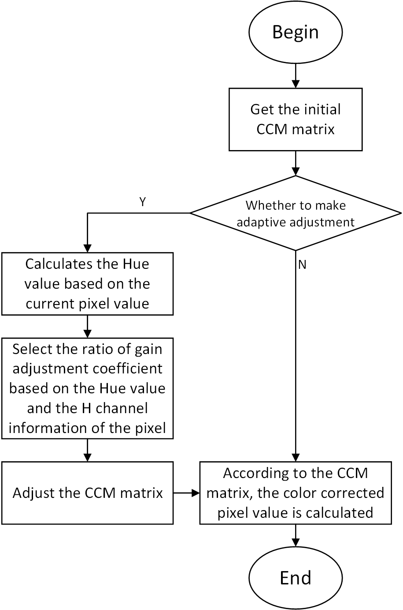

# CMC algorithm module

[TOC]

## Revision History

| Revision | Date | Author | Description |
| -------- | ---- | ------ | ----------- |
| 0.1      | 2022.12.06 | Xiao Wanwei | origin      |

## 1.Introduction

### 1.1 Request & Purpose

This document presents Color  Correction Matrix algorithm and specification in XK-ISP pipeline architecture. It defines the features with high-level diagram and modules design. The team members can follow this document to do detailed design and implementation.

### 1.2 Definitions & Abbreviations

| Name | Description             |
| :--- | ----------------------- |
| CCM  | Color Correction Matrix |

## 2. Overview

This module corrects the Color of the image through Color Correction Matrix (CCM), that is, color correction matrix, so that the effect of the corrected image is closer to the visual perception of the human eye. The reason why color correction is needed is that there is usually a deviation between the response of the sensor to the spectrum and the response of the human eye to the spectrum, which will lead to a deviation between the color of the scene seen by the human eye and the color of the photo taken by the camera.

Therefore, it is necessary to correct the color of the shot to make the final image look and feel as similar as possible to the human eye. Therefore, in ISP, a color correction matrix CCM is usually used to correct the cross effect and response intensity of spectral response, so that the image processed by ISP is consistent with human vision in color.

#### 2.1 CMC Location

## 3. CMC algorithm and process

### 3.1 CMC Algorithm and function

In our xkISP, the basic principle of color correction is to use a 3×3 color correction matrix CCM to transform the input image pixel value in the RGB domain, and add a bias coefficient to get a new pixel value (R ',G ',B ') by mapping. [1] is referred here, so the key to color correction lies in the acquisition of CCM matrix.
$$
\left[
 \begin{matrix}
   R^`\\
   G^`\\
   B^`
  \end{matrix}
  \right] =M*\left[
 \begin{matrix}
   R\\
   G\\
   B
  \end{matrix}
  \right]
$$

Generally, the calibrated CCM matrix of 3*4 is used for correction. By shooting color checker24 color board, the image value taken by the camera is compared with the standard value of the color board, and a set of CCM matrix that can correct the shooting value to the closest standard value is obtained.

### 3.2 CMC Parameter initialization（cmc_init）

#### 3.2.1 Function interfaces

| Name     | Description              |
| -------- | ------------------------ |
| topParam | ISP top-level parameters |
| cmcParam | CMC module parameters    |

#### 3.2.2 Algorithm and function

Initializes all parameter values

### 3.3 CMC top level module（isp_cmc）

#### 3.3.1 Function interfaces

| Name     | Description              |
| -------- | ------------------------ |
| topParam | ISP top-level parameters |
| CMCParam | CMC module parameters    |
| srcData  | input data               |
| dstData  | output data              |

#### 3.3.2 Algorithm and function

Our algorithm flow provides an adaptive color matrix adjustment method. The whole calculation process is as follows:

For the adaptive adjustment method, the corresponding chromaticity value (Hue value) (0&lt; Hue&lt; 360); Then, different color gain adjustment coefficient HueRatio was selected according to the calculated distribution interval of the chromaticity value corresponding to the current pixel, and EdgeRatio was selected according to the edge signal intensity recorded by the H channel of the current pixel. Finally, the gain of CCM matrix is adjusted by combining HueRatio and EdgeRatio.

Next, the details of the adaptive adjustment process are introduced in detail. Firstly, the default CCM matrix is set, and then the Hue value is calculated using the values of the three channels of the current pixel RGB.

For different Hue values, select the preset gain adjustment factor HueRatio. When the Hue value is located at the HueRange boundary of the hue interval, the HueVanishBoundary of the hue gradient interval is calculated according to the set smoothing interval bandshift, and finally HueRatio is calculated.
$$
HueVanishBoundary = HueRange - 2^{bandshift}\\
HueRatio = (Hue - HueVanishBoundary) * 2^{6-bandshift}
$$
Finally, the original pixel [R G B] is multiplied with the updated matrix to get the color corrected pixel value [R 'G' B '].
$$
\left[
 \begin{matrix}
   R^`\\
   G^`\\
   B^`
  \end{matrix}
  \right] =M*\left[
 \begin{matrix}
   R\\
   G\\
   B
  \end{matrix}
  \right]
$$

### 3.4 CMC algorithm function module（RGB2H）

#### 3.4.1 Function interfaces

| Name | Description           |
| ---- | --------------------- |
| R    | R-channel pixel value |
| G    | G-channel pixel value |
| B    | B-channel pixel value |

#### 3.4.2 Algorithm and function

This function is used to convert RGB values to HSL color models. This function accepts three integers representing the R, G, and B values of color and returns an integer representing hue. Hue is calculated by finding the minimum and maximum RGB values and using them to determine the hue based on which of R, G, or B equals the maximum. The hue value returned ranges from 0 to 360, where 0 represents red and the hue increases in increments of 60 as it moves through the color wheel.

### 3.5 CMC algorithm function module（_procCMCLine）

#### 3.5.1 Function interfaces

| Name       | Description                 |
| ---------- | --------------------------- |
| frameWidth | the width of the image      |
| src        | input data                  |
| dst        | output data                 |
| blc        | Black horizontal correction |
| gain       | Image gain value            |

#### 3.5.2 Algorithm and function

This is a method of color correction for images. The method receives images as input and corrects them based on the "CCM filter" algorithm. The method processes each line of the image, adjusting the red, green, and blue values of each pixel, taking into account tone and edge information. The corrected value is stored in the output image. The correction process involves calculating a ratio based on hue and edge information, and then applying that ratio to the red, green, and blue values of each pixel. The correction also uses a 4x3 matrix to adjust the value of each pixel. In this method, tone range, edge threshold and correction intensity are used to control the correction process.

## 4. Reference

[1] Leon Lozhkin, and A.A. Soldatov. "Color Correction in Modern Color Reproduction Devices." Journal of Communications Technology and Electronics 63.4: 361-366,2018. 