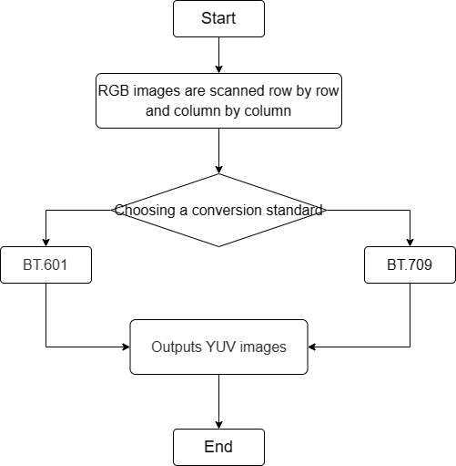
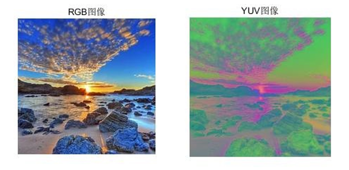

# CSC Module

1. Introduction

   1.1 Request & Purpose

   1.2 Definitions & Abbreviations

2. Overview

   2.1 CSC Location

   2.2 CSC parameters

3. CSC algorithm and process

   3.1 CSC parameter initialization（csc_init）

   3.2 CSC parameter transfer function（_rgb2yuvFrameStart）

   3.3 CSC top level module（isp_csc）

   3.4 CSC algorithm function module（_rgb2yuv）

   3.5 CSC algorithm function module（_rgb2yuvLineProc）

4. Reference

## Revison History

| Revision | Date   | Author | Description |
| ---- | ---------- | -------- | ---- |
| 0.1  | 2022.11.08 | Yuheng Wei | Initial draft |
|      |            |          |      |
|      |            |          |      |

## 1. Introduction

### 1.1 Request & Purpose

This document describes the algorithm of the color space conversion module in the CTL ISP architecture. Team members can use it to understand the code, or they can follow the design details and implement their own code.

### 1.2 Definitions & Abbreviations

| Name | Description            |
| ---- | ---------------------- |
| CSC  | color space conversion |
|      |                        |
|      |                        |
|      |                        |
|      |                        |

## 2. Overview

In our xkISP, the CSC module performs the conversion from RGB color space to YUV color space. The conversion criteria from RGB color space to YUV color space [1]\[2]\[3] are as follows:

(1) BT.601 standard - Standard definition digital television（SDTV)
$$
\begin{cases}
Y=0.299×R+0.587×G+0.114×B \\
U=Cb=0.564×(B-Y) \\
V=Cr=0.713×(R-Y)
\end{cases}\tag{2-1}
$$
(2) BT.709 standard - High definition digital television（HDTV)
$$
\begin{cases}
Y=0.2126×R+0.7152×G+0.0722×B \\
U=Cb=0.539×(B-Y) \\
V=Cr=0.635×(R-Y)
\end{cases}\tag{2-2}
$$
(3) BT.2020 standard - Ultra high definition digital TV（UHDTV)
$$
\begin{cases}
Y=0.2627×R+0.6780×G+0.0593×B \\
U=Cb=0.5315×(B-Y) \\
V=Cr=0.678×(R-Y)
\end{cases}\tag{2-3}
$$

### 2.1 CSC location

Figure 2-1 Position of the CSC module in the ISP pipeline

### 2.2 CSC parameters

| Name     | Default Value | Shadow | Description                              |
| -------- | ------------- | ------ | ---------------------------------------- |
| m_nEb    | 1             |        | enable signal for CSC module             |
| coef[12] | \             |        | color space conversion formula parameter |
|          |               |        |                                          |
|          |               |        |                                          |
|          |               |        |                                          |
|          |               |        |                                          |
|          |               |        |                                          |
|          |               |        |                                          |
|          |               |        |                                          |

## 3. CSC algorithm and process

BGR image conversion to YUV image requires point-by-point conversion, so each pixel should be scanned. In this module, the alternative standards are BT.601 and BT.709.

- top parameters

| Name        | Description                                                  |
| ----------- | ------------------------------------------------------------ |
| imgPattern  | bayer format (Channel 0:r, channel 1:Gr, channel 2:Gb, channel 3:b) |
| frameWidth  | Width of image                                               |
| frameHeight | Height of image                                              |
|             |                                                              |
|             |                                                              |
|             |                                                              |

### 3.1 CSC parameter initialization（csc_init）

#### 3.1.1 Function interfaces

| Name     | Description              |
| -------- | ------------------------ |
| topParam | ISP top-level parameters |
| cscParam | CSC module parameters    |
|          |                          |
|          |                          |
|          |                          |
|          |                          |

#### 3.1.2 Algorithm and function

Initializes all parameter values

### 3.2 CSC parameter transfer function（_rgb2yuvFrameStart）

#### 3.2.1 Function interfaces

| Name         | Description              |
| ------------ | ------------------------ |
| topParam     | ISP top-level parameters |
| inParam      | function input parameter |
| rgb2yuvParam | CSC module parameters    |
|              |                          |
|              |                          |
|              |                          |

#### 3.2.2 Algorithm and function

It is used to pass parameters

### 3.3 CSC top level module（isp_csc）

#### 3.3.1 Function interfaces

| Name         | Description              |
| ------------ | ------------------------ |
| topParam     | ISP top-level parameters |
| rgb2yuvParam | CSC module parameters    |
| srcData      | input data               |
| dstData      | output data              |
|              |                          |
|              |                          |

#### 3.3.2 Algorithm and function

The whole process of color space conversion algorithm can be divided into three steps:

- Step 1: Scan RGB images point by point;

- Step 2: Select conversion standard for conversion;

- Step 3: Save the YUV image.

  

Figure 3-1 Flowchart of BGR2YUV

### 3.4 CSC algorithm function module（_rgb2yuv）

#### 3.4.1 Function interfaces

| Name | Description                              |
| ---- | ---------------------------------------- |
| src  | input data                               |
| dst  | output data                              |
| coef | color space conversion formula parameter |
| data | stores pixel RGB and YUV data            |
|      |                                          |
|      |                                          |
|      |                                          |

#### 3.4.2 Algorithm and function

Single pixel color space conversion processing

### 3.5 CSC algorithm function module（_rgb2yuvLineProc）

#### 3.5.1 Function interfaces

| Name         | Description                |
| ------------ | -------------------------- |
| src          | input data                 |
| dst          | output data                |
| srcPitch     | input image width boundary |
| rgb2yuvParam | CSC module parameters      |
|              |                            |
|              |                            |
|              |                            |

#### 3.5.2 Algorithm and function

Perform color space conversion processing on the image line by line

Figure 3-2 CSC effect

## 4. Reference

[1] Recommendation ITU-R BT.601-7 (03/2011), Studio encoding parameters of digital television for standard 4:3 and wide-screen 16:9 aspect ratios, BT Series Broadcasting service (television), Electronic Publication Geneva, 2015.

[2] Recommendation ITU-R BT.709-6 (06/2015), Parameter values for the HDTV standards for production and international programme exchange, BT Series Broadcasting service (television), Electronic Publication Geneva, 2015.
