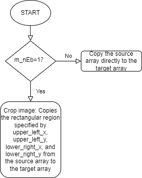
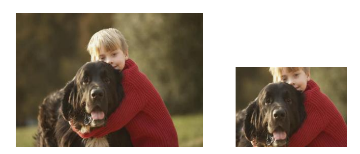

# Crop algorithm module

[TOC]

## Revision History

| Revision | Date | Author | Description |
| -------- | ---- | ------ | ----------- |
| 0.1  | 2022.12.06 | 许珐      | 初稿 |

## 1.Introduction

### 1.1 Request & Purpose

This document presents Crop algorithm and specification in XK-ISP pipeline architecture. It defines the features with high-level diagram and modules design. The team members can follow this document to do detailed design and implementation.

### 1.2 Definitions & Abbreviations

| Name | Description    |
| :--- | -------------- |
| Crop | Image cropping |

## 2. Overview

The Crop module is located at the last level of the xkISP pipeline. Its function is to crop out the area of interest in the completed image. It is a relatively simple module in the ISP pipeline.

### 2.1 Crop location

## 3. Crop algorithm and process

### 3.1 Crop Algorithm and function

The image clipping method is relatively simple. The pixel value of the interested area of the image can be saved to the output image to complete the image clipping. As shown in the figure, With and Height indicate the width and height of the original image, OutWidth and OutHeight indicate the image width after cropping, and top, bottom, left and right indicate the information needed to complete image cropping.

The flowchart of Crop module:

Effects of Crop algorithm:

### 3.2 Crop parameter initialization（crop_init）

#### 3.1.1 Function interfaces

| Name      | Description              |
| --------- | ------------------------ |
| topParam  | ISP top-level parameters |
| cropParam | Crop module parameters   |

#### 3.2.2 Algorithm and function

Initializes all parameter values

### 3.3 Crop top-level module (isp_crop)

#### 3.3.1 Function interfaces

| Name     | Description              |
| -------- | ------------------------ |
| topParam | ISP top-level parameters |
| cropData | Crop module parameters   |
| srcData  | input data               |
| dstData  | output data              |

#### 3.3.2 Algorithm and function

This function takes source YUV image data and clipping parameters as input, and generates clipped YUV image data. The crop region is defined by the top left and bottom right coordinates of the crop rectangle. The input image data can be in two different formats: full YUV format or y format only. Filters check the format of the input data and crop accordingly. If the m_nEb flag is set to 0, the output image is the same as the input image. Otherwise, the input Y/U/V data is copied to the specified clipping area to obtain the output Y/U/V data.
