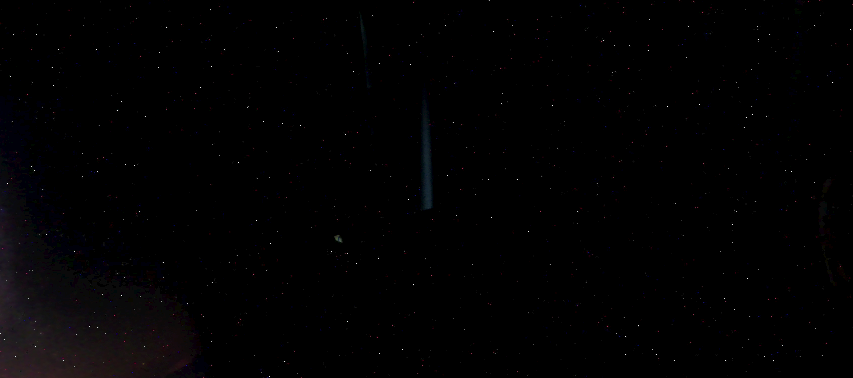
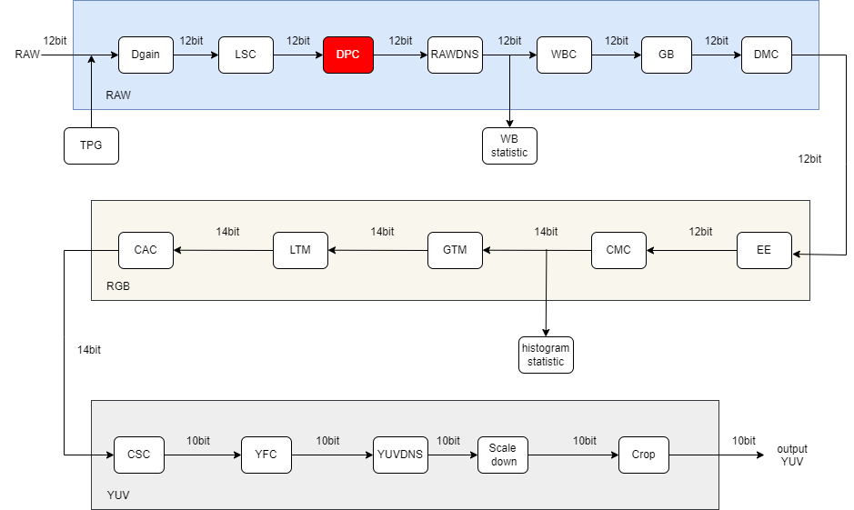
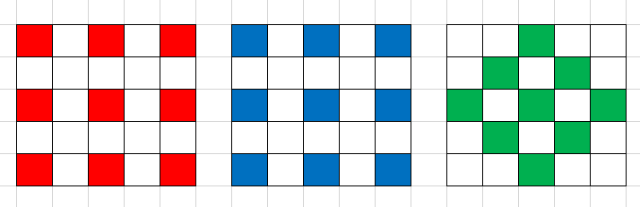
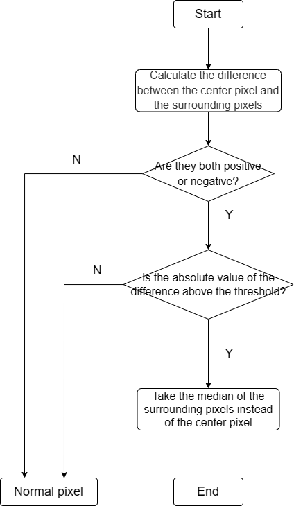
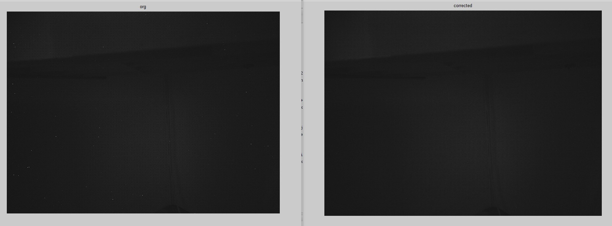

# DPC Module

1. Introduction

   1.1 Request & Purpose

   1.2 Definitions & Abbreviations

2. Overview

   2.1 DPC location

   2.2 DPC parameters

3. DPC algorithm and process

   3.1 DPC parameter initialization（dpc_init）

   3.2 DPC top level module（isp_dpc）

   3.3 DPC algorithm function module（medianFilter）

   3.4 DPC algorithm function module（defectPixelDetection）

   3.5 DPC algorithm function module（GetRawWindow）

4. Reference

## Revison History

| Revision | Date       | Author    | Description   |
| -------- | ---------- | --------- | ------------- |
| 0.1      | 2022.10.14 | Hongbo Ke | Initial draft |
|          |            |           |               |
|          |            |           |               |

## 1. Introduction

### 1.1 Request & Purpose

This document describes the algorithm for the bad-point correction module in the CTL ISP architecture. Team members can use it to understand the code, or they can follow the design details and implement their own code.

### 1.2 Definitions & Abbreviations

| Name | Description                |
| ---- | -------------------------- |
| DPC  | Defective Pixel Correction |
|      |                            |
|      |                            |
|      |                            |
|      |                            |

## 2. Overview

The Pixels on CMOS lens that appear extremely bright or extremely dark due to the failure of external illumination can be divided into Dead pixels, Stuck Pixels and Hot pixels. The former is the dark pixels under high exposure, and the middle is the color pixels appearing at the same position under high exposure. The latter are bright spots produced under extremely dark conditions. The bad point correction module is to detect the bad point and correct the bad point.

Figure 2-1 Defective Pixel in the image

### 2.1 DPC location

Figure 2-2 Position of the DPC module in the ISP pipeline

### 2.2 DPC parameters

| Name        | Default Value | Shadow | Description                                                  |
| ----------- | ------------- | ------ | ------------------------------------------------------------ |
| m_nEb       | 1             |        | enable signal for DPC module                                 |
| threshold_w | 300           |        | the upper threshold absolute value of the difference between pixel values |
| threshold_b | 300           |        | the lower threshold absolute value of the difference between pixel values |
|             |               |        |                                                              |
|             |               |        |                                                              |
|             |               |        |                                                              |
|             |               |        |                                                              |
|             |               |        |                                                              |
|             |               |        |                                                              |

## 3. DPC algorithm and process

### PINTO algorithm

The main idea is that bad points tend to be extremely bright or extremely dark points in a neighborhood, as shown in Figure 3-1. A 5x5 neighborhood is used as the detection area, and the current pixel value is replaced by the median value of eight adjacent pixel values after judging a bad point.

Figure 3-1 5x5 neighborhood detection area

- top parameters

| Name        | Description                                                  |
| ----------- | ------------------------------------------------------------ |
| imgPattern  | bayer format (Channel 0:r, channel 1:Gr, channel 2:Gb, channel 3:b) |
| frameWidth  | Width of image                                               |
| frameHeight | Height of image                                              |
|             |                                                              |
|             |                                                              |
|             |                                                              |

### 3.1 DPC parameter initialization（dpc_init）

#### 3.1.1 Function interfaces

| Name     | Description              |
| -------- | ------------------------ |
| topParam | ISP top-level parameters |
| dpcParam | DPC module parameters    |
|          |                          |
|          |                          |
|          |                          |
|          |                          |

#### 3.1.2 Algorithm and function

Initializes all parameter values

### 3.2 DPC top level module（isp_dpc）

#### 3.2.1 Function interfaces

| Name     | Description              |
| -------- | ------------------------ |
| topParam | ISP top-level parameters |
| dpcParam | DPC module parameters    |
| srcData  | input data               |
| dstData  | output data              |
|          |                          |
|          |                          |

### 3.2.2 Algorithm and function

The whole process of lens bad point correction algorithm can be divided into five steps:

- Step 1: Calculate the difference between the center pixel and the eight surrounding pixels;
- Step 2: Determine if all eight differences are positive or all eight are negative;
- Step 3: If some are positive and some are negative, then it is normal, otherwise proceed to the next step;
- Step 4: Set a threshold, if the absolute value of the eight differences check the threshold, then judge as a bad point;
- Step 5: Replace the current pixel value with the median of eight neighboring pixel values after the bad pixel value is detected.

Figure 3-2 Flowchart of the DPC algorithm

### 3.3 DPC algorithm function module（medianFilter）

#### 3.3.1 Function interfaces

| Name       | Description                             |
| ---------- | --------------------------------------- |
| array_ori  | input 8 neighboring pixel values        |
| array_sort | output the median of eight pixel values |
|            |                                         |
|            |                                         |
|            |                                         |
|            |                                         |
|            |                                         |

#### 3.3.2 Algorithm and function

The bubble sort algorithm is used to find the median value of the eight adjacent pixel values of the center pixel to be detected.

### 3.4 DPC algorithm function module（defectPixelDetection）

#### 3.4.1 Function interfaces

| Name         | Description                                                  |
| ------------ | ------------------------------------------------------------ |
| array_ori[8] | input 8 neighboring pixel values                             |
| pixel        | the pixel value of the center pixel to be detected           |
| th_w         | the upper threshold absolute value of the difference between pixel values |
| th_b         | the lower threshold absolute value of the difference between pixel values |
|              |                                                              |
|              |                                                              |
|              |                                                              |

#### 3.4.2 Algorithm and function

A threshold is set to calculate the difference between the center pixel and the eight surrounding pixels, and whether the eight differences are all positive or all negative values are determined. If the absolute value of each of the eight differences passes the threshold, it is considered a bad point.

### 3.5 DPC algorithm function module（GetRawWindow）

#### 3.5.1 Function interfaces

| Name             | Description                                   |
| ---------------- | --------------------------------------------- |
| srcData          | input data                                    |
| (\*rawWindow)[5] | the neighborhood of 5x5 is the detection area |
| row              | the number of rows in the window              |
| col              | the number of columns in the window           |
| stride           | interval step size                            |
|                  |                                               |
|                  |                                               |

#### 3.5.2 Algorithm and function

The image is scanned for window data.

Figure 3-3 DPC effect

## 4. Reference

[1] Jenny Leung, Jozsef Dudas, Glenn H. Chapman, Israel Koren and Zahava Koren. Quantitative Analysis of In-Field Defects in Image Sensor Arrays[C]// Defect and Fault-Tolerance in VLSI Systems, 2007. DFT '07. 22nd IEEE International Symposium on. IEEE, 2007.
