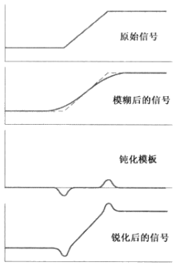
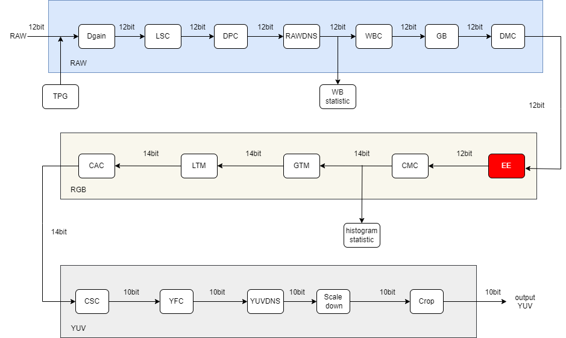
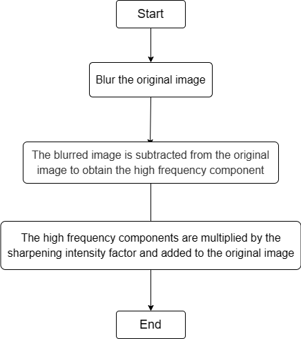

# EE Module

1. Introduction

   1.1 Request & Purpose

   1.2 Definitions & Abbreviations

2. Overview

   2.1 EE Location

   2.2 EE parameters

3. EE algorithm and process

   3.1 EE parameter initialization（ee_init）

   3.2 EE top level module（isp_edge_enhancement）

   3.3 EE window fetching function（get_block）

   3.4 EE image copy function（copydata）

   3.5 EE algorithm operation（ee_process）

4. Reference

## Revison History

| Revision | Date       | Author    | Description   |
| -------- | ---------- | --------- | ------------- |
| 0.1      | 2022.10.17 | Hongbo Ke | Initial draft |
|          |            |           |               |
|          |            |           |               |

## 1. Introduction

### 1.1 Request & Purpose

This document describes the algorithm for the edge enhancement module in the CTL ISP architecture. Team members can use it to understand the code, or they can follow the design details and implement their own code.

### 1.2 Definitions & Abbreviations

| Name | Description      |
| ---- | ---------------- |
| EE   | Edge Enhancement |
|      |                  |
|      |                  |
|      |                  |
|      |                  |

## 2. Overview

The image processed by the past noise module in the ISP pipeline often has blurred visual effects. The sharpening module can enhance the details and edges in the image. This sharpening module is after Demosaic and is sharpened in the RGB domain of the image.

Figure 2-1 Image sharpening

### 2.1 EE location

Figure 2-2 Position of the EE module in the ISP pipeline

### 2.2 EE parameters

| Name     | Default Value | Shadow | Description                 |
| -------- | ------------- | ------ | --------------------------- |
| eb       | 1             |        | enable signal for EE module |
| win_size | 5             |        | window size                 |
| ee_coeff | 3             |        | filter parameters           |
|          |               |        |                             |
|          |               |        |                             |
|          |               |        |                             |
|          |               |        |                             |
|          |               |        |                             |
|          |               |        |                             |

## 3. EE algorithm and process

### USM algorithm

Since the details and edges in the image are mainly reflected in the high frequency band with higher sharpness in the frequency domain, the basic idea of sharpening is to enhance the proportion of the high-frequency components generated by the image separation in the pixel value. As shown in Expression 3-1:

$$
y'=y+k\times HighFeq \tag{3-1}
$$

In the above equation, y' and y respectively represent the pixel values before and after sharpening at the same position,k represents the sharpening intensity factor, the larger the value of k, the stronger the sharpening degree, and HighFeq is the high-frequency component to be sharpening.

- top parameters

| Name        | Description     |
| ----------- | --------------- |
| frameWidth  | Width of image  |
| frameHeight | Height of image |
|             |                 |
|             |                 |
|             |                 |
|             |                 |

### 3.1 EE parameter initialization（ee_init）

#### 3.1.1 Function interfaces

| Name | Description              |
| ---- | ------------------------ |
| t1   | ISP top-level parameters |
| t2   | EE module parameters     |
|      |                          |
|      |                          |
|      |                          |
|      |                          |

#### 3.1.2 Algorithm and function

Initializes all parameter values

### 3.2 EE top level module（isp_edge_enhancement）

#### 3.2.1 Function interfaces

| Name    | Description              |
| ------- | ------------------------ |
| isp_top | ISP top-level parameters |
| ee_reg  | EE module parameters     |
| src     | input data               |
| dst     | output data              |
|         |                          |
|         |                          |

### 3.2.2 Algorithm and function

The whole process of edge enhancement algorithm can be divided into 3 steps：

- Step 1: Blur the original image;
- Step 2: The blurred image is subtracted from the original image to obtain the high frequency component;
- Step 3: The high frequency components are multiplied by the sharpening intensity factor and added to the original image.

Figure 3-2 EE algorithm steps

### 3.3 EE window fetching function（get_block）

#### 3.3.1 Function interfaces

| Name         | Description                |
| ------------ | -------------------------- |
| src_in       | input data                 |
| block[5] [5] | image filtering 5*5 window |
| isp_top      | ISP top-level parameters   |
| ee_reg       | EE module parameters       |
| cur_y        | number of window rows      |
| cur_x        | number of window columns   |

#### 3.3.2 Algorithm and function

A window of 5*5 size is read in the image to prepare for the next step of the algorithm

### 3.4 EE image copy function（copydata）

#### 3.4.1 Function interfaces

| Name    | Description              |
| ------- | ------------------------ |
| isp_top | ISP top-level parameters |
| src     | input data               |
| dst     | output data              |
|         |                          |
|         |                          |
|         |                          |

#### 3.4.2 Algorithm and function

Copy the whole image data

### 3.5 EE algorithm operation（ee_process）

#### 3.5.1 Function interfaces

| Name         | Description                |
| ------------ | -------------------------- |
| block[5] [5] | image filtering 5*5 window |
| isp_top      | ISP top-level parameters   |
| ee_reg       | EE module parameters       |
| cur_y        | number of window rows      |
| cur_x        | number of window columns   |
|              |                            |

#### 3.5.2 Algorithm and function

The method of blurring the image uses the 5\*5 range Gaussian filter with a custom threshold centered at the position to be filtered, and the coefficients are shown in Figure 3-3:

Figure 3-3 Gaussian filtering in the 5*5 range

The high frequency component HighFreq is obtained by subtracting the Gaussian filtered blurred image pixels from the original image pixel values.

Figure 3-4 EE effect

## 4. Reference

[1] 冈萨雷斯.数字图像处理: 第三版[TN].北京：电子工业出版社，2011
