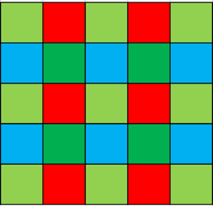
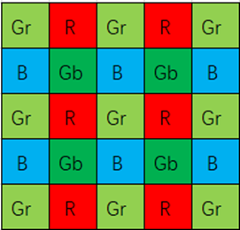
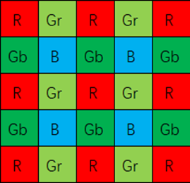
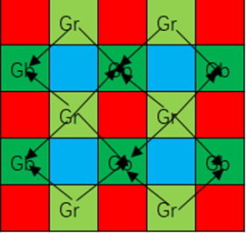
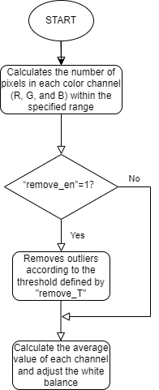

# GB algorithm module

[TOC]

## Revision History

| Revision | Date | Author | Description |
| -------- | ---- | ------ | ----------- |
|          | 2022.12.06   | Ke Hongbo| Origin      |

## 1. Introduction

### 1.1 Request & Purpose

This document presents automatic green balance algorithm and specification in XK-ISP pipeline architecture. It defines the features with high-level diagram and modules design. The team members can follow this document to do detailed design and implementation.

## 1.2 Definitions & Abbreviations

| Name | Description   |
| ---- | ------------- |
| GB   | green balance |

## 2. Overview

The green balance module is usually before the de-mosaics module in the ISP pipeline, in order to eliminate the excessive difference in channel brightness caused by the difference between Gr and Gb modules, which leads to the "maze lattice" effect.

 

Normal Bayer grid, no process deviation between Gr/Gb,The color of adjacent areas of the image is uniform, and there is no maze lattice phenomenon.

Due to the brightness deviation between Gr/Gb produced by the manufacturing process, the image appeared maze lattice phenomenon.

### 2.1 GB Location

### 2.2 GB parameters

| Name              | Default Value | Shadow | Description                                                  |
| ----------------- | ------------- | ------ | ------------------------------------------------------------ |
| gb_top.eb         | 1             |        | enable signal for GB module                                  |
| gb_local.low_num  | 4             |        | The minimum number of Gb and Gr pairs in a block             |
| gb_local.high_num | 20            |        | The maximum number of Gb and Gr pairs in a block             |
| gb_local.thre     | 683           |        | The maximum threshold for the chromaticity difference between adjacent Gb and Gr |

## 3. GB algorithm and process

### 3.1 GB Algorithm and function

The solution to the maze lattice phenomenon is to equalize the brightness difference between Gr and Gb channels. For R/Gr pixels in Raw images, the difference between the pixels and the mean Gb in the neighboring regions should be subtracted. The same is true for B/Gb pixels, as shown in the following example:

The chroma type of the center point is Gr, The chroma type of the center point is R

The chroma type of the center point is B, The chroma type of the center point is Gb

As shown in the picture in the first row above, when the chromaticity type of the center point is Gr/R chromaticity, the difference mean value of Gr/Gb pairs adjacent to all positions in the 5*5 area should be subdivided from the pixel value of the center point, as shown in the following formula (where Gr 'and Gr respectively represent the pixel value of the same position before and after green balance treatment):

$R'=R-\frac{Mean(Gr-Gb)}{2}$   $Gr'=Gr-\frac{Mean(Gr-Gb)}{2}$  

Taking the chromaticity type of the center point R as an example (Gr is the same), the mean value of Gr/Gb difference pairs in the 5*5 area centered by the center point R is calculated as shown in the following figure. By observing the image, it can be seen that the essence is to calculate the difference between the Gb chromaticity of each Gr position and its diagonal position in the figure and then take the mean value.

When the chromaticity type of the center point is Gb/B chromaticity, the difference mean of Gr/Gb pairs adjacent to all positions in the 5*5 area should be subtracted from the pixel value of its position, as shown in the following formula:

$B'=B-\frac{Mean(Gb-Gr)}{2}$  $Gb'=Gb-\frac{Mean(Gb-Gr)}{2}$

Taking the chromaticity type B of the center point as an example (Gb is the same), the mean value of Gr/Gb difference pairs in the 5*5 area centered by the center point B is calculated as shown in the following figure. By observing the image, we can see that the essence is to calculate the difference between Gr of each Gb position and its diagonal position and then take the mean value.

GB top parameters initialization:

| Name                | Default | Description                   |
| ------------------- | ------- | ----------------------------- |
| isp_top.frameHeight | 1088    | the height of image           |
| isp_top.frameWidth  | 1928    | the width of image            |
| isp_top.imgPattern  | 3       | the pattern of bayer          |
| gb_top.win_size     | 7       | the size of each pixel window |

The flowchart of GB module:

### 3.2 GB Parameter initialization（gb_init）

#### 3.2.1 Function interfaces

| Name    | Description              |
| ------- | ------------------------ |
| isp_top | ISP top-level parameters |
| gb_top  | GB module parameters     |

#### 3.2.2 Algorithm and function

Initializes all parameter values

### 3.3 GB top level module（isp_greenbalance）

#### 3.3.1 Function interfaces

| Name    | Description              |
| ------- | ------------------------ |
| isp_top | ISP top-level parameters |
| gb_top  | GB module parameters     |
| src_in  | input data               |
| dst_out | output data              |

#### 3.3.2 Algorithm and function

The function first checks if the green balance feature is enabled. If enabled, it initializes local variables and sets the output array to the input array. It then blocks the image, with each block measuring 7x7 pixels. This function extracts the current block using a function named "get_block" and then performs "gb_process" on each block to get the output pixel value. Finally, the function returns a Boolean value indicating whether the process was successful. If the green balancing feature is not enabled, the function copies the input array to the output array using the "copydata" function.

### 3.4 GB algorithm function module（get_block）

#### 3.4.1 Function interfaces

<table>
    <tr>
        <td>Parameter</td>
        <td>Description</td>
    </tr>
    <tr>
        <td>src_in</td>
        <td>Input data</td>
    </tr>
    <tr>
        <td>block[7] [7]</td>
        <td>Window of 7x7 extracted from input data</td>
    </tr>
    <tr>
        <td>isp_top</td>
        <td>ISP top-level parameters</td>
    </tr>
    <tr>
        <td>gb_top</td>
        <td>gb module parameters</td>
    </tr>
    <tr>
        <td>cur_y</td>
        <td>Current point's y-coordinate</td>
    </tr>
    <tr>
        <td>cur_x</td>
        <td>Current point's x-coordinate</td>
    </tr>
</table>

#### 3.4.2 Algorithm and function

This function is used to get window pixels. Gets a 7*7 window block centered on the current coordinate (cur_x, cur_y) from the input source image array src_in. This window block is stored in an array of blocks. The function also uses two structure parameters: isp_top and gb_top. Finally, the function returns a Boolean value indicating whether the operation was successful.

### 3.5 GB algorithm function module（gb_process）

#### 3.5.1 Function interfaces

<table>
    <tr>
        <td>Parameter</td>
        <td>Description</td>
    </tr>
    <tr>
        <td>block[7] [7]</td>
        <td>Input data</td>
    </tr>
    <tr>
        <td>top</td>
        <td>Input data</td>
    </tr>
    <tr>
        <td>gb_top</td>
        <td>ISP top level parameter</td>
    </tr>
    <tr>
        <td>local</td>
        <td>GB module parameter</td>
    </tr>
    <tr>
        <td>cur_y</td>
        <td>Y-coordinate of current point</td>
    </tr>
    <tr>
        <td>cur_x</td>
        <td>X-coordinate of current point</td>
    </tr>
    <tr>
        <td>bIfRBpixel</td>
        <td>Flag indicating it is a red/blue (RB) pixel or a green pixel</td>
    </tr>
    <tr>
        <td>Gfifo[6]</td>
        <td>Array used as a FIFO (first-in first-out)</td>
    </tr>
    <tr>
        <td>countfifo[6]</td>
        <td>Array used as a FIFO (first-in first-out)</td>
    </tr>
</table>

#### 3.5.2 Algorithm and function

This function is used to calculate the green balance of pixels in the window. Process 7x7 pixel blocks in the image and calculate green balance statistics. The block is treated differently depending on whether it is a Red and Blue (RB) pixel. For RB pixels, the difference between the current pixel and its two diagonal neighbors is calculated, and if the absolute difference is less than the threshold, it is added to the sum. For non-RB pixels, the difference between the current pixel and its four diagonal neighbors is calculated, and if the absolute difference is less than the threshold, it is added to the sum. The sum and the total number of pixel differences used in the sum are calculated and used to update green balance statistics.

### 3.6 GB algorithm function module（copydata）

#### 3.6.1 Function interfaces

| Name    | Description              |
| ------- | ------------------------ |
| isp_top | ISP top-level parameters |
| dst_out | output data              |
| src_in  | input data               |

#### 3.6.2 Algorithm and function

When a variable of class 'GreenBalance' is disabled, the original data is written to the output array 'dst_out' by copying. This function copies memory using the 'memcpy' function. Function returns a Boolean variable representing the state of execution.
