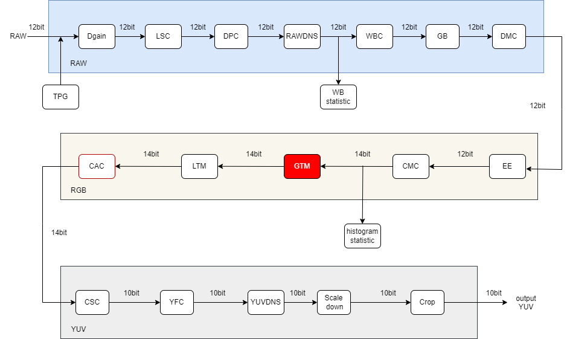
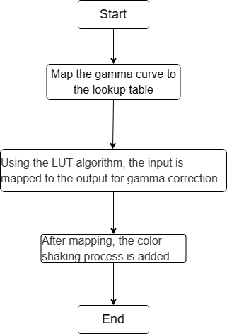
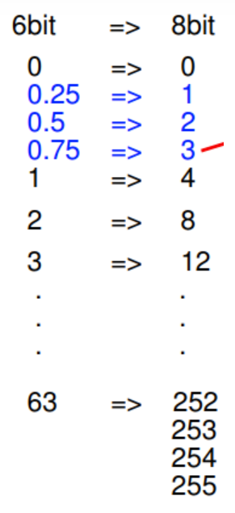

# GTM Module

1. Introduction

   1.1 Request & Purpose

   1.2 Definitions & Abbreviations

2. Overview

   2.1 GTM Location

   2.2 GTM parameters

3. GTM algorithm and process

   3.1 GTM parameter initialization（gtm_init）

   3.2 GTM parameter transfer function（_gtmFrameStart）

   3.3 GTM top level module（isp_gtm）

   3.4 GTM algorithm function module（globalToneMapping）

   3.5 GTM algorithm function module（_gtmLineProc）

4. Reference


## Revison History

| Revision | Date       | Author      | Description   |
| ---- | ---------- | -------- | ---- |
| 0.1  | 2022.10.14 | Wanwei Xiao | Initial draft |
|      |            |          |      |
|      |            |          |      |

## 1. Introduction

### 1.1 Request & Purpose

This document describes the algorithm for the gamma correction module in the CTL ISP architecture. Team members can use it to understand the code, or they can follow the design details and implement their own code.

### 1.2 Definitions & Abbreviations

| Name | Description      |
| ---- | ---------------- |
| GTM  | Gamma Correction |
|      |                  |
|      |                  |
|      |                  |
|      |                  |

## 2. Overview

Since the human eye's perception of natural brightness is nonlinear, and the medium used to record/display images, the dynamic range and gray scale budget are limited. In order to coordinate the mapping relationship between natural brightness and subjective gray-scale perception under the premise of limited gray-scale budget, gamma is produced.


<center>Figure 2-1 Grayscale plots with different gamma values</center>

### 2.1 GTM location



<center>Figure 2-2 Position of the GTM module in the ISP pipeline</center>

### 2.2 GTM parameters

| Name               | Default Value | Shadow | Description                           |
| ------------------ | ------------- | ------ | ------------------------------------- |
| eb                 | 1             |        | enable signal for GTM module          |
| m_bDitheringEnable | 1             |        | enable signal of color shaking module |
| gtmTab[129];       | /             |        | lookup table for gamma curve mapping  |
|                    |               |        |                                       |
|                    |               |        |                                       |
|                    |               |        |                                       |
|                    |               |        |                                       |
|                    |               |        |                                       |
|                    |               |        |                                       |

## 3. GTM algorithm and process

In our xkISP, GTM module uses gamma curve for correction, mainly in RGB color space, and the correction formula is as follows:
$$
y=(x+esp)^γ \tag{3-1}
$$
In the above equation, x and y are the gray values of the input and output images respectively, esp is the compensation coefficient, and γ is the gamma coefficient. Gamma transform can selectively enhance the contrast of low gray area or high gray area according to different values. γ is a very important parameter in image gray correction. Its value determines the gray mapping mode between the input image and the output image, that is, it determines whether to enhance the low gray area (the dark part of the image) or enhance the high gray area (the light part of the image).


<center>Figure 3-1 Diagram of the gamma transform in the range 0-1</center>

- top parameters

| Name        | Description                                                  |
| ----------- | ------------------------------------------------------------ |
| imgPattern  | bayer format (Channel 0:r, channel 1:Gr, channel 2:Gb, channel 3:b) |
| frameWidth  | Width of image                                               |
| frameHeight | Height of image                                              |
|             |                                                              |
|             |                                                              |
|             |                                                              |

### 3.1 GTM parameter initialization（gtm_init）

#### 3.1.1 Function interfaces

| 参数     | 说明                     |
| -------- | ------------------------ |
| topParam | ISP top-level parameters |
| gtmParam | GTM module parameters    |
|          |                          |
|          |                          |
|          |                          |
|          |                          |

#### 3.1.2 Algorithm and function

Initializes all parameter values

### 3.2 GTM parameter transfer function（_gtmFrameStart）

#### 3.2.1 Function interfaces

| Name     | Description              |
| -------- | ------------------------ |
| topParam | ISP top-level parameters |
| inParam  | input data               |
| gtmParam | GTM module parameters    |
| Seed[6]  | color shaking parameter  |
|          |                          |
|          |                          |

#### 3.2.2 Algorithm and function

It is used to pass parameters

### 3.3 GTM top level module（isp_gtm）

#### 3.3.1 Function interfaces

| Name     | Description              |
| -------- | ------------------------ |
| topParam | ISP top-level parameters |
| gtmParam | GTM module parameters    |
| src_data | input data               |
| dst_data | output data              |
|          |                          |
|          |                          |

### 3.3.2 Algorithm and function

The whole process of gamma correction algorithm can be divided into 3 steps:

- Step 1: Firstly, the gamma curve is mapped to a lookup table, and different lookup tables are generated for different curves. The larger the number of lookup tables, the higher the accuracy of the fitting curve;
- Step 2: After obtaining the lookup table, apply the LUT algorithm and map the input to the output for gamma correction;
- Step 3: In order to solve the problem of color fault after mapping, the color shaking process is added after mapping.



<center>Figure 3-2 GTM algorithm steps</center>


<center>Figure 3-3 The LUT algorithm</center>



<center>Figure 3-4 Color shaking</center>

### 3.4 GTM algorithm function module（globalToneMapping）

#### 3.4.1 Function interfaces

| Name               | Description                           |
| ------------------ | ------------------------------------- |
| in_data            | input data                            |
| m_bDitheringEnable | enable signal of color shaking module |
| gamma_curve        | gamma transform curve                 |
| Seed               | color shaking parameter               |
|                    |                                       |
|                    |                                       |
|                    |                                       |

#### 3.4.2 Algorithm and function

The process of gamma correction to obtain the output value is as follows:

```c++
index = in_data >> 7
y_pos0 = (gamma_curve[index] << 4) | 0xf
y_pos1 = (gamma_curve[index + 1] << 4) | 0xf 
```

In the above equation, in_data is the input pixel point, and the input pixel point is shifted, so the index value is in the range of the gamma curve mapping lookup table. Then y_pose0 and y_pose1 are obtained after adding four bits to the last gamma_curve value obtained.

$$
f(n) =
\begin{cases} 
y*x+16>>5,  & \text{if }index\text{ < 127} \\
y*x*129+2048>>12, & \text{if }index\text{ > 127}
\end{cases}
$$
After gamma correction, to compensate for the loss of accuracy and make the color excess smoother, color shaking is added, and the output pixels are processed as follows:

dithering:

```c++
out_value = (y_pos0 << 2) + out_value + (*Seed);
Seed = out_value &0x1f;
out_value >>= 2;
```

no_dithering:

```
out_value = y_pos0 +((out_value + 2) >> 2);
```

### 3.5 GTM algorithm function module（_gtmLineProc）

#### 3.5.1 Function interfaces

| Name       | Description             |
| ---------- | ----------------------- |
| src        | input data              |
| dst        | output data             |
| frameWidth | Width of image          |
| gtmParam   | GTM module parameters   |
| Seed[3]    | color shaking parameter |
|            |                         |
|            |                         |

#### 3.5.2 Algorithm and function

Execute the globalToneMapping function line by line.


<center>Figure 3-5 GTM effect</center>

## 4. Reference
