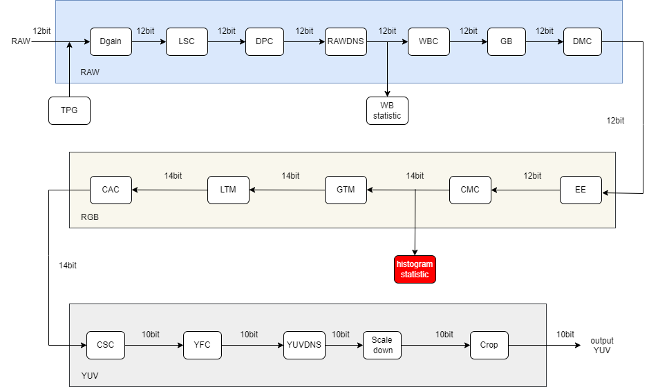
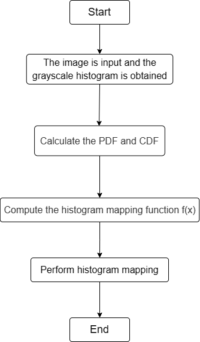

# HistEQ Module

1. istEQIntroduction

   1.1 Request & Purpose

   1.2 Definitions & Abbreviations

2. Overview

   2.1 HistEQ Locationodule

   2.2 HistEQ parameters

3. HistEQ algorithm and process

   3.1 HistEQ parameter initialization（histeq_init）

   3.2 HistEQ top level module（histteq）

   3.3 HistEQ algorithm function module（hist_static）

   3.4 HistEQ algorithm function module（hist_sum）

   3.5 HistEQ algorithm function module（map_matrix）

   3.6 HistEQ algorithm function module（mapping）

   3.7 HistEQ algorithm function module（ColorSplit）

   3.8 HistEQ algorithm function module（ColorMerg）

   3.9 HistEQ algorithm function module（copydata）

4. Reference

## Revison History

| Revision | Date       | Author | Description   |
| ---- | ---------- | -------- | ---- |
| 0.1  | 2022.11.08 | Fa Xu | Initial draft |
|      |            |          |      |
|      |            |          |      |

## 1. Introduction

### 1.1 Request & Purpose

This document describes the algorithm for the histogram equalization module in the CTL ISP architecture. Team members can use it to understand the code, or they can follow the design details and implement their own code.

### 1.2 Definitions & Abbreviations

| Name   | Description            |
| ------ | ---------------------- |
| HistEQ | Histogram Equalization |
|        |                        |
|        |                        |
|        |                        |
|        |                        |

## 2. Overview

Histogram equalization is a simple and effective image enhancement technology, which changes the gray level of each pixel in the image by changing the histogram of the image. It is mainly used to enhance the contrast of the image with small dynamic range. The intensity distribution of the original image may be concentrated in a narrow range, resulting in the image is not clear enough. The goal of histogram equalization is to stretch and adjust the histogram of the original image so that it is more evenly distributed.

### 2.1 HistEQ location

Figure 2-1 Position of the HistEQ module in the ISP pipeline

### 2.2 HistEQ parameters

| Name | Default Value | Shadow | Description                     |
| ---- | ------------- | ------ | ------------------------------- |
| eb   | 1             |        | enable signal for HistEQ module |
|      |               |        |                                 |
|      |               |        |                                 |
|      |               |        |                                 |
|      |               |        |                                 |
|      |               |        |                                 |
|      |               |        |                                 |
|      |               |        |                                 |
|      |               |        |                                 |

## 3. HistEQ algorithm and process

The basic idea of histogram equalization is to fit a histogram mapping curve :y=f(x). Where x is the gray level of the input image histogram, there are 255 kinds of gray levels in the 8-bit image, f() is the fitting histogram mapping function, which is the key to determine the effect of histogram equalization. y is the gray value of input gray level x transformed by mapping function f().

Figure 3-1 Visual representation of the image and its histogram distribution before histogram equalization

Figure 3-2 Visual effect of histogram equalization and its histogram distribution

Observing the effect before and after equalization of the histogram of the same image, it can be seen that the distribution range of the histogram of the equalized image is wider and more uniform. There is a noticeable increase in image contrast (change in image brightness in the image above).

- top parameters

| Name        | Description                                                  |
| ----------- | ------------------------------------------------------------ |
| imgPattern  | bayer format (Channel 0:r, channel 1:Gr, channel 2:Gb, channel 3:b) |
| frameWidth  | Width of image                                               |
| frameHeight | Height of image                                              |
|             |                                                              |
|             |                                                              |
|             |                                                              |

### 3.1 HistEQ parameter initialization（histeq_init）

#### 3.1.1 Function interfaces

| Name       | Description              |
| ---------- | ------------------------ |
| histeq_reg | HistEQ module parameters |
|            |                          |
|            |                          |
|            |                          |
|            |                          |
|            |                          |

#### 3.1.2 Algorithm and function

Initializes all parameter values

### 3.2 HistEQ top level module（histteq）

#### 3.2.1 Name  Description

| 参数       | 说明                     |
| ---------- | ------------------------ |
| top_reg    | ISP top-level parameters |
| histeq_reg | HistEQ module parameters |
| src_in     | input data               |
| dst_out    | output data              |
|            |                          |
|            |                          |

#### 3.2.2 Algorithm and function

The entire color space conversion algorithm can be divided into four steps:

- Step 1: Calculate the RGB histogram of the input image;
- Step 2: Calculate PDF and CDF;
- Step 3: Calculate the histogram mapping function f(x) according to the above equation;
- Step 4: Perform grayscale mapping of the histogram.

Figure 3-3 Hist_EQ algorithm steps

The basic idea of histogram equalization is to fit a histogram mapping curve :y=f(x). Where x is the gray level of the input image histogram, there are 255 kinds of gray levels in the 8-bit image, f() is the fitting histogram mapping function, which is the key to determine the effect of histogram equalization. y is the gray value of input gray level x transformed by mapping function f().

The process of determining the histogram mapping function involves two basic concepts: (1) the probability density function PDF and (2) the cumulative density function CDF.

(1) PDF: Assuming that an 8-bit image (256 gray levels, range [0,255]) contains N pixels, the probability density of each gray level value in the image is calculated to obtain the PDF function of the gray level distribution, which can be expressed by the following formula:
$$
PDF(X_i)=\frac{n(i)}{N}\tag{3-1}
$$
In equation 3-1 above, i=0,1,2... 255, n(i) is the number of pixels at gray level i.

（2） CDF: The CDF is obtained by integrating over the PDF. The relationship between the two is:
$$
CDF(I)=\sum_{i=0}^{I}PDF(i)\tag{3-2}
$$
There are two most basic principles to choose the mapping function f() : (1) The selection of f() must be a monotonically increasing function. (2) The starting point of f() mapping must correspond to the starting point of the original image gray level. For example, if the gray level range of the original 8-bit image is [0,255], the gray level interval after mapping is still [0,255], and the starting and ending positions of the gray level interval before and after mapping are corresponding to each other.

The mapping function used in Ali's code is:
$$
f(x)=\frac{(2^B-1)*CDF(x)}{2*(N-1)}\tag{3-3}
$$
In the above equation 3-3, B is the depth of the image, the meaning of CDF is as described above, and N is the total number of pixels in the image to be equalized.

### 3.3 HistEQ algorithm function module（hist_static）

#### 3.3.1 Function interfaces

| Name              | Description                             |
| ----------------- | --------------------------------------- |
| src_in            | input data                              |
| hist_matrix[4096] | store pixels with different gray values |
| top_reg           | ISP top-level parameters                |
| type              | color channel                           |
|                   |                                         |
|                   |                                         |

#### 3.3.2 Algorithm and function

Perform histogram statistics

### 3.4 HistEQ algorithm function module（hist_sum）

#### 3.4.1 Function interfaces

| Name                  | Description                                  |
| --------------------- | -------------------------------------------- |
| hist_matrix[4096]     | store pixels with different gray values      |
| hist_sum_matrix[4096] | the sum of pixels with different gray values |
| type                  | color channel                                |
|                       |                                              |
|                       |                                              |
|                       |                                              |

#### 3.4.2 Algorithm and function

Histogram cumulative probability distribution calculation

### 3.5 HistEQ algorithm function module（map_matrix）

#### 3.5.1 Function interfaces

| Name                  | Description                                  |
| --------------------- | -------------------------------------------- |
| hist_sum_matrix[4096] | the sum of pixels with different gray values |
| mapping_matrix[4096]  | distribution of gray levels                  |
| top_reg               | ISP top-level parameters                     |
|                       |                                              |
|                       |                                              |
|                       |                                              |

#### 3.5.2 Algorithm and function

Construct the histogram equalization mapping table

### 3.6 HistEQ algorithm function module（mapping）

#### 3.6.1 Function interfaces

| Name                 | Description                 |
| -------------------- | --------------------------- |
| src_in               | input data                  |
| dst_out              | output data                 |
| mapping_matrix[4096] | distribution of gray levels |
| top_reg              | ISP top-level parameters    |
|                      |                             |
|                      |                             |

#### 3.6.2 Algorithm and function

Histogram equalization is done according to map_matrix

### 3.7 HistEQ algorithm function module（ColorSplit）

#### 3.7.1 Function interfaces

| Name      | Description              |
| --------- | ------------------------ |
| src_in    | input data               |
| r_channel | R channel                |
| g_channel | B channel                |
| b_channel | G channel                |
| top_reg   | ISP top-level parameters |
|           |                          |

##### 3.7.2 Algorithm and function

Color channel separation

### 3.8 HistEQ algorithm function module（ColorMerg）

#### 3.8.1 Function interfaces

| Name      | Description              |
| --------- | ------------------------ |
| r_channel | R channel                |
| g_channel | B channel                |
| b_channel | G channel                |
| top_reg   | ISP top-level parameters |
| dst_out   | output data              |
|           |                          |

#### 3.8.2 Algorithm and function

Color channel merging

### 3.9 HistEQ algorithm function module（copydata）

#### 3.9.1 Function interfaces

| Name    | Description              |
| ------- | ------------------------ |
| src_in  | input data               |
| dst_out | output data              |
| top_reg | ISP top-level parameters |
|         |                          |
|         |                          |
|         |                          |

#### 3.9.2 Algorithm and function

Output data

Figure 3-4 HistEQ effect

## 4.Reference

