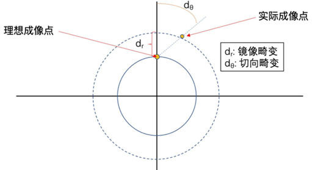
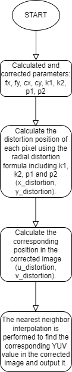

# LDC algorithm module

[TOC]

## Revision History

| Revision | Date | Author | Description |
| -------- | ---- | ------ | ----------- |
|          | 2022.12.06   | Wei Yuheng | Origin      |

## 1.Introduction

### 1.1 Request & Purpose

This document presents LDC algorithm and specification in XK-ISP pipeline architecture. It defines the features with high-level diagram and modules design. The team members can follow this document to do detailed design and implementation.

### 1.2 Definitions & Abbreviations

| Name   | Description                |
| :----- | -------------------------- |
| LDC | Lens Distortion Correction |

## 2. Overview

The LDC(Lens Distortion Correction) module is a software module that implements lens distortion correction. It does not have the corresponding hardware function.

### 2.1 LDC location

## 3. LDC algorithm and process

### 3.1 LDC Algorithm and function

The distortion correction model is as follows. The deviation between the actual imaging point and the correct imaging point is modeled into radial distortion and tangential distortion, as shown in the figure.

The distortion correction algorithm is as follows: the ideal imaging point is represented by $\left(x_c, y_c\right)$, and the actual imaging point is represented by$\left(x_d, y_d\right)$.
The relationship between the two is as follows:
$$
\begin{aligned}
& x_d=x_c\left(1+k_1 r^2+k_2 r^4+k_3 r^6\right)+2 p_1 x_c y_c+p_2\left(r^2+2 x_c^2\right) \\
& y_d=y_c\left(1+k_1 r^2+k_2 r^4+k_3 r^6\right)+p_1\left(r^2+2 y_c^2\right)+2 p_2 x_c y_c
\end{aligned}
$$
The first item is radial deviation correction, and the second and third items are tangential deviation correction.
The algorithm calculates the corresponding $\left(x_c, y_c\right)$for each actual imaging point $\left(x_d, y_d\right)$, uses nearest neighbor interpolation to obtain the integer coordinates of $\left(x_c, y_c\right)$, and finally moves the pixels of $\left(x_d, y_d\right)$ to$\left(x_c, y_c\right)$.
Parameters k1, k2 and k3 are radial distortion coefficients, while p1 and p2 are tangential distortion coefficients, which are related to the actual imaging system. In order to obtain good correction results, it is necessary to take a series of pictures from different angles of the checkerboard grid and use the calibration algorithm to obtain accurate distortion coefficients.

The flowchart of LDC module:

### 3.2 LDC Parameter initialization（ldc_init）

#### 3.2.1 Function interfaces

| Name    | Description              |
| ------- | ------------------------ |
| top_reg | ISP top-level parameters |
| ldc_reg | LDC module parameters    |

#### 3.2.2 Algorithm and function

Initializes all parameter values

### 3.3 LDC top level module（isp_ldc）

#### 3.3.1 Function interfaces

<table>
   <tr>
      <td>Parameters</td>
      <td>Data Type</td>
      <td>Description</td>
   </tr>
   <tr>
      <td>y_src_in</td>
      <td>uint16_t*</td>
      <td>Pointer to the source Y data</td>
   </tr>
   <tr>
      <td>u_src_in</td>
      <td>uint16_t*</td>
      <td>Pointer to the source U data</td>
   </tr>
   <tr>
      <td>v_src_in</td>
      <td>uint16_t*</td>
      <td>Pointer to the source V data</td>
   </tr>
   <tr>
      <td>y_dst_out</td>
      <td>uint16_t*</td>
      <td>Pointer to the destination Y data</td>
   </tr>
   <tr>
      <td>u_dst_out</td>
      <td>uint16_t*</td>
      <td>Pointer to the destination U data</td>
   </tr>
   <tr>
      <td>v_dst_out</td>
      <td>uint16_t*</td>
      <td>Pointer to the destination V data</td>
   </tr>
   <tr>
      <td>top_reg</td>
      <td>_isp_top_param_t</td>
      <td>Structure containing frame height and width information</td>
   </tr>
</table>

#### 3.3.2 Algorithm and function

This function is used to eliminate lens distortion in an image by first checking that lens distortion correction (eb) is enabled. If so, it computes the correction parameters (fx, fy, cx, cy, k1, k2, p1, p2) from the input. It then runs two nested loops to process each pixel of the input image. For each pixel, the function first calculates the distortion position (x_distortion, y_distortion) using the radial distortion formula containing k1, k2, p1 and p2. Then, by mapping the distorted position back to the image plane, the corresponding position in the corrected image is calculated (u_distortion, v_distortion). Finally, the function performs nearest neighbor interpolation to find the corresponding YUV values in the corrected image and write them to the output.

### 3.4 LDC algorithm function module（copydata）

#### 3.4.1 Function interfaces

<table>
   <tr>
      <td>Parameters</td>
      <td>Data Type</td>
      <td>Description</td>
   </tr>
   <tr>
      <td>y_src_in</td>
      <td>uint16_t*</td>
      <td>Pointer to the source Y data</td>
   </tr>
   <tr>
      <td>u_src_in</td>
      <td>uint16_t*</td>
      <td>Pointer to the source U data</td>
   </tr>
   <tr>
      <td>v_src_in</td>
      <td>uint16_t*</td>
      <td>Pointer to the source V data</td>
   </tr>
   <tr>
      <td>y_dst_out</td>
      <td>uint16_t*</td>
      <td>Pointer to the destination Y data</td>
   </tr>
   <tr>
      <td>u_dst_out</td>
      <td>uint16_t*</td>
      <td>Pointer to the destination U data</td>
   </tr>
   <tr>
      <td>v_dst_out</td>
      <td>uint16_t*</td>
      <td>Pointer to the destination V data</td>
   </tr>
   <tr>
      <td>top_reg</td>
      <td>_isp_top_param_t</td>
      <td>Structure containing frame height and width information</td>
   </tr>
</table>

#### 3.4.2 Algorithm and function

The copydata function uses the memcpy function to copydata from the source array (y_src_in, u_src_in, v_src_in) to the target array (y_dst_out, u_dst_out, v_dst_out).

### 3.5 LDC algorithm function module（initUndistorRectifyMap）

#### 3.5.1 Function interfaces

<table>
   <tr>
      <td>Parameter</td>
      <td>Type</td>
      <td>Description</td>
   </tr>
   <tr>
      <td>top_reg</td>
      <td>_isp_top_param_t</td>
      <td>A struct that holds information about the frame dimensions (width and height).</td>
   </tr>
   <tr>
      <td>ldc_reg</td>
      <td>_isp_ldc_param_t</td>
      <td>A struct that holds information about the distortion parameters (k1, k2, p1, and p2).</td>
   </tr>
   <tr>
      <td>map_x</td>
      <td>uint32_t*</td>
      <td>A pointer to an array where the rectified x-coordinate for each pixel will be stored.</td>
   </tr>
   <tr>
      <td>map_y</td>
      <td>uint32_t*</td>
      <td>A pointer to an array where the rectified y-coordinate for each pixel will be stored.</td>
   </tr>
</table>
#### 3.5.2 Algorithm and function

The function uses the given distortion parameters to calculate the distorted image coordinates and stores the resulting corrected image coordinates in map_x and map_y. The distortion correction algorithm is based on the radial distortion model, which uses k1, k2, p1 and p2 parameters to describe the mapping from undistorted to distorted coordinates.
