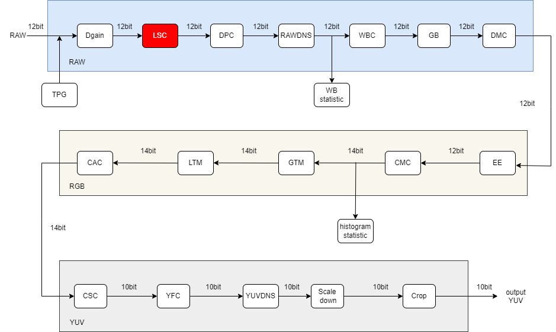
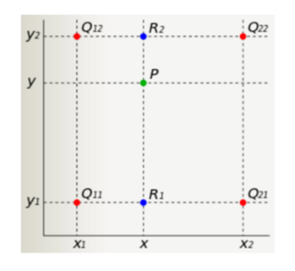

# LSC Module

1. Introduction

   1.1 Request & Purpose

   1.2 Definitions & Abbreviations

2. Overview

   2.1 LSC Location

   2.2 LSC parameters

3. LSC algorithm and process

   3.1 LSC parameter initialization（lsc_init）

   3.2 LSC parameter transfer function（_ispLSCFrameStart）

   3.3 LSC top level module（isp_lsc）

   3.4 LSC algorithm function module（BilinearInterpolation）

4. Reference

## 历史版本修订

| Revision | Date       | Author     | Description   |
| ---- | ---------- | -------- | ---- |
| 0.1  | 2022.10.17 | Jiarui Liu | Initial draft |
|      |            |          |      |
|      |            |          |      |

## 1. Introduction

### 1.1 Request & Purpose

This document describes the algorithm for the shot shadow correction module in the CTL ISP architecture. Team members can use it to understand the code, or they can follow the design details and implement their own code.

### 1.2 Definitions & Abbreviations

| Name | Description            |
| ---- | ---------------------- |
| LSC  | Lens Shadow Correction |
|      |                        |
|      |                        |
|      |                        |
|      |                        |

## 2. Overview

The shadows caused by lens and sensor in images generally include brightness shadows and color shadows. In this paper, the LSC module mainly focuses on luma shading, and uses the original pixel value * gain value to correct the image.

Figure 2-1 Brightness shadows

### 2.1 LSC location

Figure 2-2 Position of the LSC module in the ISP pipeline

### 2.2 LSC parameters

| Name            | Default Value | Shadow | Descripti                                  |
| --------------- | ------------- | ------ | ------------------------------------------ |
| m_nEb           | 1             |        | enable signal for LSC module               |
| rGain[13] [17]  | \             |        | Vertex gain value prefetched by channel r  |
| GrGain[13] [17] | \             |        | Vertex gain value prefetched by channel Gr |
| GbGain[13] [17] | \             |        | Vertex gain value prefetched by channel Gb |
| bGain[13] [17]  | \             |        | Vertex gain value prefetched by channel b  |
|                 |               |        |                                            |
|                 |               |        |                                            |
|                 |               |        |                                            |
|                 |               |        |                                            |

## 3. LSC algorithm and process

### mesh algorithm

In this paper, we choose the method of mesh shading correct, which divides the whole image into m*n meshes, and then prefetches the corrected gains for the mesh vertices, and then stores the gains of these vertices in the memory. Similarly, the gains of other points are also calculated by bilinear interpolation.

Figure 3-1 The LSC module

- top parameters

| Name        | Description                                                  |
| ----------- | ------------------------------------------------------------ |
| imgPattern  | bayer format (Channel 0:r, channel 1:Gr, channel 2:Gb, channel 3:b) |
| frameWidth  | Width of image                                               |
| frameHeight | Height of image                                              |
| blc         | Black pixel value                                            |
|             |                                                              |
|             |                                                              |

### 3.1 LSC parameter initialization（lsc_init）

#### 3.1.1 Function interfaces

| Name     | Description              |
| -------- | ------------------------ |
| topParam | ISP top-level parameters |
| lscParam | LSC module parameters    |
|          |                          |
|          |                          |
|          |                          |
|          |                          |

#### 3.1.2 Algorithm and function

Initializes all parameter values

### 3.2 LSC parameter transfer function（_ispLSCFrameStart）

#### 3.2.1 Function interfaces

| Name     | Description              |
| -------- | ------------------------ |
| topParam | ISP top-level parameters |
| inParam  | input data               |
| lscParam | LSC module parameters    |
|          |                          |
|          |                          |
|          |                          |

#### 3.2.2 Algorithm and function

It is used to pass parameters

### 3.3 LSC top level module（isp_lsc）

#### 3.3.1 Function interfaces

| Name     | Description              |
| -------- | ------------------------ |
| topParam | ISP top-level parameters |
| lscParam | LSC module parameters    |
| src_data | input data               |
| dst_data | output data              |
|          |                          |
|          |                          |

#### 3.3.2 Algorithm and function

The entire lens shadow correction algorithm can be divided into five steps:

- Step 1: Input the image and prefetch the gain value of 17*13 pixels, and divide the image into 16 *12 squares evenly, as shown in Figure 3-2;
- Step 2: Using 2*2 pixels as the minimum processing unit, traverse all pixels of the image to determine the location of the current pixel;
- Step 3: Calculate the gain value of the current pixel through the bilinear interpolation function using the gain values of the four vertices of the block it belongs to;
- Step 4: Use the calculated gain value multiplied with the value of the pixel to correct the image;
- Step 5: Output the image with finished lens shadow correction.

Figure 3-2 Schematic diagram of LSC pixel scanning

### 3.4 LSC algorithm function module（BilinearInterpolation）

#### 3.4.1 Function interfaces

| Name          | Description                                                  |
| ------------- | ------------------------------------------------------------ |
| topParam      | ISP top-level parameters                                     |
| LeftTopGain   | The gain value prefetched in the upper-left corner of the square |
| LeftDownGain  | The gain value prefetched in the bottom left corner of the square |
| RightTopGain  | The gain value prefetched in the upper-right corner of the square |
| RightDownGain | The gain value prefetched in the bottom right corner of the square |
| row           | The number of rows in the window                             |
| col           | The number of columns in the window                          |

#### 3.4.2 Algorithm and function

The gain values of the four vertices of the block are used to obtain the current pixel gain value by interpolation, as shown in Figure 3-3.

Figure 3-3 Bilinear interpolation

Figure 3-4 The LSC effect

## 4. Reference

