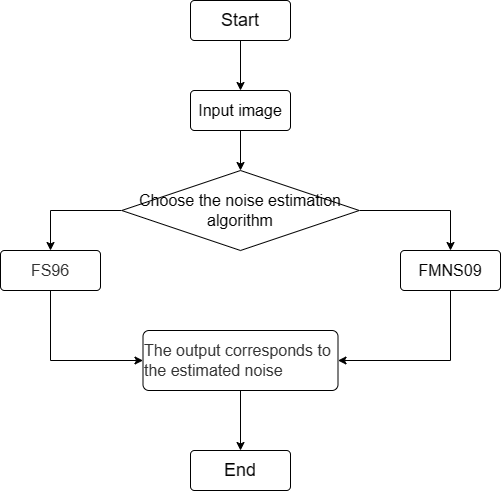

# Noise_Estimation Module

1. Introduction

   1.1 Request & Purpose

   1.2 Definitions & Abbreviations

2. Overview

   2.1 Noise_Estimation parameters

3. Noise_Estimation  algorithm and process

   3.1 Noise_Estimation top level module（Noise_Top）

   3.2 Noise_Estimation top level module（FS96_Main）

   3.3 Noise_Estimation algorithm function module（FS96_Single）

   3.4 Noise_Estimation top level module（FMNS09_Main）

   3.5 Noise_Estimation algorithm function module（FMNS09_Single）

4. Reference

## 历史版本修订

| Revision | Date       | Author       | Description   |
| ---- | ---------- | -------- | ---- |
| 0.1  | 2022.11.08 | Zhihan Zhang | Initial draft |
|      |            |          |      |
|      |            |          |      |

## 1. Introduction

### 1.1 Request & Purpose

This document describes the algorithm for the denoising estimation module in the Raw/RGB/YUV domain of the CTL ISP architecture. Team members can use it to understand the code, or they can follow the design details and implement their own code.

### 1.2 Definitions & Abbreviations

| Name             | Description      |
| ---------------- | ---------------- |
| Noise_Estimation | Noise Estimation |
|                  |                  |
|                  |                  |
|                  |                  |
|                  |                  |

## 2. Overview

The noise reduction estimation algorithm is used to estimate the noise and reduce the noise according to the estimated noise.

### 2.2 Noise_Estimation parameters

| Name | Default Value | Shadow | Description |
| ---- | ------------- | ------ | ----------- |
|      |               |        |             |
|      |               |        |             |
|      |               |        |             |
|      |               |        |             |
|      |               |        |             |
|      |               |        |             |
|      |               |        |             |
|      |               |        |             |
|      |               |        |             |

## 3. Noise_Estimation algorithm and process

The denoising estimation algorithm is used to estimate the noise, and the denoising estimation in Raw/RGB/YUV domain is carried out according to the estimated noise. The core algorithm is FS96 and FMNS09 algorithm.

- top parameters

| Name       | Description     |
| ---------- | --------------- |
| Img_Height | Height of image |
| Img_Width  | Width of image  |
| Img_Mode   | Image type      |
|            |                 |
|            |                 |
|            |                 |

### 3.1 Noise_Estimation top level module（Noise_Top）

#### 3.1.1 Function interfaces

| Name        | Description                |
| ----------- | -------------------------- |
| src_in      | input data                 |
| Img_Height  | height of image            |
| Img_Width   | width of image             |
| Img_Mode    | image type                 |
| Enable_Mode | algorithm module Selection |
| sigma_out   | Output noisy data          |

#### 3.1.2 Algorithm and function

The whole process of noise reduction estimation algorithm can be divided into three steps:

- Step 1: Select the corresponding algorithm;
- Step 2: Noise estimation of the image;
- Step 3: Output the noise corresponding to the estimate.

Figure 3-1 Noise_Estimation algorithm steps

### 3.2 Noise_Estimation top level module（FS96_Main）

#### 3.2.1 Function interfaces

| Name      | Description              |
| --------- | ------------------------ |
| src_in    | input data               |
| top_param | ISP top-level parameters |
|           |                          |
|           |                          |
|           |                          |
|           |                          |

#### 3.2.2 Algorithm and function

The idea of FS96 algorithm is as follows. Firstly, after the edge suppression filter is used to suppress the image edge, the variance of the whole image is calculated statistically as the variance value of the image noise.

Figure 3-2 The edge suppression filter

$$
\sigma^2_n=\frac{1}{36(W-2)(H-2)}\sum_{imageI}(I(x,y)*N)^2\tag{3-1}
$$

$$
\sigma^2_n=\sqrt\frac{\pi}{2}\frac{1}{6(W-2)(H-2)}\sum_{imageI}|I(x,y)*N|\tag{3-2}
$$

The above equations 3-1 and 3-2 calculate the noise intensity variance value and standard deviation value respectively.

### 3.3 Noise_Estimation algorithm function module（FS96_Single）

#### 3.3.1 Function interfaces

| Name   | Description     |
| ------ | --------------- |
| src_in | input data      |
| Height | height of image |
| Width  | width of image  |
|        |                 |
|        |                 |
|        |                 |

#### 3.3.2 Algorithm and function

The FS96 algorithm performs the noise estimation

### 3.4 Noise_Estimation top level module（**FMNS09**_Main）

#### 3.4.1 Function interfaces

| Name      | Description              |
| --------- | ------------------------ |
| src_in    | input data               |
| top_param | ISP top-level parameters |
|           |                          |
|           |                          |
|           |                          |
|           |                          |

#### 3.4.2 Algorithm and function

The idea of FMNS09 algorithm is as follows, which mainly includes the steps of edge two-dimensional suppression filtering, image block variance calculation and histogram statistical sorting.

The above equation performs edge two-dimensional suppression filtering by calculating the parameters, and at the same time, the image is divided into blocks to calculate the variance

Figure 3-3 Histogram of block variances

### 3.5 Noise_Estimation algorithm function module（FMNS09_Single）

#### 3.5.1 Function interfaces

| Name   | Description     |
| ------ | --------------- |
| src_in | input data      |
| Height | height of image |
| Width  | width of image  |
|        |                 |
|        |                 |
|        |                 |

#### 3.5.2 Algorithm and function

The FMNS09 algorithm performs the noise estimation

## 4.Reference

[1] Immerk R J . Fast Noise Variance Estimation[J]. Computer Vision & Image Understanding, 1996, 64(2):300-302.

[2] Liu A . A Fast Method of Estimating Gaussian Noise[C]// 2009 First International Conference on Information Science and Engineering. IEEE, 2010

