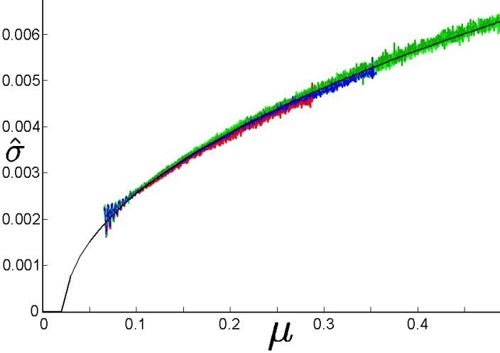
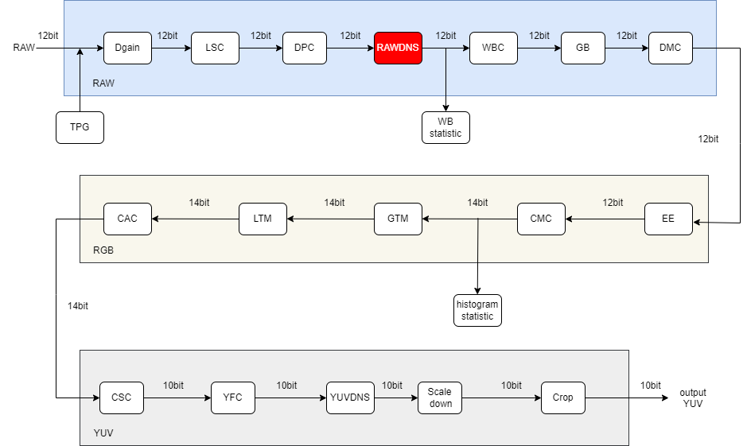
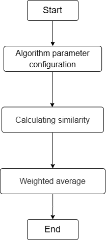

# RAWDNS Module

1. Introduction

   1.1 Request & Purpose

   1.2 Definitions & Abbreviations

2. Overview

   2.1 RAWDNS Location

   2.2 RAWDNS parameters

3. RAWDNS algorithm and process

   3.1 RAWDNS parameter initialization（rawdns_init）

   3.2 RAWDNS top level module（isp_rawdns）

   3.3 RAWDNS Window fetcher Function (Get_NLM_Block)

   3.4 RAWDNS Euclidean Distance Function (Cal_Euc_Dis)

   3.5 RAWDNS Weight Calculation Function (_cal_NLM_weight)

   3.6 RAWDNS row-handling Functions（ProcessLine）

   3.7 RAWDNS Whole Image Processing Function (processimage)

   3.8 RAWDNS Image Copy Function (CopyData)

4. Reference

## Revison History

| Revision | Date       | Author       | Description   |
| -------- | ---------- | ------------ | ------------- |
| 0.1      | 2022.10.17 | Zhihan Zhang | Initial draft |
|          |            |              |               |
|          |            |              |               |

## 1. Introduction

### 1.1 Request & Purpose

This document describes the algorithm for the Raw domain denoising module in the CTL ISP architecture. Team members can use it to understand the code, or they can follow the design details and implement their own code.

### 1.2 Definitions & Abbreviations

| Name   | Description                   |
| ------ | ----------------------------- |
| RAWDNS | Noise reduction in Raw domain |
| NLM    | Nonlocal Means Algorithm      |
|        |                               |
|        |                               |
|        |                               |

## 2. Overview

The human world is a world of signal transmission, so noise is everywhere, and images as a way of signal transmission are certainly not immune. In order to minimize the impact of noise on image quality, a series of noise reduction methods are proposed to restore the original state of the object. The RAWDNS module selects the NLM algorithm and uses the information of the entire image to filter the noise.

Figure 2-1 Noise

### 2.1 RAWDNS location

Figure 2-2 Placement of the RAWDNS module in the ISP pipeline

### 2.2 RAWDNS parameters

| Name       | Default Value | Shadow | Description                     |
| ---------- | ------------- | ------ | ------------------------------- |
| m_nEb      | 1             |        | enable signal for RAWDNS module |
| win_size   | 1             |        | neighborhood window             |
| Filterpara | 0x66          |        | filter control parameters       |
| sigma      |               |        | noise level                     |
|            |               |        |                                 |
|            |               |        |                                 |
|            |               |        |                                 |
|            |               |        |                                 |
|            |               |        |                                 |

## 3. RAWDNS algorithm and process

### NLM algorithm

The idea of NLM algorithm is as follows, where p represents the position of the pixel to be denoised,q represents the position of the reference pixel used for weighting calculation, v(x) represents the pixel value vector composed of the image block of pixel x, and the weight w(p,q) represents the similarity between pixel p and q. Note that the similarity between two pixels is usually determined by the pixel value vector v(x) of the corresponding image patch. According to the idea of NLM, because q1 and q2 pixels have more similar neighborhoods with p pixels to be denoized, while q3 pixel neighborhoods are more different from p pixels, therefore, q1 and q2 pixels contribute more to the denoising of p pixels.
$$
NL(v(p))=\sum_{q\in S}w(p,q)v(q) \tag{3-1}
$$

Figure 3-1 An illustration of the NLM algorithm

The weight w(p,q) can be measured by the Gaussian weighted Euclidean distance ‖v(p)-v(q)‖^2^~(2,α)~, where α is the standard deviation of the Gaussian kernel function, which is usually 2-5. The final weight w(p,q) is calculated as shown in the formula below, where Z(p) is the weight normalization constant, and the parameter h controls the decay speed of the exponential function. The value is linearly related to the noise level σ in the image, and h=λ*σ, σ is the standard deviation of the noise image. Note that NLM finally calculates the image block weight w of the pixel p to be denoised itself, that is, when p=q, the current maximum weight is taken.
$$
w(p,q)=\frac{1}{Z(q)}\exp(-\frac{||v(p)-v(q)||^{2}_{2,\alpha}}{h^2})\tag{3-2}
$$

- top parameters

| Name        | Description                                                  |
| ----------- | ------------------------------------------------------------ |
| imgPattern  | bayer format (Channel 0:r, channel 1:Gr, channel 2:Gb, channel 3:b) |
| frameWidth  | Width of image                                               |
| frameHeight | Height of image                                              |
| blc         | Black pixel value                                            |
|             |                                                              |
|             |                                                              |

### 3.1 RAWDNS parameter initialization（rawdns_init）

#### 3.1.1 Function interfaces

| Name         | Description              |
| ------------ | ------------------------ |
| top_param    | ISP top-level parameters |
| rawdns_param | RAWDNS module parameters |
|              |                          |
|              |                          |
|              |                          |
|              |                          |

#### 3.1.2 Algorithm and function

Initializes all parameter values

### 3.2 RAWDNS top level module（isp_rawdns）

#### 3.2.1 Function interfaces

| Name         | Description              |
| ------------ | ------------------------ |
| top_param    | ISP top-level parameters |
| rawdns_param | RAWDNS module parameters |
| src_data     | input data               |
| dst_data     | output data              |
|              |                          |
|              |                          |

#### 3.2.2 Algorithm and function

The NLM process for the denoised data points is shown in Figure 3-2, where each grid represents the Raw data at a pixel position. Different from the YUV domain denoising, the calculation centers selected by the denoising in Raw domain are spaced.

The whole process of NLM algorithm can be divided into 3 steps:

- Step 1: Configuration of algorithm parameters. According to the noise level, the linear ratio λ between the image block size W\*W, the search area S\*S and the filtering control parameter h and the noise level σ are set.
- Step 2: Calculate the similarity. The sum D of absolute differences between the data value in the image block (orange box) centered on the data in the search area (gray box) and the data in the image block (blue box) centered on the data point to be denoised (blue box) was calculated. Then, the weight value is assigned according to the relative relationship between the sum of absolute differences D and 2\*W\*W*σ. The weight allocation follows the following rules: the smaller the relative D is, the larger the weight value is assigned.
- Step 3: Weighted averaging. After the similarity weight calculation of the data block in the search area is completed, the weighted average of the data in the gray area is performed. The data involved in the calculation include the data points to be denoised, and the maximum weight is assigned to the data points to be denoised. Finally, the denoising results of the data points to be denoised are obtained.

Figure 3-2 Diagram of the NLM calculation flow Diagram of the algorithm

Figure 3-3 RAWDNS algorithm steps

### 3.3 RAWDNS Window fetcher Function（Get_NLM_Block）

#### 3.3.1 Function interfaces

| Name               | Description              |
| ------------------ | ------------------------ |
| src_data           | input data               |
| nlm_block\[11][11] | NLM window               |
| top_reg            | ISP top-level parameters |
| block              | window radius            |
| cur_x              | number of window columns |
| cur_y              | number of window rows    |

#### 3.3.2 Algorithm and function

The corresponding window was obtained for the NLM algorithm from the image, a sliding window was defined for each point, and the information of all points in the window was used to calculate the noise reduction

### 3.4 RAWDNS Euclidean Distance Function（Cal_Euc_Dis）

#### 3.4.1 Function interfaces

| Name               | Description                              |
| ------------------ | ---------------------------------------- |
| nlm_block\[11][11] | NLM window                               |
| cur_x              | search area pixel x coordinates          |
| cur_y              | search area pixel y coordinates          |
| center_x           | x coordinate of the pixel to be denoised |
| center_y           | y coordinate of the pixel to be denoised |
| win_size           | search area pixel window radius          |
| block_size         | search area size                         |

#### 3.4.2 Algorithm and function

Calculate the sum of the Euclidean distances of the pixel blocks

### 3.5 RAWDNS Weight Calculation Function（_cal_NLM_weight）

#### 3.5.1 Function interfaces

| Name         | Description                                |
| ------------ | ------------------------------------------ |
| rawdns_param | RAWDNS module parameters                   |
| diff         | sum of Euclidean distances of pixel blocks |
|              |                                            |
|              |                                            |
|              |                                            |
|              |                                            |

#### 3.5.2 Algorithm and function

Calculate the NLM weight coefficients

### 3.6 RAWDNS row-handling Functions（ProcessLine）

#### 3.6.1 Function interfaces

| Name       | Description                  |
| ---------- | ---------------------------- |
| poutline   | pixel values after denoising |
| top_reg    | ISP top-level parameters     |
| rawdns_reg | RAWDNS module parameters     |
| i          | number of image rows         |
| src_data   | input data                   |
|            |                              |

#### 3.6.2 Algorithm and function

Images are processed by RAWDNS in rows

### 3.7 RAWDNS Whole Image Processing Function（processimage）

#### 3.7.1 Function interfaces

| Name         | Description              |
| ------------ | ------------------------ |
| top_param    | ISP top-level parameters |
| rawdns_param | RAWDNS module parameters |
| src_data     | input data               |
| dst_data     | output data              |
|              |                          |
|              |                          |

#### 3.7.2 Algorithm and function

TOP functions for full image processing

### 3.8 RAWDNS Image Copy Function（CopyData）

#### 3.8.1 Function interfaces

| Name     | Description              |
| -------- | ------------------------ |
| top_reg  | ISP top-level parameters |
| src_data | input data               |
| dst_data | output data              |
|          |                          |
|          |                          |
|          |                          |

#### 3.8.2 Algorithm and function

Copy the whole image data

Figure 3-4 RAWDNS effect

##  4. Reference

[1]Antoni Buades, Bartomeu Coll, and Jean-Michel Morel, ''Non-Local Means Denoising,'' Image Processing On Line, vol. 1, pp. 208-212, 2011.
