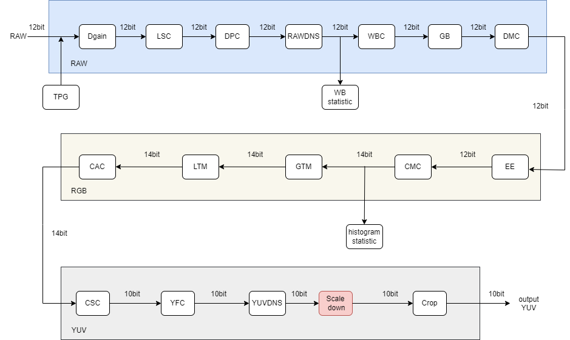
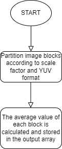
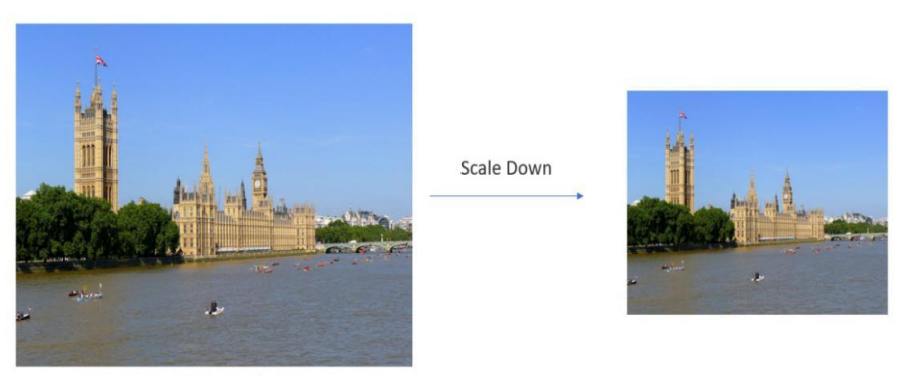

# ScaleDown algorithm module

[TOC]

## Revision History

| Revision | Date | Author | Description |
| -------- | ---- | ------ | ----------- |
| 0.1  | 2022.12.06 | 许珐      | 初稿 |

## 1.Introduction

### 1.1 Request & Purpose

This document describes the algorithm of image reduction module (i.e. image downsampling module) in CTL ISP architecture. Team members can rely on this document to understand the code, or they can implement it themselves based on design details.

### 1.2 Definitions & Abbreviations

| Name      | Description                          |
| :-------- | ------------------------------------ |
| Scaledown | Image reduction (image downsampling) |

## 2. Overview 

Image downsampling, also known as Scale Down, has two main purposes. One is to make the image conform to the size of the display area, and the other is to generate the thumbnail of the corresponding image. Image up-sampling is also known as image amplification, the main purpose of which is to enlarge the original image so that it can be displayed on a higher resolution display device. In our xkISP, the ScaleDown module uses the mean value method.

### 2.1 Scaledown location

## 3. ScaleDown algorithm and process

### 3.1 ScaleDown Algorithm and function

For an image of size $X^* Y$, an image of size $(X/N)^* (Y/N)$ is obtained by n-fold drop sampling, where N should be the common divisor of X and Y. If the image is abstracted into a matrix form, image downsampling is to transform the pixels in the $N^* N$ window of the original image into a pixel, the value of which is the mean value of all pixels in the window, and the formula is shown as follows.
$$
P_{\text {out }}=\sum_{i=0}^{N^2} \frac{p_i}{N^2}
$$
Where $P_i$ is the pixel value of the input pixel, $P_{\text {out }}$ is the pixel value of the output pixel, and $N^2$ is the number of pixel points in the selected window.

The flowchart of Scaledown module:

Effects of the  Scaledown algorithm:

### 3.2 Scaledown Parameter initialization（scaledown_init）

#### 3.2.1 Function interfaces

| Name           | Description                 |
| -------------- | --------------------------- |
| topParam       | ISP top-level parameters    |
| scaledownParam | scaledown module parameters |

#### 3.2.2 Algorithm and function

Initializes all parameter values

### 3.3 Scaledown top level module（isp_scaledown）

#### 3.3.1 Function interfaces

<table>    <tr>       <td>Variable</td>       <td>Description</td>    </tr>    <tr>       <td>topParam</td>       <td>Pointer to the header parameter structure, which stores information such as frame width and height</td>    </tr>    <tr>       <td>scaledownParam</td>       <td>Pointer to the scaling parameter structure, which stores the parameters and factors for scaling</td>    </tr>    <tr>       <td>y_srcData</td>       <td>The Y component value of each pixel in the source YUV image</td>    </tr>    <tr>       <td>u_srcData</td>       <td>The U component value of each pixel in the source YUV image</td>    </tr>    <tr>       <td>v_srcData</td>       <td>The V component value of each pixel in the source YUV image</td>    </tr>    <tr>       <td>y_dstData</td>       <td>The Y component value of each pixel in the destination YUV image</td>    </tr>    <tr>       <td>u_dstData</td>       <td>The U component value of each pixel in the destination YUV image</td>    </tr>    <tr>       <td>v_dstData</td>       <td>The V component value of each pixel in the destination YUV image</td>    </tr> </table>

#### 3.3.2 Algorithm and function

This function shrinks the YUV image by a factor of 2 or 4, depending on the value of "times" in the scaling parameter. Scaling is done by averaging pixels in either 2x2 or 4x4 blocks, respectively.
