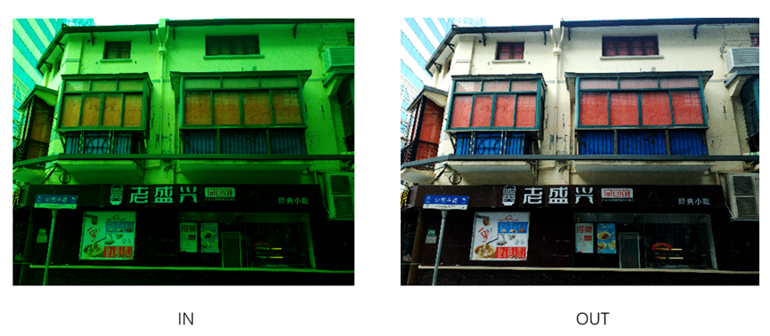
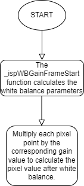

# WBC algorithm module

[TOC]

## Revision History

| Revision | Date       | Author    | Description |
| 0.1      | 2022.12.06 | Gao Yuxin | origin      |
|          |            |           |             |

## 1.Introduction

### 1.1 Request & Purpose

This document presents automatic white balance algorithm and specification in XK-ISP pipeline architecture. It defines the features with high-level diagram and modules design. The team members can follow this document to do detailed design and implementation.

### 1.2 Definitions & Abbreviations

| Name | Description              |
| :--- | -----------------------  |
| WBC  | white balance correction |

## 2. Overview

In our xkISP, the WBC module receives the gain value of the AWB module in the RAW domain to correct the image color.

### 2.1 WBC location

### 2.2 WBC parameters

| Name  | Description              | Value |
| ----- | ------------------------ | ----- |
| m_nEb | enable signal            | 1     |
| m_nR  | gain value of R channel  | 9090  |
| m_nGr | gain value of Gr channel | 4686  |
| m_nGb | gain value of Gb channel | 4686  |
| m_nB  | gain value of B channel  | 6667  |

## 3. WBC algorithm and process

### 3.1 WBC Algorithm and function

The algorithm formula of WBC is as follows, multiplying each pixel by the corresponding gain value.

R_out = m_nR * R_in

Gr_out = m_nGr * Gr_in

Gb_out = m_nGb * Gb_in

B_out = m_nB * B_in

The correction results are shown below.

The flowchart of WBC module:

### 3.2 WBC Parameter initialization（wbc_init）

#### 3.2.1 Function interfaces

| Name     | Description              |
| -------- | ------------------------ |
| topParam | ISP top-level parameters |
| wbc4gain | WBC module parameters    |

#### 3.2.2 Algorithm and function

Initializes all parameter values

### 3.3 WBC top level module（isp_wbc_gain）

#### 3.3.1 Function interfaces

| Name      | Description              |
| --------- | ------------------------ |
| topParam  | ISP top-level parameters |
| wbc_param | WBC module parameters    |
| srcData   | input data               |
| dstData   | output data              |

#### 3.3.2 Algorithm and function

The purpose of this function is to achieve white balance. The function checks if the input parameter has a null pointer and returns an error if it does. The _ispWBGainFrameStart function is then called to calculate the white balance parameters. If m_nEb is zero, the srcData array is copied into the dstData array, otherwise the function performs a white balance algorithm, reads the pixel value from the srcData array, calculates the white-balanced pixel value, and stores it in the dstData array.
