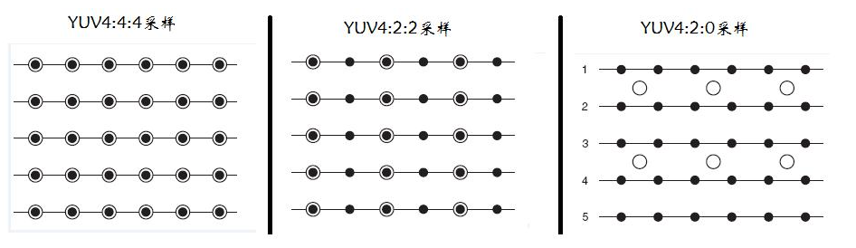
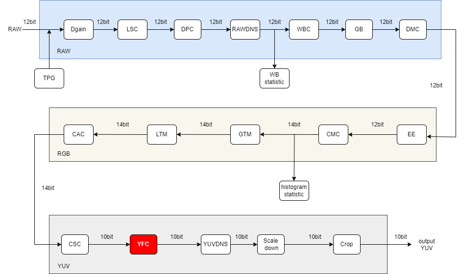
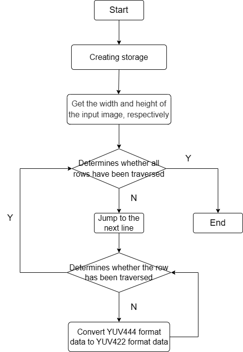

# YFC Module

1. Introduction

   1.1 Request & Purpose

   1.2 Definitions & Abbreviations

2. Overview

   2.1 YFC Location

   2.2 YFC parameters

3. YFC algorithm and process

   3.1 YFC parameter initialization（yfc_init）

   3.2 YFC parameter transfer function（_yfcFrameStart）

   3.3 YFC top level module（isp_yfc）

4. Referenc

## Revison History

| Revision | Date       | Author     | Description   |
| ---- | ---------- | -------- | ---- |
| 0.1      | 2022.11.08 | Yuheng Wei | Initial draft |
|      |            |          |      |
|      |            |          |      |

## 1. Introduction

### 1.1 Request & Purpose

This document describes the algorithm for the YUV format conversion module in the CTL ISP architecture. Team members can use it to understand the code, or they can follow the design details and implement their own code.

### 1.2 Definitions & Abbreviations

| Name | Description           |
| ---- | --------------------- |
| YFC  | YUV Format Conversion |
|      |                       |
|      |                       |
|      |                       |
|      |                       |

## 2. Overview

The YFC module is responsible for the conversion of the YUV format, which supports the conversion of the YUV444 format to YUV422 and YUV420 formats, which can be selected by means of configuration registers.

Figure 2-1 YUV format

### 2.1 YFC location

Figure 2-2 Position of the YFC module in the ISP pipeline

### 2.2 YFC parameters

| Name              | Default Value      | Shadow | Description                  |
| ----------------- | ------------------ | ------ | ---------------------------- |
| m_nEb             | 1                  |        | enable signal for YFC module |
| output_yuvpattern | 0:yuv422，1:yuv420 |        | YUV output format            |
|                   |                    |        |                              |
|                   |                    |        |                              |
|                   |                    |        |                              |
|                   |                    |        |                              |
|                   |                    |        |                              |
|                   |                    |        |                              |
|                   |                    |        |                              |

## 3. YFC algorithm and process

Taking YUV444 to 422 as an example, converting YUV444 storage format to YUV422 storage format is a downsampling process, and a common method is to average the UV values of two adjacent pixels, as shown in Figure 3-1:

Figure 3-1 Downsampling

In the figure, Y1, U1, V1 and Y2, U2, V2 on the left are the YUV values of two adjacent pixels sampled by YUV444, while YUYV on the right is the YUV values of two adjacent pixels sampled by YUV422. It can be seen from the figure that Y values in YUYV are directly copied from Y values of two adjacent pixels in YUV444, while U and V values in YUYV are averaged from U and V values of two adjacent pixels in YUV444, completing the conversion from YUV444 to YUV422.

- top parameters

| Name        | Description                                                  |
| ----------- | ------------------------------------------------------------ |
| imgPattern  | bayer format (Channel 0:r, channel 1:Gr, channel 2:Gb, channel 3:b) |
| frameWidth  | Width of image                                               |
| frameHeight | Height of image                                              |
|             |                                                              |
|             |                                                              |
|             |                                                              |

### 3.1 YFC parameter initialization（yfc_init）

#### 3.1.1 Function interfaces

| Name     | Description              |
| -------- | ------------------------ |
| topParam | ISP top-level parameters |
| yfcParam | YFC module parameters    |
|          |                          |
|          |                          |
|          |                          |
|          |                          |

#### 3.1.2 Algorithm and function

Initializes all parameter values

### 3.2 YFC parameter transfer function（_yfcFrameStart）

#### 3.2.1 Function interfaces

| Name     | Description              |
| -------- | ------------------------ |
| topParam | ISP top-level parameters |
| inParam  | input data               |
|          |                          |
|          |                          |
|          |                          |
|          |                          |

#### 3.2.2 Algorithm and function

It is used to pass parameters

### 3.3 YFC top level module（isp_yfc）

#### 3.3.1 Function interfaces

| Name      | Description              |
| --------- | ------------------------ |
| topParam  | ISP top-level parameters |
| yfcParam  | YFC module parameters    |
| srcData   | input data               |
| y_dstData | Output data Y component  |
| u_dstData | Output data U component  |
| v_dstData | Output data V component  |

#### 3.3.2 Algorithm and function

The whole process of color space conversion algorithm can be divided into four steps:

- Step 1: First create a temporary storage space to store the YUV values read in first;
- Step 2: Copy and average the next YUV value;
- Step 3: Output YUYV data after the operation is complete;
- Step 4: Perform the above operations for other pixels successively. After traversing the entire image, the conversion from YUV444 format to YUV422 format is completed.

Figure 3-2 Flowchart of the YFC algorithm

## 4. Reference

