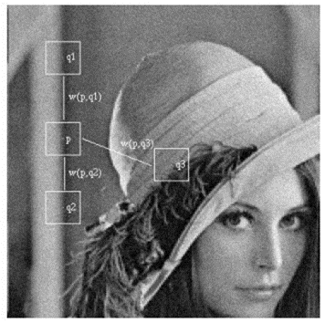
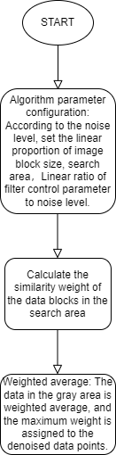
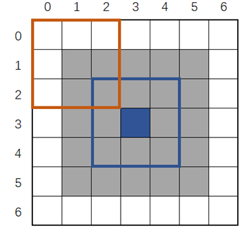

# YUVDNS algorithm module

[TOC]

## Revision History

| Revision | Date | Author | Description |
| -------- | ---- | ------ | ----------- |
| 0.1  | 2022.12.06 | 许珐      | 初稿 |

## 1.Introduction

### 1.1 Request & Purpose

This document presents YUV Denoise algorithm and specification in XK-ISP pipeline architecture. It defines the features with high-level diagram and modules design. The team members can follow this document to do detailed design and implementation.

### 1.2 Definitions & Abbreviations

| Name   | Description |
| :----- | ----------- |
| YUVDNS | YUV Denoise |

## 2. Overview

Digital image signal is affected by imaging equipment and external environment in the process of acquisition, transmission and display, which will contain a lot of noise. The noise will affect the visual effect of the image, and also cause adverse effects to the subsequent image analysis, such as compression, coding, recognition, etc., so it is necessary to denoise the noisy image. ISP RAW image denoising link is closer to the sensor, so this link can more effectively suppress the image signal acquisition process noise, such as photon scatter noise, fixed mode noise, dark current noise, etc.. However, even after RAW image denoising, the noise introduced by the signal acquisition link will not be completely eliminated, and when ISP converts the collected image signal to the YUV domain, the image signal will pass through multiple processing modules in ISP, and each module introduces new noise to different degrees. The YUV image denoising link can effectively increase the signal to noise ratio of the image signal again before the final image imaging, improve the image quality, and directly affect the visual effect of the subsequent image. The information processed in this process includes image brightness and chromaticity.

In our xkISP, YUVDNS module separates Y channel and UV channel for noise reduction. The core algorithm of noise reduction is non-local mean algorithm (NLM).

### 2.1 YUVDNS location

## 3. YUVDNS algorithm and process

### 3.1 YUVDNS Algorithm and function

The idea of NLM algorithm is as follows, where p represents the pixel position to be denoised,q represents the reference pixel position used for weighting calculation, v(x) represents the pixel value vector formed by the image block where pixel x resides, and the weight w(p,q) represents the similarity between pixel p and q. Note that the similarity between two pixels is generally determined by the pixel value vector v(x) of the corresponding image block. According to the idea of NLM, q1 and q2 pixels contribute more to the denoising of p pixels because q1 and q2 pixels have more similar neighborhoods with p pixels to be denoised, while q3 pixel neighborhood is significantly different from p pixels.
$$
NLM(v(p))=\sum_{q\in S}w(p,q)v(q)
$$

The weight w(p,q) can be calculated by the Gaussian weighted Euclidean distance ‖v(p) − v(q)‖_(2,α)^2, where α is the standard deviation of the Gaussian kernel function, generally ranging from 2 to 5. The formula for calculating the final weight w(p,q) is shown in the following formula, where Z(p) is the weight normalization constant, and parameter h controls the decay speed of the exponential function. The value is linearly related to the noise level σ in the image, and h=λ*σ is the standard deviation of the noisy image. Note that NLM finally calculates the weight w of the image block where the pixel p to be denoised is located, that is, when p=q, the current maximum weight is taken.
$$
w(p,q)=\frac{1}{Z(p)}exp(-\frac{\|v(p)-v(q)\|_{2,\alpha}^{2}}{h^2})
$$

The flowchart of YUVDNS module:

Effects of YUVDNS algorithm (above is before YUVDNS, below is after YUVDNS):

### 3.2 YUVDNS Parameter initialization（yuvdns_init）

#### 3.2.1 Function interfaces

| Name        | Description              |
| ----------- | ------------------------ |
| topParam    | ISP top-level parameters |
| yuvdnsParam | YUVDNS module parameters |

#### 3.2.2 Algorithm and function

Initializes all parameter values

### 3.3 YUVDNS top level module（isp_yuvdns）

#### 3.3.1 Function interfaces

<table>    <tr>       <td>Parameter Name</td>       <td>Type</td>    </tr>    <tr>       <td>_isp_top_param_t* topParam</td>       <td>Top-level parameter</td>    </tr>    <tr>       <td>_isp_yuvdns_param_t* YUVDNSParam</td>       <td>Parameter of YUV DNS</td>    </tr>    <tr>       <td>uint16_t* y_srcData</td>       <td>Input Y channel data</td>    </tr>    <tr>       <td>uint16_t* u_srcData</td>       <td>Input U channel data</td>    </tr>    <tr>       <td>uint16_t* v_srcData</td>       <td>Input V channel data</td>    </tr>    <tr>       <td>uint16_t* y_dstData</td>       <td>Output Y channel data</td>    </tr>    <tr>       <td>uint16_t* u_dstData</td>       <td>Output U channel data</td>    </tr>    <tr>       <td>uint16_t* v_dstData</td>       <td>Output V channel data</td>    </tr> </table>

#### 3.3.2 Algorithm and function

The NLM process for denoising data points is shown in the figure, where each grid represents the Y/U/V data at a pixel position.

① Configure algorithm parameters. According to the noise level, the linear ratio λ of the calculated image block size W*W, search area S*S and filtering control parameter h to the noise level σ is set.

② Calculate the similarity. Find the absolute difference sum D of the data values in the image block (orange box) centered on the data in the search area (gray grid area) and the data values in the image block (blue box) centered on the data points to be denoised (blue box); Then, weight values are assigned according to the relative relationship between the sum of absolute differences D and 2*W*W*σ. Weight distribution follows the following rules: the smaller D is, the larger the weight value is assigned.

③ Weighted average. After the similarity weight calculation of the data blocks in the search area is completed, the weighted average of the data in the gray area is carried out. The data involved in the calculation includes the data points to be denoised, and the maximum weight is assigned to the denoised data points. Finally, the denoising results of the data points to be denoised are obtained.

### 

### 3.4 YUVDNS algorithm function module（get_NLM_block）

#### 3.4.1 Function interfaces

<table>    <tr>       <td>Parameter Name</td>       <td>Type</td>       <td>Description</td>    </tr>    <tr>       <td>pInLines</td>       <td>uint16_t**</td>       <td>Input image data</td>    </tr>    <tr>       <td>nlm_block</td>       <td>uint16_t[9][9]</td>       <td>Stores the current image block being processed</td>    </tr>    <tr>       <td>frameWidth</td>       <td>uint32_t</td>       <td>Width of the image</td>    </tr>    <tr>       <td>cur_x</td>       <td>uint32_t</td>       <td>Index of the current image column being processed</td>    </tr>    <tr>       <td>block_size</td>       <td>uint32_t</td>       <td>Size of the image block</td>    </tr> </table>

#### 3.4.2 Algorithm and function

This function gets the pixels of the computed window by populating the "nlm_block" array with the data associated with the current processing column from the input image.

### 3.5 YUVDNS algorithm function module（_RotateLine）

#### 3.5.1 Function interfaces

<table>
   <tr>
      <td>Parameter Name</td>
      <td>Type</td>
      <td>Description</td>
   </tr>
   <tr>
      <td>pInLine</td>
      <td>uint16_t*</td>
      <td>Input one-line data</td>
   </tr>
   <tr>
      <td>pOutLine</td>
      <td>uint16_t*</td>
      <td>Output one-line data</td>
   </tr>
   <tr>
      <td>frameWidth</td>
      <td>uint32_t</td>
      <td>Image width</td>
   </tr>
   <tr>
      <td>h</td>
      <td>uint32_t</td>
      <td>Line number for computing input data offset</td>
   </tr>
</table>
#### 3.5.2 Algorithm and function

Data is read from an input row (pInLine) and converted to an output row (pOutLine). This function accesses each pixel through a loop, reading it from the input data and storing it in the output data.

### 3.6 YUVDNS algorithm function module（_cal_euc_dis）

#### 3.6.1 Function interfaces

<table>
   <tr>
      <td>Parameter</td>
      <td>Type</td>
      <td>Description</td>
   </tr>
   <tr>
      <td>nlm_block</td>
      <td>uint16_t[9][9]</td>
      <td>Input 9x9 pixel block</td>
   </tr>
   <tr>
      <td>cur_i</td>
      <td>uint32_t</td>
      <td>Row number of the current processed pixel</td>
   </tr>
   <tr>
      <td>cur_j</td>
      <td>uint32_t</td>
      <td>Column number of the current processed pixel</td>
   </tr>
   <tr>
      <td>win_size</td>
      <td>uint32_t</td>
      <td>Window size</td>
   </tr>
   <tr>
      <td>block_size</td>
      <td>uint32_t</td>
      <td>Pixel block size</td>
   </tr>
</table>

#### 3.6.2 Algorithm and function

The function is to calculate the Euclidean distance between two blocks. Internally, the function loops through every element in the window, calculates the Euclidean distance between the current element and other elements in the window, and finally returns the result of the average distance.

### 3.7 YUVDNS algorithm function module（_cal_NLM_weight）

#### 3.7.1 Function interfaces

<table>
   <tr>
      <td>Parameter</td>
      <td>Description</td>
   </tr>
   <tr>
      <td>eur_distance</td>
      <td>The Euclidean distance between two blocks</td>
   </tr>
   <tr>
      <td>sigma2</td>
      <td>Parameter for determining the weight</td>
   </tr>
   <tr>
      <td>H2</td>
      <td>Parameter for determining the weight</td>
   </tr>
   <tr>
      <td>invH2</td>
      <td>The inverse of H2</td>
   </tr>
</table>

#### 3.7.2 Algorithm and function

Function calculates the weight coefficient of NLM by calculating the Euclidean distance. The calculation involves differentiating the Euclidean distance from 2 * sigma2, then using the table's pre-defined weight values based on the values of H2 and sigma2 to determine the returned weight.

### 3.8 YUVDNS algorithm function module（_procdnsline）

#### 3.8.1 Function interfaces

<table>    <tr>       <td>Parameter</td>       <td>Description</td>    </tr>    <tr>       <td>pInLines</td>       <td>Pointer to input lines</td>    </tr>    <tr>       <td>dst</td>       <td>Pointer to destination buffer</td>    </tr>    <tr>       <td>sigma2</td>       <td>Parameter for determining the weight</td>    </tr>    <tr>       <td>block_size</td>       <td>Size of the block</td>    </tr>    <tr>       <td>win_size</td>       <td>Size of the window</td>    </tr>    <tr>       <td>H2</td>       <td>Parameter for determining the weight</td>    </tr>    <tr>       <td>invH2</td>       <td>The inverse of H2</td>    </tr>    <tr>       <td>nWidth</td>       <td>Width of the image</td>    </tr>    <tr>       <td>block_len</td>       <td>Length of the block</td>    </tr>    <tr>       <td>y</td>       <td>Current line number</td>    </tr> </table>

#### 3.8.2 Algorithm and function

The main function of this function is to denoise the image, and the processed image data will be stored in the dst. It uses non-local mean (NLM) algorithm to achieve noise reduction.

## 4. Reference

[1]Antoni Buades, Bartomeu Coll, and Jean-Michel Morel, ''Non-Local Means Denoising,'' Image Processing On Line, vol. 1, pp. 208-212, 2011.