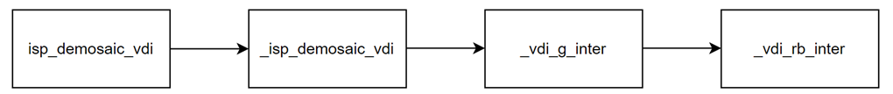
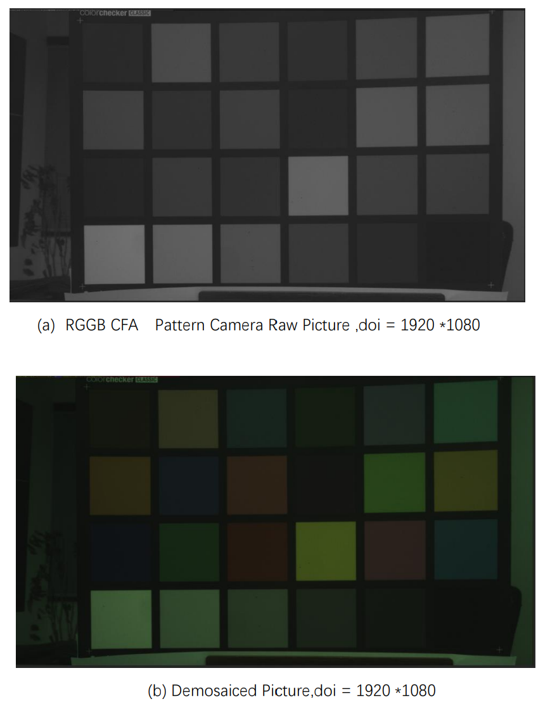

# Demosaic algorithm module

[TOC]

## Revision History

| Revision | Date       | Author     | Description |
| -------- | ---------- | ---------- | ----------- |
|          | 2022.12.06 | Liu Jiarui | Origin      |

## 1.Introduction

### 1.1 Request & Purpose

This document presents Demosaic algorithm and specification in XK-ISP pipeline architecture. It defines the features with high-level diagram and modules design. The team members can follow this document to do detailed design and implementation.

### 1.2 Definitions & Abbreviations

| Name     | Description  |
| :------- | ------------ |
| Demosaic | vdi_demosaic |

## 2. Overview

The overall algorithm structure is based on chromatic aberration demosaics, and the overall framework of the algorithm is shown as follows: The overall structure is to calculate the G-channel interpolation first, then calculate the chromatic aberration value (R-G or B-G), interpolate the chromatic aberration value, and restore the pixel value of RB channel.

### 2.1 Demosaic Location

## 3. Demosaic algorithm and process

### 3.1 Demosaic Algorithm and function

Judgment of interpolation direction:
Calculate the horizontal and vertical gradients of the chroma component (R or B) position to determine the edge orientation.
$$
\begin{aligned}
& \left\{\begin{aligned}
\Delta H_{m, n}^R= & \left|R_{m, n-2}+R_{m, n+2}-2 \times R_{m, n}\right| \\
& +\left|G_{m, n-1}-G_{m, n+1}\right| \\
\Delta V_{m, n}^R= & \left|R_{m-2, n}+R_{m+2, n}-2 \times R_{m, n}\right| \\
& +\left|G_{m-1, n}-G_{m+1, n}\right|
\end{aligned}\right. \\
& \left\{\begin{aligned}
\Delta H_{m, n}^B= & \left|B_{m, n-2}+B_{m, n+2}-2 \times B_{m, n}\right| \\
& +\left|G_{m, n-1}-G_{m, n+1}\right| \\
\Delta V_{m, n}^B= & \left|B_{m-2, n}+B_{m+2, n}-2 \times B_{m, n}\right| \\
& +\left|G_{m-1, n}-G_{m+1, n}\right|
\end{aligned}\right. \\
&
\end{aligned}
$$
Determine the edge direction according to the gradient, flag = 1, vertical edge; flag = 0, horizontal edge.
$$
\begin{cases}\text { flag }_{m, n}^X=1, & \text { if } \Delta H_{m, n}^X>\Delta V_{m, n}^X \\ \text { flag }_{m, n}^X=0, & \text { if } \Delta H_{m, n}^X \leq \Delta V_{m, n}^X\end{cases}
$$
Voting strategy: 

sum >= 4, the dominant interpolation direction is vertical.
sum <= 1, the dominant interpolation direction is horizontal.
Other, non-edging regions (smooth regions).
$$
f_{l a g_{s u m}}=\sum_{m, n} f l a g_{m, n}^X
$$
G interpolation:
Using the spectral correlation between adjacent pixels, G at R5 in four directions is estimated.
$$
\left\{\begin{array}{l}
\widetilde{G}_5^N=G_9+0.5 \times\left(R_5-R_2\right) \\
\widetilde{G}_5^S=G_{16}+0.5 \times\left(R_5-R_8\right) \\
\widetilde{G}_5^W=G_{12}+0.5 \times\left(R_5-R_4\right) \\
\widetilde{G}_5^E=G_{13}+0.5 \times\left(R_5-R_6\right)
\end{array}\right.
$$
Calculate four directional gradients.
$$
\left\{\begin{array}{c}
\nabla^N=\left|G_5-G_{12}\right|+\left|G_2-G_9\right|+\left|G_6-G_{13}\right| \\
\quad+\left|B_2-B_6\right|+\left|B_3-B_7\right|+\left|R_2-R_5\right|+\varepsilon \\
\nabla^S=\left|G_{12}-G_{19}\right|+\left|G_{13}-G_{20}\right|+\left|G_{16}-G_{23}\right| \\
\quad+\left|B_{10}-B_{14}\right|+\left|B_{11}-B_{15}\right|+\left|R_5-R_8\right|+\varepsilon \\
\nabla^W=\left|G_8-G_9\right|+\left|G_{11}-G_{12}\right|+\left|G_{15}-G_{16}\right| \\
\quad+\left|B_5-B_6\right|+\left|B_9-B_{10}\right|+\left|R_4-R_5\right|+\varepsilon \\
\nabla^E=\left|G_9-G_{10}\right|+\left|G_{13}-G_{14}\right|+\left|G_{16}-G_{17}\right| \\
\quad+\left|B_7-B_8\right|+\left|B_{11}-B_{12}\right|+\left|R_5-R_6\right|+\varepsilon
\end{array}\right.
$$
Calculate the weight value according to the gradient.
$$
w^N=\frac{1}{\nabla^N}, \quad w^S=\frac{1}{\nabla^S}, \quad w^W=\frac{1}{\nabla^W}, \quad w^E=\frac{1}{\nabla^E} 
$$
The interpolation strategy is determined according to the interpolation direction. Horizontal interpolation, vertical interpolation, smooth region interpolation.
$$
\begin{gathered}
\widetilde{G}_5=\frac{\widetilde{G}_5^W \times w^W+\widetilde{G}_5^E \times w^E}{w^W+w^E} \\
\widetilde{G}_5=\frac{\widetilde{G}_5^N \times w^N+\widetilde{G}_5^S \times w^S}{w^N+w^S} \\
\widetilde{G}_5=\frac{\widetilde{G}_5^N \times w^N+\widetilde{G}_5^S \times w^S+\widetilde{G}_5^W \times w^W+\widetilde{G}_5^E \times w^E}{w^N+w^S+w^W+w^E}
\end{gathered}
$$
G channel enhancement:
$$
\begin{gathered}
\left\{\begin{array}{l}
d^N=\left|G_9-\widetilde{G}_5\right|+\left|R_2-R_5\right|+\varepsilon \\
d^S=\left|G_{16}-\widetilde{G}_5\right|+\left|R_8-R_5\right|+\varepsilon \\
d^W=\left|G_{12}-\widetilde{G}_5\right|+\left|R_4-R_5\right|+\varepsilon \\
d^E=\left|G_{13}-\widetilde{G}_5\right|+\left|R_6-R_5\right|+\varepsilon
\end{array}\right. \\
w_d^N=\frac{1}{d^N}, \quad w_d^S=\frac{1}{d^S}, \quad w_d^W=\frac{1}{d^W}, \quad w_d^E=\frac{1}{d^E}
\end{gathered}
$$
The G pixel enhancement strategy is determined according to the interpolation direction. Horizontal interpolation, vertical interpolation, smooth region interpolation.
$$
\begin{aligned}
\widetilde{G}_5^e & =R_5+\frac{\left(G_{12}-R_5\right) \times w_d^W+\left(G_{13}-R_5\right) \times w_d^E}{2 \times\left(w_d^W+w_d^E\right)} \\
& +0.5 \times\left(\widetilde{G}_5-R_5\right) . \\
\widetilde{G}_5^e & =R_5+\frac{\left(G_9-R_5\right) \times w_d^N+\left(G_{16}-R_5\right) \times w_d^S}{2 \times\left(w_d^N+w_d^S\right)} \\
& +0.5 \times\left(\widetilde{G}_5-R_5\right) . \\
\widetilde{G}_5^e & =R_5+\frac{\Psi}{2 \times\left(w_d^W+w_d^E+w_d^N+w_d^S\right)}+0.5 \times\left(\widetilde{G}_5-R_5\right)
\end{aligned}
$$
where
$$
\begin{aligned}
\Psi & =\left(G_{12}-R_5\right) \times w_d^W+\left(G_{13}-R_5\right) \times w_d^E \\
& +\left(G_9-R_5\right) \times w_d^N+\left(G_{16}-R_5\right) \times w_d^S
\end{aligned}
$$
RB channel interpolation:
The RB channel uses bilinear interpolation for chromatic aberration values.
$$
\begin{aligned}
&\left\{\begin{array}{c}
D^{R G}=R-G \\
D^{B G}=B-G
\end{array}\right.\\
&\left\{\begin{array}{c}
R=G+D^{R G} \\
B=G+D^{B G}
\end{array}\right.
\end{aligned}
$$

Demosaic process:

The core is the _vdi_g_inter function, which contains the initial g interpolation and g enhancement module.

Top-level parameter:

| Name          | Description                                                  |
| ------------- | ------------------------------------------------------------ |
| eb            | Enable signal, whether to turn on to mosaics                 |
| frameWidth    | Width of image                                               |
| frameHeight   | Height of image                                              |
| m_nCFAPattern | bayer mode                                                   |
| g_enhance_eb  | g channel enhancement Indicates whether to enable g channel enhancement |
| cal_h_eb      | h channel enable signal, whether to calculate the image high frequency information |

Effects of Demosaic algorithm:

### 3.2 Demosaic parameter initialization(demosaic_init）

#### 3.1.1 Function interfaces

| Name          | Description                |
| ------------- | -------------------------- |
| topParam      | ISP top-level parameters   |
| demosaicParam | demosaic module parameters |

#### 3.2.2 Algorithm and function

Initializes all parameter values

### 3.3 Demosaic top-level module (isp_demosaic)

#### 3.3.1 Function interfaces

| Name          | Description                |
| ------------- | -------------------------- |
| topParam      | ISP top-level parameters   |
| demosaicParam | demosaic module parameters |
| srcData       | input data                 |
| dstData       | output data                |

#### 3.3.2 Algorithm and function

This function implements color interpolation processing of image and is used to extract color information from image data obtained by image sensor.

### 3.4 Demosaic algorithm function module（GetRawWindow_3）

#### 3.4.1 Function interfaces

<table>
   <tr>
      <td>Parameter</td>
      <td>Description</td>
   </tr>
   <tr>
      <td>srcData</td>
      <td>Original image data</td>
   </tr>
   <tr>
      <td>rawWindow[3] [3]</td>
      <td>Image data of 3x3 window</td>
   </tr>
   <tr>
      <td>row</td>
      <td>Current row of image being processed</td>
   </tr>
   <tr>
      <td>col</td>
      <td>Current column of image being processed</td>
   </tr>
   <tr>
      <td>stride</td>
      <td>Stride of image data</td>
   </tr>
</table>

#### 3.4.2 Algorithm and function

This function extracts a 3x3 pixel value window from the source data and stores it in the "rawWindow" array.

### 3.5 Demosaic algorithm function module（GetRawWindow_5）

#### 3.5.1 Function interfaces

<table>
   <tr>
      <td>Parameter</td>
      <td>Description</td>
   </tr>
   <tr>
      <td>srcData</td>
      <td>Original image data</td>
   </tr>
   <tr>
      <td>rawWindow[5] [5]</td>
      <td>Image data of 5x5 window</td>
   </tr>
   <tr>
      <td>row</td>
      <td>Current row of image being processed</td>
   </tr>
   <tr>
      <td>col</td>
      <td>Current column of image being processed</td>
   </tr>
   <tr>
      <td>stride</td>
      <td>Stride of image data</td>
   </tr>
</table>

#### 3.5.2 Algorithm and function

1. Use two loops to go through each location of the window
2. Copy the pixel values at each location into the rawWindow array

### 3.6 Demosaic algorithm function module（GetRawWindow_7）

#### 3.6.1 Function interfaces

<table>
   <tr>
      <td>Parameter</td>
      <td>Description</td>
   </tr>
   <tr>
      <td>srcData</td>
      <td>Original image data</td>
   </tr>
   <tr>
      <td>(*rawWindow)[7]</td>
      <td>Image data of 7x7 window</td>
   </tr>
   <tr>
      <td>row</td>
      <td>Current row of image being processed</td>
   </tr>
   <tr>
      <td>col</td>
      <td>Current column of image being processed</td>
   </tr>
   <tr>
      <td>stride</td>
      <td>Stride of image data</td>
   </tr>
</table>

#### 3.6.2 Algorithm and function

1. Use two loops to go through each location of the window
2. Copy the pixel values at each location into the rawWindow array.

### 3.7 Demosaic algorithm function module（_cal_grade）

#### 3.7.1 Function interfaces

<table>
   <tr>
      <td>Parameter</td>
      <td>Description</td>
   </tr>
   <tr>
      <td>direction_flag</td>
      <td>Indicates direction of edge (0-horizontal, 1-vertical)</td>
   </tr>
   <tr>
      <td>ct_y</td>
      <td>Specifies the y-coordinate of the center pixel in the window</td>
   </tr>
   <tr>
      <td>ct_x</td>
      <td>Specifies the x-coordinate of the center pixel in the window</td>
   </tr>
   <tr>
      <td>(*rawWindow)[7]</td>
      <td>Image data of 7x7 window</td>
   </tr>
</table>

#### 3.7.2 Algorithm and function

The function returns an integer grade_t, which is the computed edge grade. The edge grade is calculated as the sum of the absolute difference between the average of the two pixels on opposite sides of the center pixel in the specified direction and twice the value of the center pixel, and the sum of the absolute difference between the two pixels adjacent to the center pixel in the specified direction.

### 3.8 Demosaic algorithm function module（_cal_volting_result）

#### 3.8.1 Function interfaces

<table>
   <tr>
      <td>Parameter</td>
      <td>Description</td>
   </tr>
   <tr>
      <td>(*rawWindow)[7]</td>
      <td>Image data of 7x7 window</td>
   </tr>
   <tr>
      <td>ct</td>
      <td>Position to compute target pixel</td>
   </tr>
</table>

#### 3.8.2 Algorithm and function

This function is a function used to calculate the result of the vote. Function calculates horizontal and vertical scores for R5, B6, B7, B10, B11, and so on in the original window by calling another function, _cal_grade. Then calculate their difference and count the number of all the numbers whose difference is greater than zero. This number is returned as the result of a vote, which represents the number of edge directions considered to have the highest probability in that window.

### 3.9 Demosaic algorithm function module（_vdi_g_inter）

#### 3.9.1 Function interfaces

<table>
   <tr>
      <td>Parameter</td>
      <td>Description</td>
   </tr>
   <tr>
      <td>(*rawWindow)[7]</td>
      <td>Image data of 7x7 window</td>
   </tr>
   <tr>
      <td>ct</td>
      <td>Position to compute target pixel</td>
   </tr>
   <tr>
      <td>voting</td>
      <td>Used to select the final pixel value</td>
   </tr>
   <tr>
      <td>g_enhance_eb</td>
      <td>Green enhancement parameter</td>
   </tr>
</table>

#### 3.9.2 Algorithm and function

This function is used to remove images captured by the Bayer mode image sensor. Bayer mode is a Mosaic filter array applied to an image sensor to sample the color information of an image at a lower resolution. The goal of demosaics is to estimate missing color information and produce a full-color image.

The function _vdi_g_inter takes as input a 7x7 rawWindow array containing the original pixel value of a small window around the current pixel, the current pixel position ct, the voting parameters, and the green enhancement parameters. The missing green (G) pixel value of the current pixel (position ct) is then calculated by interpolating G values from its four adjacent pixels (north, South, east, and west).

It calculates the rank of the four directions by dividing the rank by their sum, based on the difference between the original values of the surrounding pixels and the weight of each direction. The green pixel value is then estimated by a weighted average of each green value in the four directions. The final green pixel value can also be enhanced based on the green enhancement parameter.

### 3.10 Demosaic algorithm function module（_vdi_rb_inter）

#### 3.10.1 Function interfaces

<table>
    <tr>
        <td>Parameter</td>
        <td>Description</td>
    </tr>
    <tr>
        <td>(*rawWindow)[5]</td>
        <td>2D array storing original camera data</td>
    </tr>
    <tr>
        <td>(*gWindow)[5]</td>
        <td>2D array storing grayscale data</td>
    </tr>
    <tr>
        <td>ct</td>
        <td>Center position of target pixel</td>
    </tr>
    <tr>
        <td>flag</td>
        <td>Selection of computation method</td>
    </tr>
</table>

#### 3.10.2 Algorithm and function

The function computes the values of 'M1' and 'M2' and uses those values to compute the value of 'rb_pixel'. The value of 'flag' determines the calculation. If the value of 'flag' is 0, the first method is used. If the value of 'flag' is 1, the second calculation method is used. If the value of 'flag' is 2, the third calculation is used. Finally, the function returns the computed 'rb_pixel' value, which represents the value of a color component (red or blue).
