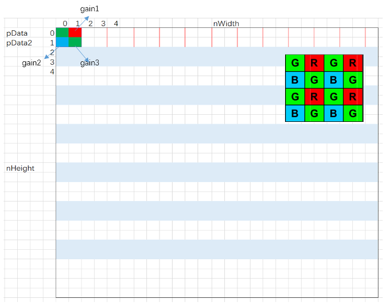

# lsc
## parameters

```C++
typedef struct{
    bool eb;
    uint13 rGain[13*17];
    uint13 GrGain[13*17];
    uint13 GbGain[13*17];
    uint13 bGain[13*17];
    uint9 blockHeight;
    uint9 blockWidth;
    uint14 blockWidth_1;
    uint10 blockHeight_1;
} lsc_register;
```

1. `eb`

    lsc module enable

2. `rGain`, `GrGain`, `GbGain`, `bGain`

    gain value for each calibration position pixel

3. `blockHeight`, `blockWidth`

    divide the image into 16*12 number of blocks, the size of each block

4. `blockWidth_1`, `blockHeight_1`

    $blockWidth_1 = 2^{19}/blockWidth$
    $blockHeight_1 = 2^{15}/blockHeight$

## code manual
### algorithm
The lens shadow correction is as follows, sampling the image (uniformly selecting 17x13 pixels, dividing the image evenly into 16x12 blocks), calibrating the size of these 221 pixel values, traversing all pixel points of the image, determining the block to which the current pixel point belongs, and using the gain values of the four vertices of the block to which it belongs to derive the current pixel gain value. The pixel points are arranged in Bayer array format, and Gr and Gb pixel points are interleaved. The minimum processing cell is 2×2 pixels, and the grid positions of the red channel pixel, blue channel pixel and green channel pixel are calculated within a processing cell, and the gain values gain1, gain2 and gain3 of the corresponding grid are selected.


### code
The lsc module describes the entire process of lens shadow correction，There are a lot of parameters，the meaning as follows.
1. `srw`, `dst`

    the input and output dataflow

2. `block_width`, `block_height`

    the width and height of one block

3. `blockWidth_1`, `blockHeight_1`

    $blockWidth_1 = 2^{19}/blockWidth$
    $blockHeight_1 = 2^{15}/blockHeight$

4. `bayerPattern`

    the bayer pattern

5. `line_is_blue`

    the line is blue when parameter equal to 1, otherwise line is red

6. `gain_0_lt`, `gain_0_rt`， et al.

    the gain value for one block, choosing the gain value based on the bayerpattern.

7. `gain_rGb_t_nxt`, `gain_rGb_d_nxt`, `gain_Grb_t_nxt`, `gain_Grb_d_nxt`

    the gain value of next block

8. `block_count_rGr`, `block_count_Gbb`

    statistical values for blue line and red line of blocks

9. `gain_lt`, `gain_rt`, `gain_ld`, `gain_rd`

    gain value of current cycle

gain value, next gain value, `line_is_blue` parameters‘ initialization
```C++
if((x == 0) && (y == 0))
{
  gain_0_lt = lscRegister.rGain[0];
  gain_0_rt = lscRegister.rGain[1];
  gain_0_ld = lscRegister.rGain[17];
  gain_0_rd = lscRegister.rGain[18];
  gain_1_lt = lscRegister.GrGain[0];
  gain_1_rt = lscRegister.GrGain[1];
  gain_1_ld = lscRegister.GrGain[17];
  gain_1_rd = lscRegister.GrGain[18];
  gain_2_lt = lscRegister.GbGain[0];
  gain_2_rt = lscRegister.GbGain[1];
  gain_2_ld = lscRegister.GbGain[17];
  gain_2_rd = lscRegister.GbGain[18];
  gain_3_lt = lscRegister.bGain[0];
  gain_3_rt = lscRegister.bGain[1];
  gain_3_ld = lscRegister.bGain[17];
  gain_3_rd = lscRegister.bGain[18];
  gain_rGb_t_nxt = line_is_blue ? lscRegister.GbGain[2] : lscRegister.rGain[2];
  gain_rGb_d_nxt = line_is_blue ? lscRegister.GbGain[19] : lscRegister.rGai[19];
  gain_Grb_t_nxt = line_is_blue ? lscRegister.bGain[2] : lscRegister.GrGain[2];
  gain_Grb_d_nxt = line_is_blue ? lscRegister.bGain[19] : lscRegister.GrGai[19];
  line_is_blue = (bayerPattern > 1); //0: red; 1: blue
}
```

select the gain value according to the bayerpattern
```C++
if (bayerPattern == 0)
{
  gain_lt = gain_0_lt;
  gain_rt = gain_0_rt;
  gain_ld = gain_0_ld;
  gain_rd = gain_0_rd;
}
else if (bayerPattern == 1)
{
  gain_lt = gain_1_lt;
  gain_rt = gain_1_rt;
  gain_ld = gain_1_ld;
  gain_rd = gain_1_rd;
}
else if (bayerPattern == 2)
{
  gain_lt = gain_2_lt;
  gain_rt = gain_2_rt;
  gain_ld = gain_2_ld;
  gain_rd = gain_2_rd;
}
else if (bayerPattern == 3)
{
  gain_lt = gain_3_lt;
  gain_rt = gain_3_rt;
  gain_ld = gain_3_ld;
  gain_rd = gain_3_rd;
}
```

Bilinear interpolation
```C++
int14 BilinearInterpolation(uint13 LeftTopGain, uint13 LeftDownGain,uint13 RightTopGain, uint13 RightDownGain,
                            uint9 BlockWidthCount, uint9 BlockHeightCount, uint14 blockWidth_1, uint10 blockHeight_1)
{
    int14 result;

    int14 tmp_t = 0;
    int14 tmp_d = 0;
    int14 LT = LeftTopGain;
    int14 LD = LeftDownGain;
    int14 RT = RightTopGain;
    int14 RD = RightDownGain;

    tmp_t = LT - (((LT - RT) * BlockWidthCount * blockWidth_1 + 128) >> 19);
    tmp_d = LD - (((LD - RD) * BlockWidthCount * blockWidth_1 + 128) >> 19);

    result = tmp_t - (((tmp_t - tmp_d) * BlockHeightCount * blockHeight_1 + 128) >> 15);
    return result;
};
```

Update the `block_count_rGr` and `block_count_Gbb`. example on `block_count_rGr`, the initial value of `block_count_rGr` is 2, which is benefical to the process of updating blue line's gain value in the cycles of red line, because the `block_count_rGr` in one row is 17, which equal to the the number of gain in one row.  If satisfy the conditions`(x == topRegister.frameWidth - 1) && (line_is_blue == 0)`, When processing to the last two rows and need to update to the next row of blocks, `block_count_rGr` plus 2, otherwise restart counting from the first block of the current block row, then `block_count_rGr` minus 15. In addition, `block_count_rGr` is added with 1 each time the last line of a single block is processed
```C++
if((x == 0) && (y == 0))
{
  block_count_rGr = 2;
}
else if((x == topRegister.frameWidth - 1) && (line_is_blue == 0))
{
  if((block_height_count == block_height - 1) || (block_height_count == block_height -2))
  {
      block_count_rGr += 2;
  }
  else
  {
      block_count_rGr -= 15;
  }
}
else if((block_width_count == block_width - 1) && (line_is_blue == 0))
{
  block_count_rGr++;
}

if((x == 0) && (y == 0))
{
  block_count_Gbb = 2;
}
else if((x == topRegister.frameWidth - 1) && (line_is_blue == 1))
{
  if((block_height_count == block_height - 1) || (block_height_count == block_height -2))
  {
      block_count_Gbb += 2;
  }
  else
  {
      block_count_Gbb -= 15;
  }
}
else if((block_width_count == block_width - 1) && (line_is_blue == 1))
{
  block_count_Gbb++;
}
```

gain value update module, the additional function of this module is to update the initial gain value of the red row when the current pixel is in the blue row, and update the initial gain value of the blue row when the current pixel is in the red row, this can save cycles when changing rows
```C++
if((block_width_count == block_width - 1) && (line_is_blue == 0))
{
  gain_0_lt = gain_0_rt;
  gain_0_ld = gain_0_rd;
  gain_0_rt = gain_rGb_t_nxt;
  gain_0_rd = gain_rGb_d_nxt;
  gain_1_lt = gain_1_rt;
  gain_1_ld = gain_1_rd;
  gain_1_rt = gain_Grb_t_nxt;
  gain_1_rd = gain_Grb_d_nxt;
}
else if((line_is_blue == 1) && (x == 5) && (y != 0))
{
  gain_0_lt = lscRegister.rGain[block_count_rGr - 2];
}
else if((line_is_blue == 1) && (x == 6) && (y != 0))
{
  gain_0_rt = lscRegister.rGain[block_count_rGr - 1];
}
else if((line_is_blue == 1) && (x == 7) && (y != 0))
{
  gain_0_ld = lscRegister.rGain[block_count_rGr + 15];
}
else if((line_is_blue == 1) && (x == 8) && (y != 0))
{
  gain_0_rd = lscRegister.rGain[block_count_rGr + 16];
}
else if((line_is_blue == 1) && (x == 9) && (y != 0))
{
  gain_1_lt = lscRegister.GrGain[block_count_rGr - 2];
}
else if((line_is_blue == 1) && (x == 10) && (y != 0))
{
  gain_1_rt = lscRegister.GrGain[block_count_rGr - 1];
}
else if((line_is_blue == 1) && (x == 11) && (y != 0))
{
  gain_1_ld = lscRegister.GrGain[block_count_rGr + 15];
}
else if((line_is_blue == 1) && (x == 12) && (y != 0))
{
  gain_1_rd = lscRegister.GrGain[block_count_rGr + 16];
}

if((block_width_count == block_width - 1) && (line_is_blue == 1))
{
  gain_2_lt = gain_2_rt;
  gain_2_ld = gain_2_rd;
  gain_2_rt = gain_rGb_t_nxt;
  gain_2_rd = gain_rGb_d_nxt;
  gain_3_lt = gain_3_rt;
  gain_3_ld = gain_3_rd;
  gain_3_rt = gain_Grb_t_nxt;
  gain_3_rd = gain_Grb_d_nxt;
}
else if((line_is_blue == 0) && (x == 5) && (y != 0))
{
  gain_2_lt = lscRegister.GbGain[block_count_Gbb - 2];
}
else if((line_is_blue == 0) && (x == 6) && (y != 0))
{
  gain_2_rt = lscRegister.GbGain[block_count_Gbb - 1];
}
else if((line_is_blue == 0) && (x == 7) && (y != 0))
{
  gain_2_ld = lscRegister.GbGain[block_count_Gbb + 15];
}
else if((line_is_blue == 0) && (x == 8) && (y != 0))
{
  gain_2_rd = lscRegister.GbGain[block_count_Gbb + 16];
}
else if((line_is_blue == 0) && (x == 9) && (y != 0))
{
  gain_3_lt = lscRegister.bGain[block_count_Gbb - 2];
}
else if((line_is_blue == 0) && (x == 10) && (y != 0))
{
  gain_3_rt = lscRegister.bGain[block_count_Gbb - 1];
}
else if((line_is_blue == 0) && (x == 11) && (y != 0))
{
  gain_3_ld = lscRegister.bGain[block_count_Gbb + 15];
}
else if((line_is_blue == 0) && (x == 12) && (y != 0))
{
  gain_3_rd = lscRegister.bGain[block_count_Gbb + 16];
}
```

update `gain_rGb_t_nxt`, `gain_rGb_d_nxt`, `gain_Grb_t_nxt`, `gain_Grb_d_nxt`
```C++
if(block_width_count == 0)
{
  gain_rGb_t_nxt = (line_is_blue) ? lscRegister.GbGain[block_count_Gbb] : lscRegister.rGain[block_count_rGr];
}
else if(block_width_count == 1)
{
  gain_Grb_t_nxt = (line_is_blue) ? lscRegister.bGain[block_count_Gbb] : lscRegister.GrGain[block_count_rGr];
}
else if(block_width_count == 2)
{
  gain_rGb_d_nxt = (line_is_blue) ? lscRegister.GbGain[block_count_Gbb + 17] : lscRegister.rGain[block_count_rGr + 17];
}
else if(block_width_count == 3)
{
  gain_Grb_d_nxt = (line_is_blue) ? lscRegister.bGain[block_count_Gbb + 17] : lscRegister.GrGain[block_count_rGr + 17];
}
```
update `block_height_count`, `block_width_count`, `line_is_blue`
```C++
if((x == topRegister.frameWidth - 1) && (block_height_count == block_height - 1))
{
  block_height_count = 0;
}
else if(x == topRegister.frameWidth - 1)
{
  block_height_count++;
}

if((block_width_count == block_width - 1) || (x == topRegister.frameWidth - 1))
{
  block_width_count = 0;
}
else
{
  block_width_count++;
}

if(x == topRegister.frameWidth - 1)
{
  line_is_blue = (line_is_blue == 0);
}
```
